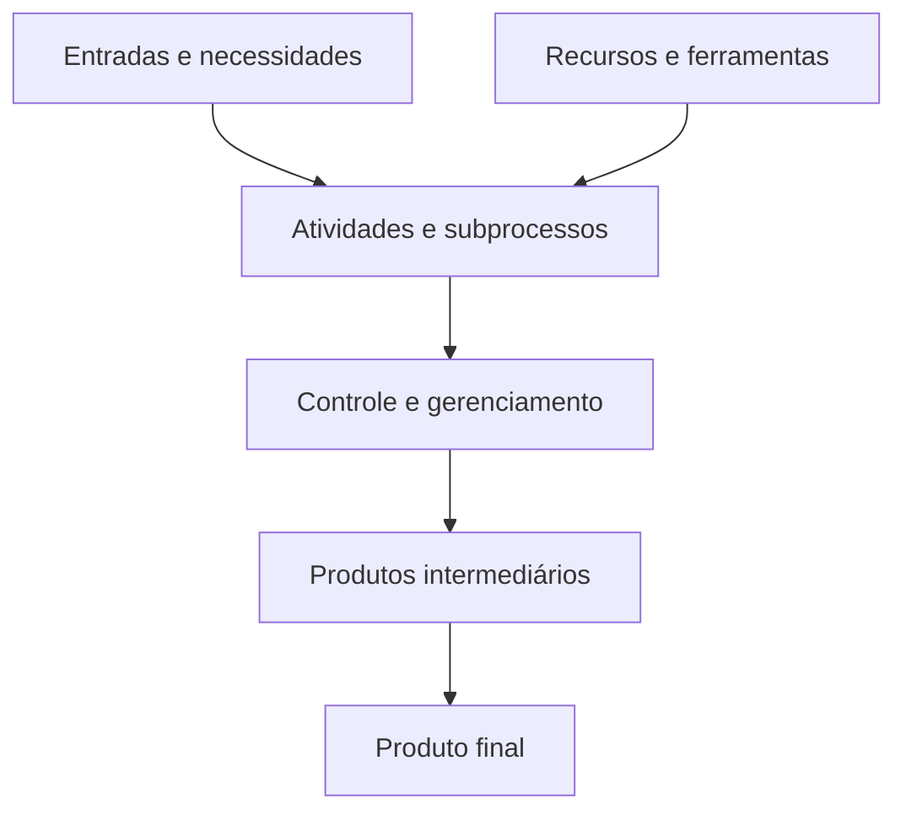
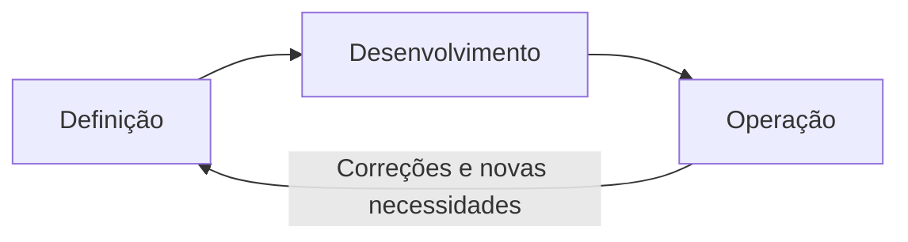
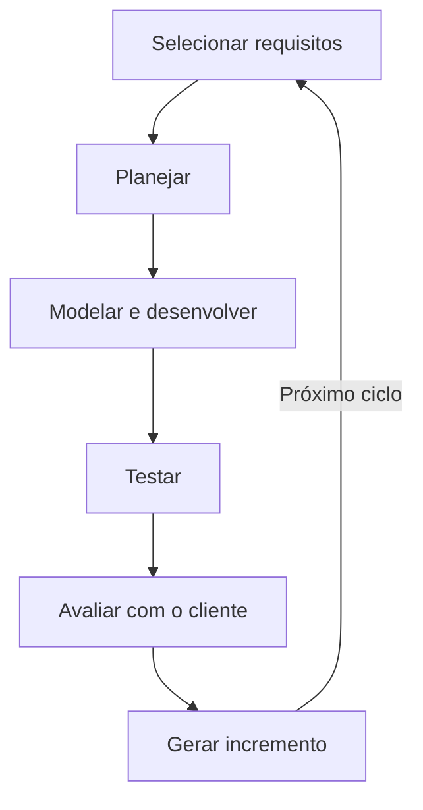
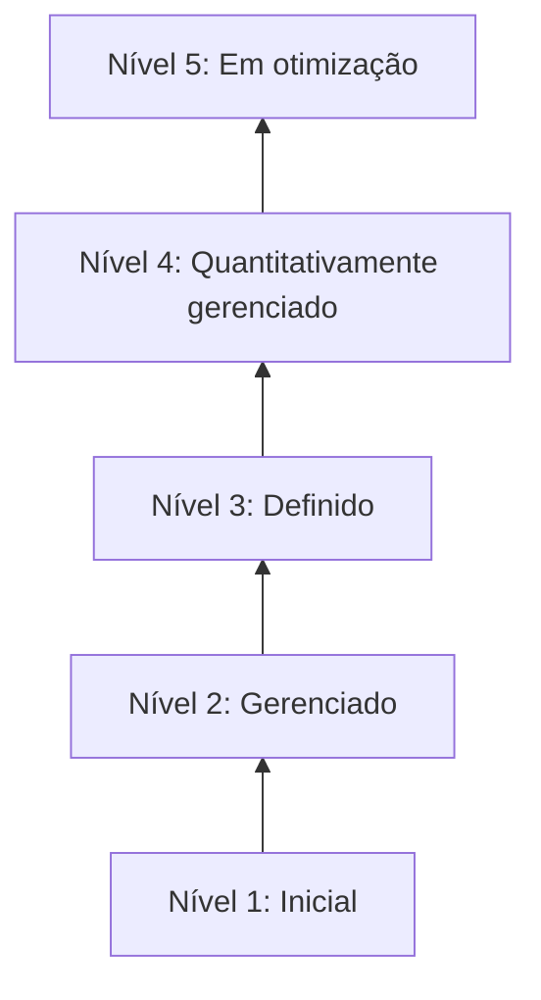
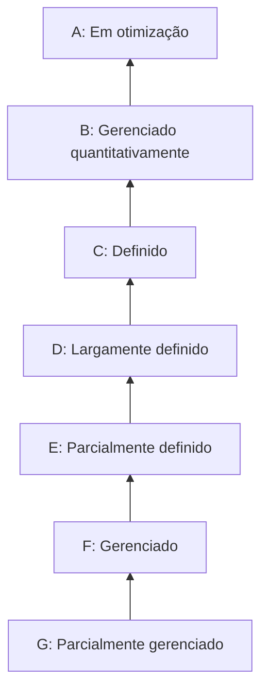

# Modelos de Ciclo de Vida e de Processos de Software

## Visão geral

> [!info] Conceito
> O desenvolvimento de software depende de processos organizados, modelos de ciclo de vida adequados ao projeto e práticas que permitam avaliar e melhorar a maturidade da organização.

Os processos de software estão cada vez mais direcionados às necessidades dos clientes. Para alcançar resultados efetivos, as organizações precisam adotar metodologias que orientem o desenvolvimento e modelos que permitam avaliar a maturidade de seus processos.

O conteúdo está estruturado em quatro eixos principais:

1. processos de software;
2. ciclo de vida de software;
3. modelo de maturidade CMMI;
4. modelo de maturidade MPS.BR.

Esses assuntos ajudam a compreender como as atividades de desenvolvimento podem ser planejadas, executadas, controladas e continuamente aperfeiçoadas.

---

## 1. Processos de software

> [!info] Processo de software
> É o conjunto organizado de disciplinas, atividades e tarefas necessárias para produzir um software, desde sua concepção até sua entrega e operação.

Um processo de software considera não somente as atividades técnicas de construção do produto, mas também os produtos gerados, as pessoas envolvidas e as ferramentas utilizadas. Embora existam modelos gerais, cada organização e cada equipe adaptam o processo às características de seu contexto.

O processo também deve contemplar o acompanhamento e o controle da produção. A gerência do projeto precisa assegurar o andamento das tarefas e administrar falhas, mudanças e imprevistos que possam surgir durante o desenvolvimento.

### Características de um processo

Todo processo apresenta alguns elementos fundamentais:

- estabelece suas principais atividades;
- utiliza recursos e está sujeito a restrições, como prazo e orçamento;
- produz resultados intermediários e finais;
- pode ser dividido em subprocessos relacionados;
- possui critérios de entrada e saída para cada atividade;
- organiza as atividades em determinada sequência;
- contém diretrizes que explicam os objetivos das atividades.

> [!tip] Resumindo
> O processo de software combina trabalho técnico e gerencial para transformar necessidades em um produto operacional.

---

## 2. Modelo de processo e ciclo de vida

> [!info] Modelo de processo
> É a forma como as etapas do desenvolvimento são organizadas, relacionadas e executadas ao longo do projeto.

O encadeamento das etapas de desenvolvimento é denominado **modelo de processo** ou **modelo de ciclo de vida**. Não existe um único modelo adequado a todos os projetos. A escolha deve considerar a natureza do software, as necessidades do cliente, os riscos, os custos, os prazos e as características da equipe.

É necessário distinguir o ciclo de vida do projeto do ciclo de vida do produto:

| Ciclo | Abrangência |
|---|---|
| **Ciclo de vida do projeto ou processo** | É temporário e termina com a conclusão do projeto de desenvolvimento. |
| **Ciclo de vida do produto** | Continua depois da entrega, abrangendo operação, manutenção, evolução e obsolescência do software. |

---

## 3. Evolução dos processos de desenvolvimento

> [!info] Evolução metodológica
> Os processos evoluíram de estruturas tradicionais, mais rígidas e documentadas, para abordagens ágeis, mais flexíveis e adaptáveis.

O material compara a evolução das metodologias de software às diferentes gerações humanas. Assim como as gerações X, Y e Z coexistem com necessidades e relações distintas com a tecnologia, as metodologias tradicionais e ágeis também coexistem e podem ser utilizadas em contextos diferentes.

Inicialmente, os processos de software eram estruturados com pouca flexibilidade e padrões metodológicos bem definidos. Posteriormente, surgiram metodologias ágeis voltadas à adaptação, à produtividade, às entregas mais rápidas e à incorporação de diferentes tecnologias.

Essa evolução não significa que uma abordagem seja necessariamente superior à outra. Cada uma apresenta características apropriadas para determinados projetos.

### Abordagens ágeis

As metodologias ágeis procuram simplificar o processo e priorizam:

- indivíduos e interações;
- funcionamento do software;
- colaboração com o cliente;
- adaptação às mudanças.

Apesar da preocupação com produtividade e qualidade, o material destaca que não há um modelo de maturidade ágil único e padronizado que descreva tudo o que ocorre no desenvolvimento. As implementações variam conforme as necessidades e a cultura de cada organização.

### Abordagens tradicionais

As metodologias tradicionais valorizam processos estruturados e documentação completa. Essa documentação favorece:

- rastreabilidade das decisões;
- continuidade do desenvolvimento;
- manutenção do produto;
- escalabilidade;
- integração do software em diferentes ambientes.

> [!warning] Atenção
> Agilidade não significa ausência de planejamento, assim como documentação e formalização não garantem, isoladamente, a qualidade do produto. A abordagem deve ser escolhida conforme o contexto.

---

## 4. Software e sistemas de informação

> [!info] Software
> Software não é somente o código executável: compreende programas, procedimentos, dados e documentação associados a um sistema computacional.

A qualidade do software está relacionada à capacidade de atender às necessidades específicas do usuário e ao propósito para o qual foi criado. Quando o produto não resolve adequadamente o problema esperado, pode ser percebido como um obstáculo à produtividade.

O conceito de **sistema de informação** é mais amplo. Ele reúne pessoas, tecnologias, sistemas e dados integrados para auxiliar as organizações na tomada de decisões. Dentro desse conjunto encontra-se o sistema de software, formado por módulos funcionais que interagem para automatizar tarefas.

A satisfação do usuário é, portanto, um fator crítico de sucesso. Um software tecnicamente funcional, mas incapaz de atender às necessidades do usuário ou da organização, não cumpre plenamente sua finalidade.

---

## 5. Ciclo de vida de software

> [!info] Ciclo de vida
> É o conjunto de processos, atividades e tarefas que acompanha o software desde sua concepção até sua operação, manutenção e evolução.

O desenvolvimento não deve começar diretamente pela codificação. Por ser uma atividade interdisciplinar, precisa contemplar concepção, planejamento, modelagem, desenvolvimento, testes, entrega e implantação no ambiente tecnológico do cliente.

O ciclo também inclui atividades posteriores à venda e à implantação, como:

- suporte aos usuários;
- atualizações;
- correção de defeitos;
- manutenção;
- inclusão de novas funcionalidades.

Os modelos de ciclo de vida diferem principalmente pela forma como suas etapas se relacionam. A escolha deve ser feita em alinhamento entre a equipe e o cliente, considerando custos, prazo de disponibilização, regras de negócio, tamanho da equipe e outras necessidades do projeto.

### Etapas fundamentais

O ciclo de vida pode ser dividido em três grandes etapas:

### 5.1 Definição

Na etapa de definição são analisados o ambiente e a viabilidade do software. Consideram-se variáveis internas e externas, capacidade tecnológica, tecnologias disponíveis, regras de negócio e viabilidade dos requisitos funcionais e não funcionais.

Nessa etapa são definidos:

- o problema que o software deverá resolver;
- o escopo;
- as funcionalidades;
- o volume do sistema;
- as premissas;
- as restrições.

### 5.2 Desenvolvimento

Na etapa de desenvolvimento ocorre a modelagem do software por meio de notações específicas. O projeto resultante orienta a prototipagem, a construção do código, os testes e a integração dos componentes.

### 5.3 Operação

Na etapa de operação, o software foi concluído, testado e implantado no ambiente do cliente. A organização precisa oferecer suporte aos usuários, corrigir bugs e avaliar a implementação de novas funcionalidades conforme os níveis de serviço acordados.

> [!tip] Resumindo
> O ciclo de vida transforma uma necessidade em um sistema operacional e continua depois da entrega por meio de suporte, correções e evolução.

---

## 6. Principais modelos de ciclo de vida

O material relaciona como modelos comuns:

- modelo cascata;
- modelo evolutivo;
- modelo iterativo e incremental;
- modelo espiral.

Entre eles, são detalhados o modelo cascata e o modelo iterativo e incremental.

---

## 7. Modelo cascata

> [!info] Modelo cascata
> Organiza o desenvolvimento em uma sequência predominantemente linear, na qual uma fase começa depois da conclusão da anterior.

No modelo cascata, cada etapa utiliza os artefatos ou produtos gerados pela etapa precedente. Embora possa ocorrer alguma retroalimentação para a fase anterior, o desenvolvimento mantém uma estrutura linear.

Esse modelo é mais apropriado quando os requisitos são bem definidos e permanecem estáveis durante o desenvolvimento. Entretanto, essa condição nem sempre corresponde à realidade dos projetos.

Como todas as etapas precisam ser concluídas antes da disponibilização do produto, a primeira versão operacional pode demorar. Isso pode reduzir a competitividade da empresa e aumentar a insatisfação do cliente.

Durante esse intervalo também podem ocorrer mudanças nos requisitos. Como o modelo apresenta menor flexibilidade para absorvê-las, essas alterações podem aumentar a carga de trabalho da gerência do projeto.

Outra crítica é que o modelo cascata deriva de uma lógica de fabricação, na qual um produto definido é posteriormente reproduzido. O desenvolvimento de software, porém, é uma atividade de criação e solução de problemas, na qual a compreensão do problema evolui durante o próprio projeto.

> [!warning] Limitação
> O modelo cascata apresenta dificuldades quando os requisitos são instáveis ou quando o cliente precisa receber uma versão funcional rapidamente.

---

## 8. Modelo iterativo e incremental

> [!info] Iterativo e incremental
> O software é construído em ciclos sucessivos, e cada ciclo acrescenta uma nova parte funcional ao produto.

O modelo iterativo e incremental surge como alternativa aos problemas enfrentados pelo modelo cascata. Em cada ciclo, uma pequena porção dos requisitos passa pelas etapas de desenvolvimento. Ao final da iteração, uma nova versão do software é entregue ou disponibilizada.

- **Iterativo** significa repetir ciclos de desenvolvimento para compreender e refinar o sistema.
- **Incremental** significa acrescentar funcionalidades ao produto em cada novo ciclo.

A disponibilização progressiva de versões reduz a ansiedade do usuário e permite que o software seja desenvolvido em módulos, conforme as necessidades e características do projeto.

Embora apresente uma dinâmica mais ágil, esse modelo não elimina o planejamento formal. As iterações permitem melhorar a compreensão do sistema, refinar os requisitos e desenvolver gradualmente a qualidade do produto.

### Comparação entre os modelos

| Aspecto | Cascata | Iterativo e incremental |
|---|---|---|
| Organização | Sequencial e linear | Organizada em ciclos |
| Requisitos | Preferencialmente estáveis | Podem ser refinados durante o projeto |
| Entrega funcional | Geralmente mais tardia | Ocorre ao final de cada ciclo |
| Participação do cliente | Mais concentrada em momentos específicos | Favorecida pelas avaliações sucessivas |
| Mudanças | Mais difíceis de incorporar | Podem ser absorvidas em novas iterações |
| Planejamento | Formal e antecipado | Formal, mas revisto ao longo dos ciclos |

> [!tip] Resumindo
> O modelo iterativo e incremental permite aprender com cada versão e evoluir o produto de maneira gradual, sem abandonar o planejamento.

---

## 9. Maturidade dos processos de software

> [!info] Maturidade
> Representa o grau em que os processos de uma organização estão definidos, institucionalizados, controlados, medidos e continuamente melhorados.

A busca pela qualidade ganhou importância após a crise do software, especialmente diante de problemas como falta de documentação, custos elevados e ciclos de vida reduzidos. A evolução tecnológica tornava sistemas antigos mais caros de manter e, em alguns casos, inviáveis.

A Engenharia de Software respondeu a esses problemas introduzindo processos, padrões, orientações e boas práticas. Na década de 1990, surgiram abordagens voltadas à avaliação da maturidade, com o propósito de verificar quanto os processos eram definidos, repetíveis, gerenciáveis e capazes de produzir resultados previsíveis.

Os dois modelos de maturidade apresentados são o **CMMI** e o **MPS.BR**.

---

## 10. CMMI

> [!info] CMMI
> O *Capability Maturity Model Integration* é um modelo de maturidade que orienta a melhoria contínua dos processos e do desempenho organizacional.

O CMMI reúne práticas avaliadas e comprovadas para ajudar as organizações a desenvolver produtos e serviços dentro de padrões de qualidade. Seu objetivo é alinhar metas de negócio, estratégias de tecnologia e operações, produzindo resultados mensuráveis em prazo, qualidade, orçamento e satisfação do cliente.

O modelo abrange práticas relacionadas a:

- qualidade;
- engenharia e desenvolvimento de produtos;
- entrega e gestão de serviços;
- seleção e gestão de fornecedores;
- planejamento e gestão do trabalho;
- flexibilidade e gestão dos negócios;
- gestão da força de trabalho;
- implementação e suporte;
- sustentabilidade e persistência;
- melhoria de desempenho.

O CMMI também oferece maior visibilidade sobre o processo de desenvolvimento para os participantes do projeto. Quanto maior a maturidade, maior tende a ser a previsibilidade de cronogramas e orçamentos e a capacidade de produzir resultados consistentes.

### Níveis de maturidade do CMMI

#### Nível 1 — Inicial ou ad hoc

Os processos são pouco previsíveis e predominantemente reativos. O material informa que esse nível não possui áreas de processo específicas.

#### Nível 2 — Gerenciado

Os processos passam a ser planejados, acompanhados e controlados. Entre suas áreas encontram-se:

- gerenciamento de requisitos;
- planejamento, monitoramento e controle de projetos;
- gerenciamento de fornecedores;
- medição e análise;
- garantia da qualidade;
- gerência de configuração;
- planejamento e controle do trabalho;
- prestação de serviços.

#### Nível 3 — Definido

Os processos são caracterizados e padronizados para toda a organização. Esse nível compreende áreas como:

- desenvolvimento de requisitos;
- solução técnica;
- integração do produto;
- verificação e validação;
- definição e melhoria dos processos organizacionais;
- treinamento organizacional;
- gerenciamento integrado de projetos;
- gerenciamento de riscos;
- análise e resolução de decisões;
- gestão e desenvolvimento de serviços;
- continuidade de serviços;
- prevenção e resolução de incidentes;
- gerenciamento de capacidade e disponibilidade.

#### Nível 4 — Quantitativamente gerenciado

Os processos são medidos e controlados por dados quantitativos. As áreas indicadas são o desempenho dos processos organizacionais e o gerenciamento quantitativo do trabalho ou projeto.

#### Nível 5 — Em otimização

A organização mantém o foco na melhoria contínua. São analisadas as causas dos problemas, e os processos são ajustados para elevar o desempenho organizacional.

### Modelos do CMMI

| Modelo | Finalidade |
|---|---|
| **CMMI-DEV** | Desenvolvimento de produtos e serviços. |
| **CMMI-ACQ** | Aquisição e terceirização de bens e serviços. |
| **CMMI-SVC** | Processos de organizações prestadoras de serviços. |

> [!tip] Resumindo
> O CMMI descreve uma evolução que parte de processos imprevisíveis e chega à melhoria contínua baseada em medição, análise e aprendizagem organizacional.

---

## 11. MPS.BR

> [!info] MPS.BR
> A Melhoria do Processo de Software Brasileiro busca disseminar a cultura de qualidade e melhorar os processos e o desempenho das organizações brasileiras de software e serviços.

O MPS.BR foi desenvolvido pela Softex com apoio do Ministério da Ciência e Tecnologia, Inovações e Comunicações. É direcionado especialmente às micro, pequenas e médias organizações, procurando aumentar sua competitividade e capacidade de inovação.

O programa reúne três componentes fundamentais:

- modelo de processos de software;
- método de avaliação;
- modelo de negócio para apoiar empresas brasileiras.

Cada processo possui atributos de capacidade que indicam o grau de refinamento e institucionalização com que é executado na organização.

### Níveis do MPS.BR

O modelo apresenta sete níveis, organizados de G até A. A evolução começa no nível G e segue em direção ao nível A.

#### Nível G — Parcialmente gerenciado

Abrange:

- gerenciamento de projetos;
- gerência de requisitos.

#### Nível F — Gerenciado

Acrescenta:

- aquisição;
- gerência de configuração;
- garantia da qualidade;
- gerência de portfólio de projetos;
- medição.

#### Nível E — Parcialmente definido

Abrange:

- avaliação e melhoria do processo organizacional;
- definição do processo organizacional;
- gerência de recursos humanos;
- gerência de reutilização.

#### Nível D — Largamente definido

Abrange:

- desenvolvimento de requisitos;
- integração do produto;
- projeto e construção do produto;
- validação;
- verificação.

#### Nível C — Definido

Abrange:

- desenvolvimento para reutilização;
- gerência de decisões;
- gerência de riscos.

#### Nível B — Gerenciado quantitativamente

Nesse nível, os processos são gerenciados quantitativamente. O material esclarece que os níveis B e A não possuem processos específicos adicionais.

#### Nível A — Em otimização

É o nível mais elevado do modelo e representa a melhoria contínua dos processos. Assim como no nível B, não são associados novos processos específicos.

> [!warning] Ordem dos níveis
> No MPS.BR, a maturidade cresce de **G para A**. Portanto, G representa o nível inicial apresentado pelo modelo e A representa o nível mais avançado.

---

## 12. Relação entre CMMI e MPS.BR

> [!info] Finalidade comum
> CMMI e MPS.BR procuram orientar, avaliar e melhorar os processos utilizados pelas organizações.

Os dois modelos estruturam a evolução da organização em níveis de maturidade. O avanço entre os níveis representa maior capacidade para definir, repetir, controlar, medir e aperfeiçoar processos.

| Aspecto | CMMI | MPS.BR |
|---|---|---|
| Estrutura | Cinco níveis | Sete níveis |
| Progressão | Do nível 1 ao nível 5 | Do nível G ao nível A |
| Nível inicial | Inicial ou ad hoc | Parcialmente gerenciado |
| Nível mais avançado | Em otimização | Em otimização |
| Ênfase apresentada | Melhoria do desempenho e maturidade organizacional | Qualidade e competitividade das organizações brasileiras |
| Abrangência | Desenvolvimento, aquisição e serviços | Processos, avaliação e modelo de negócio |
| Público destacado | Organizações de diferentes contextos | Especialmente micro, pequenas e médias organizações brasileiras |

Os modelos de maturidade não se limitam a determinar quais atividades devem ser realizadas. Eles também possibilitam avaliar a consistência dos processos e a capacidade da organização de produzir resultados previsíveis.

---

## 13. Engenharia de Software e qualidade

> [!info] Engenharia de Software
> Consiste na aplicação de princípios de engenharia para produzir software confiável, eficiente e economicamente viável.

Uma abordagem de engenharia pressupõe desenvolvimento prático, ordenado e medido. Métodos, processos, técnicas e ferramentas contribuem para que os projetos alcancem resultados mais consistentes em qualidade, prazo e custo.

A produção de software reúne ciência, técnica e criatividade. Por um lado, depende da racionalidade dos mecanismos computacionais e de suas teorias; por outro, exige originalidade e capacidade de criar soluções para problemas específicos.

O material também destaca a relevância das certificações profissionais, que podem ampliar conhecimentos, demonstrar competências e favorecer a empregabilidade na área de tecnologia.

---

## Síntese final

> [!summary] Síntese
> O desenvolvimento de software exige a integração entre processos técnicos, gestão, escolha adequada do ciclo de vida e melhoria contínua da capacidade organizacional.

Um processo de software organiza pessoas, atividades, ferramentas, recursos e restrições para transformar uma necessidade em um produto operacional. O ciclo de vida amplia essa visão, acompanhando o software desde a concepção até a operação, manutenção, evolução e eventual obsolescência.

O modelo cascata estrutura o trabalho em fases predominantemente sequenciais e é mais apropriado para requisitos estáveis. O modelo iterativo e incremental desenvolve o produto em ciclos, permitindo entregas progressivas, avaliação do cliente e refinamento do sistema.

As abordagens tradicionais e ágeis podem coexistir. Enquanto as tradicionais valorizam padronização, documentação e rastreabilidade, as ágeis enfatizam interação, colaboração, adaptação e entregas funcionais.

Por fim, CMMI e MPS.BR fornecem referências para avaliar e aperfeiçoar os processos organizacionais. Ambos representam uma evolução em níveis, partindo de processos menos estruturados em direção à gestão quantitativa e à melhoria contínua.