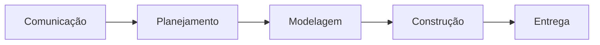
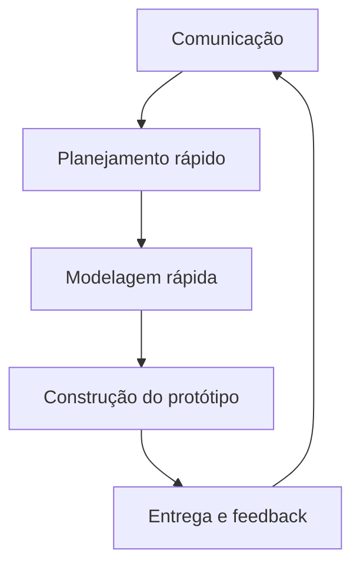
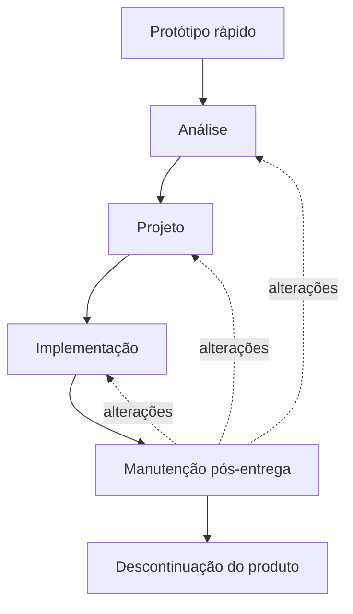
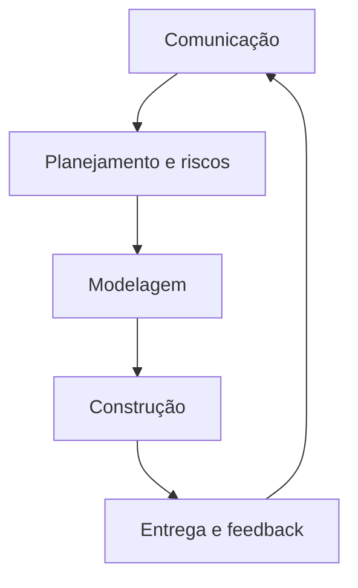
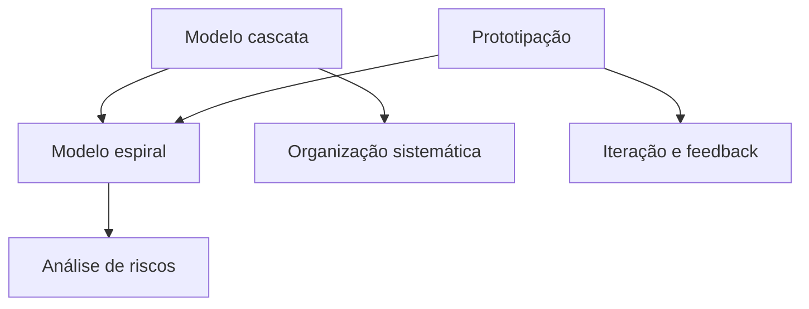

# Modelos Tradicionais de Processo de Software

## Modelo de processo

> [!info] Conceito
> Um modelo de processo orienta e organiza o trabalho realizado durante a engenharia de software.

O **modelo de processo de software** define o fluxo das atividades, ações, tarefas, artefatos e formas de organização necessárias ao desenvolvimento de um sistema. Ele fornece os passos que ajudam a executar o trabalho de engenharia de software de maneira disciplinada.

O modelo não deve ser entendido como uma estrutura absolutamente rígida. Os engenheiros de software escolhem um modelo adequado, adaptam suas características às necessidades do projeto e, então, utilizam-no como orientação para o trabalho.

> [!tip] Resumindo
> O modelo de processo funciona como um guia adaptável que organiza como o software será planejado, desenvolvido, entregue e acompanhado.

## Modelos clássicos

> [!info] Conceito
> Os modelos clássicos são abordagens de desenvolvimento criadas principalmente entre as décadas de 1970 e 1990.

Esses modelos surgiram para enfrentar problemas que dificultavam a produção de software de qualidade. Naquela época, muitos sistemas eram desenvolvidos sem processos, metodologias ou formas adequadas de organização.

O estudo desses modelos continua importante porque eles deram origem às abordagens utilizadas atualmente. Mesmo os modelos mais modernos preservam características dos modelos clássicos.

A aula apresenta três modelos tradicionais:

- modelo cascata;
- modelo de prototipação;
- modelo espiral.

## Modelo cascata

> [!info] Conceito
> O modelo cascata organiza o desenvolvimento em uma sequência de etapas executadas uma após a conclusão da outra.

Também chamado de **ciclo de vida clássico**, o modelo cascata é apresentado como o modelo de ciclo de vida mais antigo da engenharia de software e um dos mais conhecidos e referenciados na literatura.

Sua principal característica é a abordagem sequencial. Cada etapa deve ser concluída antes do início da seguinte, e o processo segue em uma única direção. O modelo não prevê o retorno normal a uma atividade anterior.

As etapas apresentadas são:

1. **Comunicação:** início do projeto e levantamento dos requisitos.
2. **Planejamento:** elaboração de estimativas, cronograma e mecanismos de acompanhamento.
3. **Modelagem:** análise dos requisitos e projeto da solução.
4. **Construção:** produção do código e realização dos testes.
5. **Entrega:** disponibilização do produto, suporte e obtenção de feedback.

### Pontos positivos do modelo cascata

O modelo possui etapas muito bem definidas e organizadas. Como cada fase é executada após a conclusão da anterior, o processo apresenta uma sequência de trabalho clara.

A abordagem pressupõe que os requisitos estejam muito bem definidos antes do avanço do projeto. Essa característica favorece situações nas quais as necessidades do cliente são conhecidas e não devem sofrer alterações significativas.

### Limitações do modelo cascata

> [!warning] Atenção
> O modelo cascata é pouco adequado quando os requisitos ainda não estão claros ou podem mudar durante o desenvolvimento.

Como não prevê o retorno às fases anteriores, o modelo dificulta a correção de problemas identificados tardiamente. Depois que a fase de requisitos é concluída, mudanças não são bem recebidas pelo processo.

Outra limitação é que o cliente normalmente só visualiza o produto ao final do desenvolvimento. Isso reduz a possibilidade de feedback ao longo do processo e aumenta o risco de o software entregue não corresponder plenamente às necessidades reais do usuário.

As principais limitações são:

- ausência de retorno planejado às atividades anteriores;
- dificuldade para corrigir problemas originados em fases já concluídas;
- baixa capacidade de acomodar mudanças nos requisitos;
- apresentação tardia do produto ao cliente;
- pouco feedback durante o desenvolvimento.

Os problemas da abordagem estritamente sequencial contribuíram para o surgimento de outros modelos de processo.

> [!tip] Resumindo
> O cascata oferece organização e etapas claras, mas depende de requisitos estáveis e dificulta mudanças e correções durante o projeto.

## Modelo de prototipação

> [!info] Conceito
> A prototipação utiliza uma representação inicial do software para ajudar o cliente e a equipe a compreender e detalhar os requisitos.

Esse modelo é empregado quando o cliente consegue definir os objetivos gerais do software, mas ainda não identifica detalhadamente os requisitos das funções e dos recursos. Em outras palavras, o cliente sabe, de maneira geral, o que precisa, mas os detalhes ainda devem ser descobertos ao longo do processo.

O trabalho começa com a **comunicação**, na qual são definidos os objetivos gerais do sistema. Em seguida, realiza-se um planejamento rápido, uma modelagem inicial e a construção de um protótipo.

O protótipo pode assumir diferentes formas, como:

- um rascunho em papel;
- uma representação das telas;
- uma versão simples do software;
- uma demonstração criada com uma ferramenta de desenvolvimento.

O objetivo do protótipo é tornar a proposta concreta e compreensível para o cliente. Os envolvidos interagem com essa representação, avaliam suas características e apresentam sugestões. O feedback obtido pode resultar na aprovação da solução ou na solicitação de alterações.

O ciclo pode ser repetido várias vezes. A cada repetição, os requisitos tornam-se mais claros e o protótipo evolui de acordo com o retorno dos usuários.

### Evolução e manutenção do produto

O material também representa a prototipação integrada ao desenvolvimento e à manutenção do produto. Um protótipo rápido serve de base para a análise, seguida pelo projeto e pela implementação. Depois da entrega, as necessidades de alteração identificadas durante a manutenção podem produzir retornos para diferentes etapas do processo.

Esse fluxo mostra que as mudanças descobertas após a entrega podem exigir revisões na análise, no projeto ou na implementação. O processo continua enquanto o produto estiver em uso, terminando com sua descontinuação.

### Pontos positivos da prototipação

A prototipação apresenta etapas definidas e facilita a compreensão dos requisitos. Como o cliente pode visualizar e experimentar uma representação do sistema, suas necessidades tornam-se mais visuais e intuitivas.

O contato frequente com o protótipo permite recolher feedback e ajustar a solução. Por esse motivo, o modelo tende a atender melhor aos requisitos do cliente, especialmente quando eles ainda não foram completamente detalhados.

### Limitações da prototipação

> [!warning] Atenção
> Alterações sucessivas no protótipo podem gerar retrabalho e aumentar o custo do desenvolvimento.

Durante a avaliação, o cliente pode solicitar diversos ajustes e mudanças. Embora esse retorno ajude a aperfeiçoar os requisitos, cada alteração exige novo trabalho da equipe. A repetição desse ciclo pode resultar em retrabalho e elevar os custos do projeto.

> [!tip] Resumindo
> A prototipação ajuda a descobrir requisitos por meio da interação com o cliente, mas a sucessão de alterações pode tornar o processo mais caro.

## Modelo espiral

> [!info] Conceito
> O modelo espiral combina o desenvolvimento iterativo da prototipação com a organização sistemática e controlada do modelo cascata.

Nesse modelo, o desenvolvimento ocorre por meio de ciclos sucessivos, representados pelas voltas da espiral. Cada ciclo passa pelas atividades de comunicação, planejamento, modelagem, construção e entrega.

A cada nova volta, uma versão mais completa do software pode ser produzida. Dessa forma, o produto cresce e evolui ao longo do tempo, incorporando o feedback obtido nas entregas anteriores.

As atividades do ciclo são:

1. **Comunicação:** contato com o cliente para conhecer as necessidades e levantar requisitos iniciais.
2. **Planejamento:** realização de estimativas de prazo e custo, definição do cronograma e análise de riscos.
3. **Modelagem:** análise dos requisitos e elaboração do projeto.
4. **Construção:** codificação e testes do software.
5. **Entrega:** disponibilização da versão desenvolvida e coleta de feedback do cliente.

Depois da entrega, um novo ciclo pode ser iniciado, repetindo essas atividades e ampliando progressivamente o software.

### Análise de riscos

> [!warning] Atenção
> A análise de riscos é o principal elemento que diferencia o modelo espiral dos demais modelos apresentados.

Durante o planejamento, a equipe avalia os riscos do projeto para decidir se é adequado continuar seu desenvolvimento naquele momento. Essa análise acompanha as estimativas, a definição dos custos e a elaboração do cronograma.

O modelo também permite a utilização de protótipos, reunindo características da prototipação e do cascata em uma abordagem evolutiva.

### Pontos positivos do modelo espiral

O modelo apresenta etapas bem definidas e combina a disciplina do ciclo de vida clássico com a evolução contínua do software. Suas principais vantagens são:

- integração de características de outros modelos;
- possibilidade de prototipação;
- produção progressiva de versões mais completas;
- obtenção de feedback a cada ciclo;
- incorporação da análise de riscos;
- combinação entre desenvolvimento clássico e evolutivo.

### Limitação do modelo espiral

A principal desvantagem apresentada é o **alto custo**. A repetição dos ciclos, a construção de novas versões, a obtenção de feedback e a realização de análises de riscos exigem recursos adicionais.

> [!tip] Resumindo
> O modelo espiral desenvolve o software em ciclos sucessivos, com evolução do produto, feedback do cliente e análise de riscos, mas pode apresentar custo elevado.

## Comparação entre os modelos

| Aspecto | Cascata | Prototipação | Espiral |
|---|---|---|---|
| Organização | Sequencial | Cíclica e baseada em protótipos | Iterativa e evolutiva |
| Requisitos | Devem estar bem definidos desde o início | São esclarecidos com o uso do protótipo | Podem evoluir a cada ciclo |
| Participação do cliente | Principalmente no levantamento inicial e na entrega | Frequente, por meio da avaliação do protótipo | Ocorre por meio das entregas e do feedback |
| Retorno a etapas anteriores | Não é normalmente previsto | O feedback gera novas repetições do ciclo | Cada volta inicia um novo ciclo de desenvolvimento |
| Evolução do produto | Produto apresentado ao final | Protótipo evolui com as alterações | Versões progressivamente mais completas |
| Análise de riscos | Não destacada | Não destacada | Elemento central do planejamento |
| Principal vantagem | Etapas claras e organizadas | Facilita a descoberta dos requisitos | Combina evolução, controle e análise de riscos |
| Principal limitação | Pouca flexibilidade para mudanças | Retrabalho e custo elevado | Alto custo |

## Relação entre os modelos

Os modelos apresentados não são completamente independentes. O cascata fornece a estrutura sequencial e disciplinada das atividades. A prototipação acrescenta interação, feedback e evolução dos requisitos. O espiral reúne elementos dessas duas abordagens e incorpora a análise de riscos.

## Leitura recomendada

A aula recomenda a leitura do **Capítulo 4** da seguinte obra:

PRESSMAN, Roger S.; MAXIM, Bruce R. *Engenharia de software: uma abordagem profissional*. 8. ed. Rio de Janeiro: AMGH, 2016.

## Síntese final

> [!summary] Síntese
> Os modelos de processo organizam o trabalho da engenharia de software. O cascata privilegia a sequência e a definição prévia dos requisitos; a prototipação utiliza versões preliminares para esclarecer as necessidades do cliente; e o espiral promove a evolução do produto em ciclos, incorporando feedback e análise de riscos.

Os modelos tradicionais surgiram para disciplinar o desenvolvimento de software e solucionar problemas relacionados à falta de organização e qualidade. Embora tenham sido criados entre as décadas de 1970 e 1990, continuam relevantes porque influenciaram as abordagens atuais.

A escolha do modelo deve considerar as características do projeto. O cascata exige requisitos estáveis; a prototipação é útil quando as necessidades ainda precisam ser detalhadas; e o espiral é apropriado quando se deseja desenvolver versões progressivas e avaliar os riscos durante o processo. Em todos os casos, o modelo pode ser adaptado pelos engenheiros de software às necessidades do trabalho.