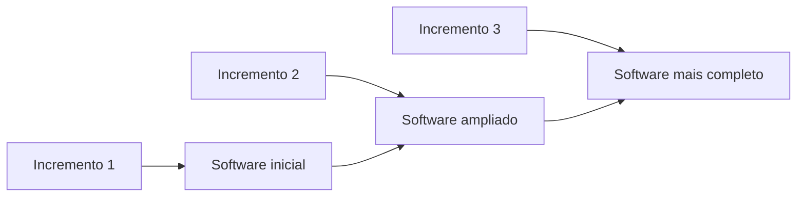
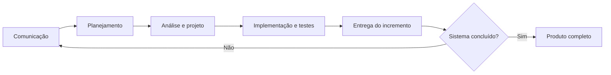
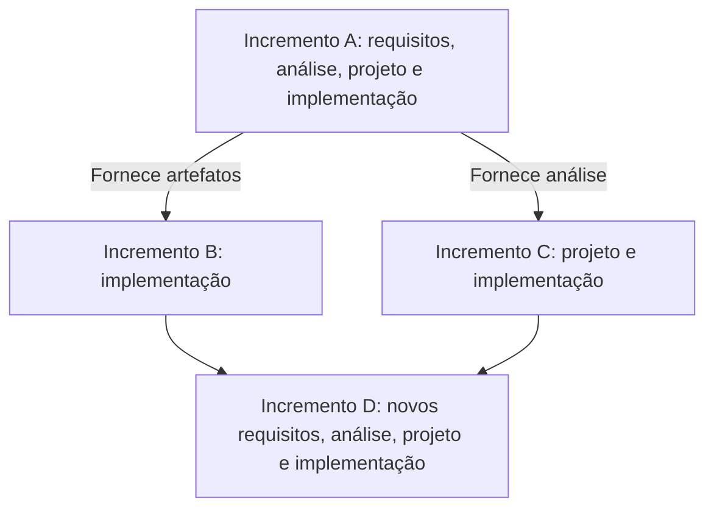
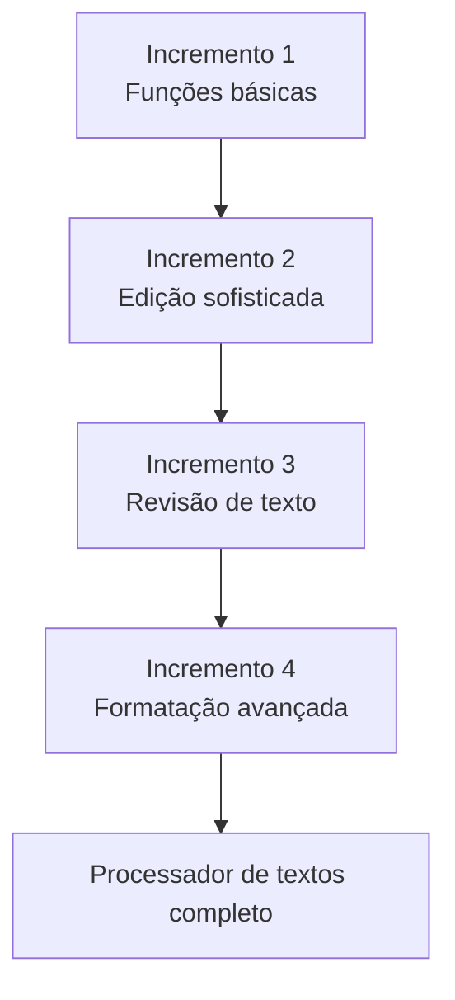

# Modelo Iterativo e Incremental

## Visão geral do modelo incremental

> [!info] Conceito
> No modelo incremental, o software é construído e entregue progressivamente, por meio da incorporação de partes funcionais chamadas **incrementos**.

O modelo incremental divide o sistema em partes, que podem ser desenvolvidas paralelamente. Quando uma parte é concluída, ela é incorporada ao sistema, fazendo com que o software cresça gradualmente até alcançar sua versão completa.

Essa abordagem é bastante utilizada pelas empresas porque permite organizar o desenvolvimento em entregas menores. Em vez de aguardar a conclusão de todo o projeto para disponibilizar o produto, a equipe produz sucessivas versões funcionais, cada uma mais completa que a anterior.

> [!tip] Resumindo
> O sistema é construído aos poucos: cada incremento adiciona novas funcionalidades ao produto existente.

## Relação com os modelos cascata e de prototipação

> [!info] Conceito
> O modelo incremental combina a execução organizada das atividades do modelo cascata com a evolução progressiva encontrada na prototipação.

Cada incremento passa por atividades de engenharia semelhantes às do modelo cascata, como comunicação, planejamento, análise, projeto, implementação, testes e disponibilização. Ao final dessa sequência, é entregue uma nova parte funcional do software.

A relação com a prototipação aparece na produção de versões progressivamente mais evoluídas do sistema. Entretanto, no modelo incremental, o resultado de cada ciclo não é apenas uma representação descartável: o incremento é incorporado ao produto e passa a fazer parte do software.

Esse processo é repetido até que todos os incrementos previstos tenham sido desenvolvidos e o sistema esteja concluído.

> [!warning] Atenção
> Cada incremento executa um pequeno ciclo de desenvolvimento e gera uma parte utilizável do sistema, não apenas documentação ou planejamento.

## Diferença entre iteração e incremento

> [!info] Conceito
> **Iteração** é a execução das atividades de engenharia; **incremento** é a parte do sistema produzida por uma ou mais iterações.

Cada iteração pode passar pelo levantamento de necessidades, análise, projeto e implementação. Também podem estar presentes atividades de comunicação, planejamento, testes, entrega, realimentação e coleta de feedback.

Uma ou mais iterações produzem um incremento. Assim, os dois termos estão relacionados, mas não significam exatamente a mesma coisa:

- **Iteração:** repetição do processo de desenvolvimento;
- **Incremento:** resultado funcional acrescentado ao software.

| Elemento | Significado |
|---|---|
| Iteração | Execução repetida das atividades de engenharia de software |
| Incremento | Parte funcional do sistema produzida e incorporada ao produto |
| Resultado acumulado | Software progressivamente mais completo |

> [!tip] Resumindo
> A iteração representa o trabalho realizado; o incremento representa aquilo que foi produzido e adicionado ao sistema.

## Desenvolvimento paralelo e sobreposição das atividades

> [!info] Conceito
> Diferentes incrementos e fluxos de trabalho podem ocorrer simultaneamente ou aproveitar resultados produzidos anteriormente.

O desenvolvimento dos incrementos pode acontecer em paralelo. Por exemplo, enquanto uma equipe está construindo ou testando o primeiro incremento, outra pode começar o levantamento de necessidades ou a análise do segundo.

As atividades também não precisam manter a mesma intensidade durante todo o projeto. Em determinado período, pode haver maior esforço no levantamento de necessidades; depois, o foco pode passar para análise, projeto, implementação e, posteriormente, testes. Dessa forma, os fluxos de trabalho se sobrepõem ao longo do tempo.

Embora o sistema seja dividido em partes, os incrementos não são necessariamente totalmente independentes. Um incremento pode utilizar um artefato, uma análise ou um projeto elaborado em outro. A divisão também serve para organizar o trabalho e distribuir melhor as atividades entre as equipes.

> [!warning] Atenção
> Desenvolvimento paralelo não significa ausência de dependências. Os incrementos podem compartilhar e reutilizar resultados produzidos anteriormente.

## Distribuição do esforço ao longo dos incrementos

> [!info] Conceito
> Os diferentes fluxos de trabalho continuam existindo ao longo do projeto, mas sua intensidade varia conforme o momento e as necessidades de cada incremento.

No primeiro incremento, pode haver uma concentração maior no levantamento inicial de necessidades. Nos incrementos seguintes, o esforço pode se deslocar para análise, projeto, implementação e testes.

O modelo apresentado na aula mostra que as atividades não precisam ocorrer como blocos completamente isolados. O trabalho de análise pode continuar enquanto o projeto começa, assim como a implementação pode ocorrer enquanto outros requisitos ainda estão sendo avaliados.

Essa sobreposição permite aproveitar os artefatos já produzidos. Um requisito levantado em um incremento pode ser analisado, projetado ou implementado nos incrementos seguintes, conforme a organização adotada pela equipe.

## Incorporação de mudanças nos requisitos

> [!info] Conceito
> Uma mudança de requisito pode ser tratada como um pequeno incremento a ser planejado, desenvolvido, testado e incorporado ao sistema.

O modelo incremental responde bem às mudanças de requisitos. Quando uma alteração é identificada, ela pode ser organizada como um novo incremento e passar pelas atividades de engenharia necessárias.

Isso permite incorporar mudanças durante o desenvolvimento sem precisar reiniciar todo o projeto. A equipe delimita a alteração, analisa seus impactos, implementa a solução e acrescenta o resultado ao produto.

> [!tip] Resumindo
> Novas necessidades podem entrar no projeto como incrementos adicionais, facilitando a evolução do software.

## Exemplo: software de processamento de textos

> [!info] Conceito
> Um software de processamento de textos pode começar com funções essenciais e receber recursos mais sofisticados em entregas posteriores.

A aula apresenta um editor de textos dividido em quatro incrementos:

| Incremento | Funcionalidades desenvolvidas |
|---|---|
| **1** | Funções básicas de gerenciamento de arquivos, edição e produção de documentos |
| **2** | Recursos sofisticados de edição e produção de documentos |
| **3** | Revisão ortográfica e gramatical |
| **4** | Recursos avançados de formatação de página |

Cada incremento possui um escopo específico, mas todos são incorporados ao mesmo produto. Ao final, as diferentes entregas formam um software de processamento de textos mais completo.

## Vantagens do modelo incremental

> [!info] Conceito
> As entregas sucessivas permitem verificar o produto repetidamente, detectar problemas mais cedo e reduzir riscos antes da conclusão do projeto.

### Evolução gradual do produto

A cada incremento é produzido um software mais completo. O usuário ou a organização não precisa esperar pelo sistema inteiro para visualizar resultados, pois novas funcionalidades são incorporadas progressivamente.

### Identificação e correção de falhas

Cada iteração oferece uma oportunidade para encontrar e corrigir falhas. Como o produto é verificado repetidamente, existem vários momentos para avaliar se aquilo que está sendo produzido está correto antes de avançar para novos incrementos.

### Avaliação antecipada da arquitetura

A arquitetura é apresentada como o núcleo estrutural do software. Sua robustez pode ser verificada relativamente cedo mediante a seleção dos requisitos mais críticos e a tentativa de implementá-los nos primeiros incrementos.

Se a arquitetura for capaz de contemplar esses requisitos críticos, haverá maior segurança de que ela também poderá sustentar as funcionalidades que serão implementadas posteriormente.

### Redução antecipada dos riscos

O modelo permite minimizar riscos ao priorizar os requisitos mais críticos. A equipe verifica antecipadamente se eles podem ser implementados e se a arquitetura consegue suportá-los. Dessa forma, problemas importantes podem ser identificados antes de comprometerem todo o desenvolvimento.

> [!tip] Resumindo
> As principais vantagens são a entrega progressiva, a correção frequente de falhas, a validação antecipada da arquitetura e a redução dos riscos do projeto.

## Leitura recomendada

A aula recomenda a leitura do **Capítulo 4** da seguinte obra:

PRESSMAN, Roger S.; MAXIM, Bruce R. *Engenharia de software: uma abordagem profissional*. 8. ed. Rio de Janeiro: AMGH, 2016.

## Síntese final

> [!summary] Síntese
> O modelo iterativo e incremental organiza o desenvolvimento em ciclos que produzem partes funcionais do software. Cada incremento amplia o sistema, pode ser desenvolvido paralelamente e pode reutilizar resultados anteriores. Essa abordagem facilita a incorporação de mudanças, a identificação de falhas, a avaliação antecipada da arquitetura e a redução de riscos.

O modelo incremental reúne a organização das atividades do modelo cascata e a evolução progressiva associada à prototipação. Em cada iteração, a equipe executa atividades como levantamento de necessidades, análise, projeto, implementação e testes. O resultado é um incremento que passa a integrar o produto.

Os incrementos podem se sobrepor e não precisam ser completamente independentes. O trabalho produzido em uma etapa pode alimentar etapas posteriores, enquanto diferentes equipes desenvolvem partes distintas simultaneamente. Ao final do processo, a integração de todos os incrementos forma o sistema completo.