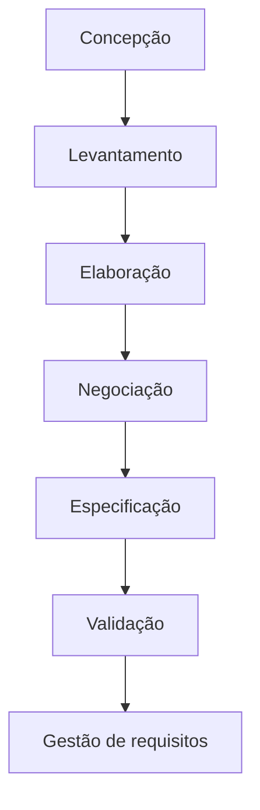
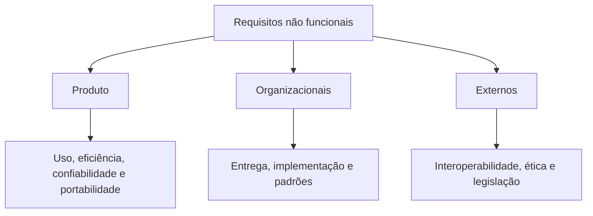
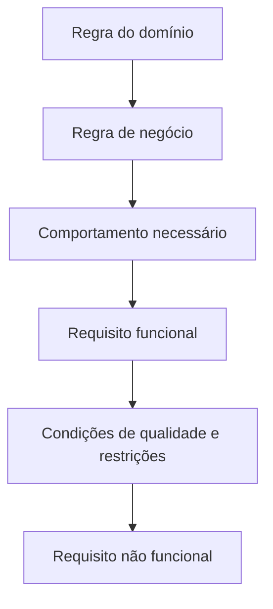

# Engenharia de Requisitos

## 1. O desafio de compreender as necessidades do cliente

> [!info] Conceito
> A Engenharia de Requisitos busca compreender com clareza o problema do cliente e determinar aquilo que o sistema realmente precisa oferecer.

Entender os requisitos está entre as tarefas mais difíceis enfrentadas pelo engenheiro de software. Muitas vezes, o próprio cliente não consegue expressar claramente aquilo de que necessita. Além disso, uma mesma explicação pode ser interpretada de maneiras diferentes pelo líder do projeto, pelo analista, pelo programador e pelos demais envolvidos.

A ilustração do balanço mostra esse problema: o que o cliente explicou, o que a equipe entendeu, o que foi projetado, o que foi construído e o que o cliente realmente desejava eram soluções completamente diferentes. Essa divergência evidencia a importância de uma abordagem organizada para descobrir, analisar, documentar e validar as necessidades do usuário.

> [!warning] Atenção
> Um entendimento incorreto no início do projeto tende a ser propagado para a análise, o projeto e a implementação, podendo resultar em um produto que funciona tecnicamente, mas não resolve o problema do cliente.

---

## 2. Importância da Engenharia de Requisitos

> [!info] Conceito
> A Engenharia de Requisitos estabelece uma base sólida para o projeto e para a construção do software.

As decisões tomadas durante o levantamento e a análise dos requisitos influenciam diretamente as etapas posteriores do desenvolvimento. Os requisitos orientam o projeto da solução, e o projeto, por sua vez, orienta sua construção.

Quando os requisitos são incompletos, ambíguos ou incorretos, essas deficiências passam para o projeto e chegam à implementação. Portanto, a qualidade do produto final depende, em grande parte, da qualidade com que as necessidades foram compreendidas no início.

> [!tip] Resumindo
> Antes de construir corretamente o sistema, é necessário compreender corretamente o problema que ele deverá resolver.

---

## 3. Etapas da Engenharia de Requisitos

> [!info] Conceito
> Segundo Pressman, a Engenharia de Requisitos compreende concepção, levantamento, elaboração, negociação, especificação, validação e gestão de requisitos.

### 3.1. Concepção

A concepção define o escopo do problema que deverá ser resolvido. Seu objetivo é compreender qual é o problema, seu contexto e os limites iniciais da solução.

### 3.2. Levantamento

O levantamento identifica o que é necessário fazer para resolver o problema do cliente ou usuário. Nessa etapa, coletam-se e identificam-se requisitos, inclusive por meio da construção de cenários de utilização do sistema.

### 3.3. Elaboração

Na elaboração, os requisitos básicos são expandidos e refinados. Os cenários levantados e as interações dos usuários com o sistema são analisados de maneira mais aprofundada.

### 3.4. Negociação

Durante a negociação, os requisitos levantados são apresentados e discutidos com o cliente. Eles são priorizados considerando aspectos como custos de desenvolvimento, riscos e prazos. Essa etapa ajuda a compatibilizar as necessidades desejadas com as limitações reais do projeto.

### 3.5. Especificação

A especificação registra formalmente os requisitos em um documento. Esse registro pode conter descrições textuais, diagramas e protótipos que tornem mais claro aquilo que deverá ser desenvolvido.

### 3.6. Validação

A validação consiste na revisão dos requisitos para identificar e eliminar ambiguidades, inconsistências, omissões e erros. O objetivo é confirmar se o conteúdo especificado representa adequadamente as necessidades do cliente.

### 3.7. Gestão de requisitos

A gestão de requisitos controla e acompanha as mudanças que ocorrem ao longo do projeto, principalmente as alterações de escopo. Como as necessidades podem mudar, é necessário registrar, avaliar e controlar seus efeitos sobre custos, riscos, prazos e demais requisitos.

> [!warning] Atenção
> A gestão de requisitos não deve ser entendida apenas como uma etapa final. O acompanhamento das mudanças precisa ocorrer durante todo o processo.

---

## 4. Levantamento de requisitos de software

> [!info] Conceito
> O levantamento de requisitos define o que é necessário fazer e está relacionado à coleta e à identificação das necessidades do sistema.

O levantamento é uma das primeiras atividades realizadas para criar um sistema. Ele é considerado crítico porque todas as atividades posteriores da Engenharia de Software — como análise, projeto e implementação — dependem das informações obtidas nessa fase.

Um erro cometido no levantamento pode ser levado para as etapas seguintes, aumentando seus efeitos ao longo do projeto. Se o que foi compreendido pela equipe for diferente do que o cliente realmente necessita, o produto entregue poderá não atender ao seu objetivo.

> [!warning] Atenção
> Um levantamento de requisitos malfeito pode levar o projeto ao fracasso.

---

## 5. Abordagem geral para a coleta de requisitos

> [!info] Conceito
> A coleta de requisitos depende da comunicação organizada entre os profissionais de software, os clientes e os demais interessados no sistema.

Uma abordagem geral para a coleta pode envolver os seguintes elementos:

- **Reuniões:** reúnem engenheiros de software, clientes e outros interessados no sistema, também chamados de *stakeholders*.
- **Agenda:** define antecipadamente os assuntos que serão tratados e ajuda a manter o encontro direcionado aos objetivos.
- **Regras de participação:** organizam a contribuição dos participantes e evitam que a reunião perca o foco.
- **Facilitador:** dirige a reunião, intervém quando necessário e conduz novamente a discussão ao assunto principal quando ocorrem desvios.
- **Mecanismos de comunicação:** recursos como planilhas, gráficos, adesivos e fóruns virtuais ajudam a registrar, compartilhar e esclarecer aquilo que o cliente deseja.

Esses elementos tornam a comunicação mais objetiva e reduzem a possibilidade de interpretações divergentes.

> [!tip] Resumindo
> A coleta eficiente requer participantes adequados, objetivos definidos, facilitação e mecanismos claros de comunicação.

---

## 6. Técnicas para descoberta de requisitos

> [!info] Conceito
> As técnicas de descoberta ajudam o analista a identificar o funcionamento esperado do sistema e as necessidades dos usuários.

### 6.1. Entrevistas

As entrevistas permitem obter informações diretamente dos clientes e usuários. Elas podem ser:

- **Abertas:** oferecem liberdade para formular diferentes perguntas e explorar as respostas dos participantes, buscando esclarecer o que deverá ser desenvolvido.
- **Fechadas:** seguem uma lista previamente definida de perguntas que deverão ser respondidas.

As entrevistas abertas favorecem a exploração do problema, enquanto as fechadas facilitam a obtenção de respostas sobre questões específicas.

### 6.2. Análise de cenários

A análise de cenários descreve de maneira completa uma situação de utilização do sistema. Deve contemplar:

- o que deverá ser executado pelo sistema;
- o fluxo normal dos acontecimentos;
- aquilo que pode dar errado;
- a maneira como os erros deverão ser tratados;
- o estado do sistema quando o cenário terminar.

Essa técnica permite analisar não apenas o comportamento esperado, mas também situações excepcionais e seus respectivos tratamentos.

### 6.3. Casos de uso

Os casos de uso representam as interações entre os usuários e o sistema. Podem ser expressos por meio de diagramas de casos de uso da UML (*Unified Modeling Language*), auxiliando na identificação das funcionalidades necessárias.

### 6.4. Etnografia

Na etnografia, o analista entra no ambiente de trabalho em que o sistema será utilizado. Ao observar e participar desse ambiente, procura compreender como as atividades realmente funcionam para, então, identificar os requisitos.

Essa técnica é útil porque algumas necessidades podem estar incorporadas à rotina dos usuários e não serem mencionadas espontaneamente em entrevistas ou reuniões.

> [!tip] Resumindo
> Entrevistas coletam relatos, cenários descrevem situações, casos de uso representam interações e a etnografia permite observar o trabalho em seu contexto real.

---

## 7. Tipos de requisitos

> [!info] Conceito
> Os requisitos podem ser classificados em requisitos funcionais, requisitos não funcionais e regras de negócio.

| Tipo | Questão principal | Conteúdo |
|---|---|---|
| Requisito funcional | O que o sistema deve fazer? | Funcionalidades e serviços |
| Requisito não funcional | Como o sistema deve funcionar ou ser construído? | Propriedades e restrições |
| Regra de negócio | Quais regras do domínio precisam ser respeitadas? | Condições próprias do processo de negócio |

---

## 8. Requisitos funcionais

> [!info] Conceito
> Requisitos funcionais descrevem as funcionalidades e os serviços que deverão ser oferecidos pelo sistema.

Esses requisitos procuram responder perguntas como:

- O que o sistema deve fazer?
- O que o sistema não deve fazer?
- Quais informações o sistema deve cadastrar?

Exemplos apresentados:

- **RF 001:** o sistema deve efetuar o cadastro de disciplinas, alunos e professores.
- **RF 002:** o sistema deve permitir a associação de professores às disciplinas.

Nos dois exemplos, o foco está em comportamentos ou operações que o sistema precisa disponibilizar aos usuários.

> [!tip] Resumindo
> O requisito funcional descreve uma ação, serviço ou comportamento esperado do sistema.

---

## 9. Requisitos não funcionais

> [!info] Conceito
> Requisitos não funcionais descrevem propriedades, restrições e condições de qualidade relacionadas ao sistema.

Esses requisitos podem tratar de segurança, desempenho, linguagem de programação, confiabilidade, facilidade de uso, portabilidade, privacidade, padrões e outras condições que influenciam a solução.

Exemplos apresentados:

- **RNF 001:** o sistema deve apresentar tempo de resposta inferior a cinco segundos.
- **RNF 002:** o sistema deve ser desenvolvido na linguagem Java.

O primeiro exemplo estabelece uma condição de desempenho, enquanto o segundo determina uma restrição de implementação.

### 9.1. Classificação dos requisitos não funcionais segundo Sommerville

A classificação mostrada na aula organiza os requisitos não funcionais em três grupos principais:

#### Requisitos do produto

Referem-se às características do próprio software:

- facilidade de uso;
- eficiência;
  - desempenho;
  - espaço;
- confiabilidade;
- portabilidade.

#### Requisitos organizacionais

Decorrem das práticas, políticas ou limitações da organização responsável pelo sistema:

- requisitos de entrega;
- requisitos de implementação;
- requisitos de padrões.

#### Requisitos externos

Resultam de fatores externos ao produto e à organização:

- interoperabilidade;
- requisitos éticos;
- requisitos legais;
  - privacidade;
  - segurança.

> [!warning] Atenção
> Requisitos não funcionais não descrevem diretamente uma funcionalidade, mas podem determinar se o sistema será seguro, rápido, confiável, utilizável ou compatível com as restrições do projeto.

---

## 10. Regras de negócio

> [!info] Conceito
> Regras de negócio são condições derivadas do domínio ou processo de negócio tratado pelo sistema.

As regras de negócio existem independentemente da existência do software e são aplicáveis ao funcionamento do negócio como um todo. O sistema precisa respeitá-las, mas não é ele que as cria.

Exemplos apresentados:

- uma disciplina presencial possui duração máxima de seis meses;
- para matricular-se na disciplina X, o aluno precisa ter cursado anteriormente a disciplina Y.

A duração máxima da disciplina e a exigência de pré-requisito já pertencem ao contexto acadêmico, mesmo que o processo de matrícula ainda não seja informatizado.

> [!warning] Atenção
> Uma regra de negócio descreve uma condição do domínio. O requisito funcional descreve aquilo que o sistema fará para aplicar ou apoiar essa condição.

---

## 11. Relação entre requisitos funcionais, não funcionais e regras de negócio

> [!info] Conceito
> Os três tipos de requisitos observam aspectos diferentes da mesma solução e devem ser analisados em conjunto.

Um sistema acadêmico pode, por exemplo, oferecer a funcionalidade de matrícula, aplicar a regra de que determinada disciplina exige um pré-requisito e, ao mesmo tempo, respeitar uma condição de desempenho para responder ao usuário em menos de cinco segundos.

Assim, as regras de negócio determinam condições que precisam ser respeitadas; os requisitos funcionais definem os serviços que o sistema executará; e os requisitos não funcionais estabelecem as propriedades e restrições sob as quais esses serviços deverão operar.

---

## 12. Síntese final

> [!summary] Síntese
> A Engenharia de Requisitos transforma necessidades, expectativas e regras do negócio em uma base compreensível, negociada, documentada, validada e controlada para orientar o desenvolvimento do software.

A aula destacou que compreender o que o cliente realmente necessita é essencial para o sucesso de um projeto. A Engenharia de Requisitos procura reduzir interpretações divergentes por meio das etapas de concepção, levantamento, elaboração, negociação, especificação, validação e gestão.

O levantamento merece atenção especial porque identifica o que deverá ser feito e alimenta todas as atividades posteriores. Para realizá-lo, podem ser utilizadas reuniões organizadas, entrevistas abertas ou fechadas, análise de cenários, casos de uso e etnografia.

Os requisitos identificados podem ser classificados em funcionais, quando descrevem funcionalidades e serviços; não funcionais, quando estabelecem propriedades e restrições; e regras de negócio, quando expressam condições próprias do domínio. A identificação e a distinção adequadas desses elementos ajudam a construir um sistema coerente com as necessidades do cliente e com o contexto em que será utilizado.

## Referência e leitura recomendada

PRESSMAN, Roger S.; MAXIM, Bruce R. *Engenharia de software: uma abordagem profissional*. 8. ed. Rio de Janeiro: AMGH, 2016.

**Leitura recomendada:** Capítulo 8.