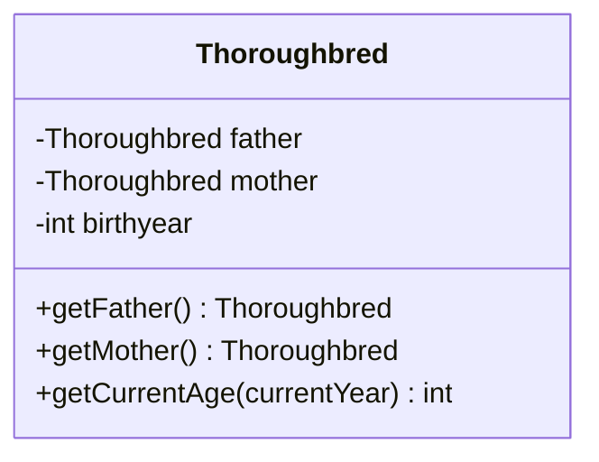
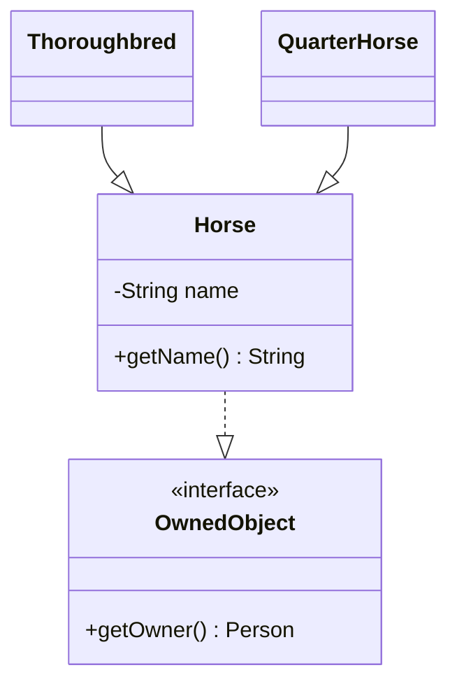
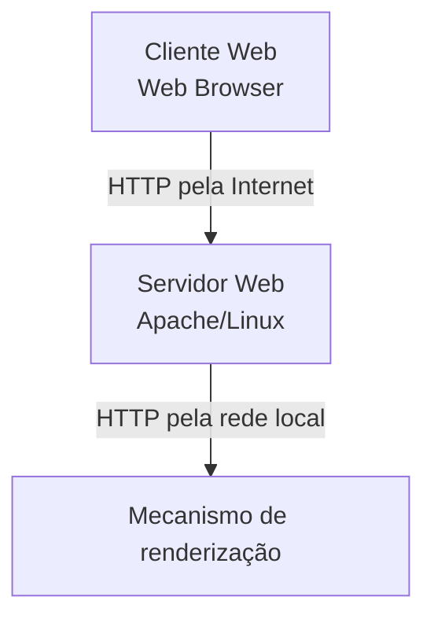
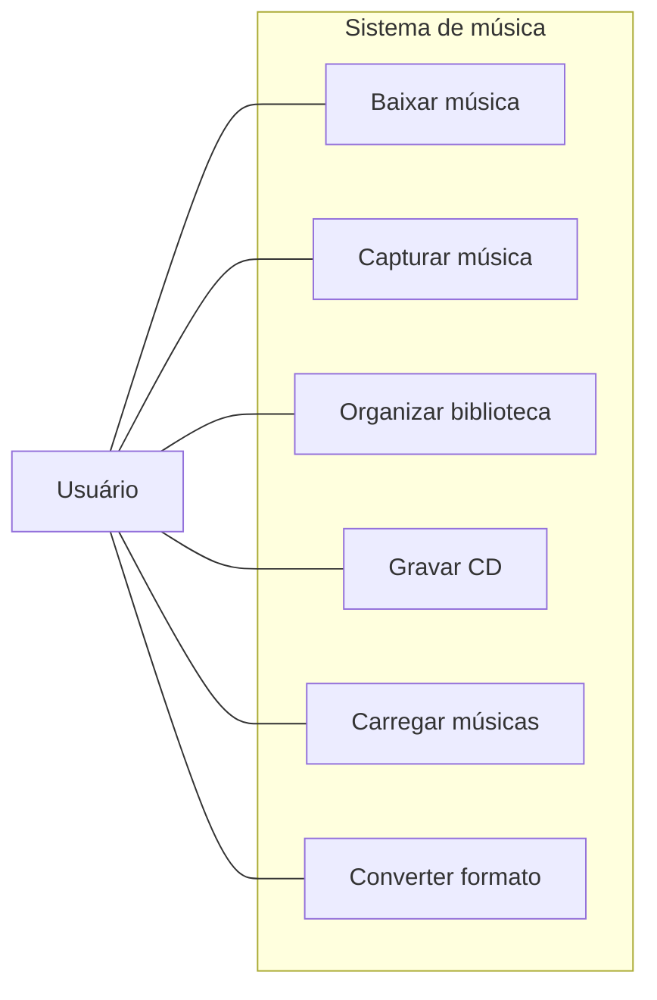
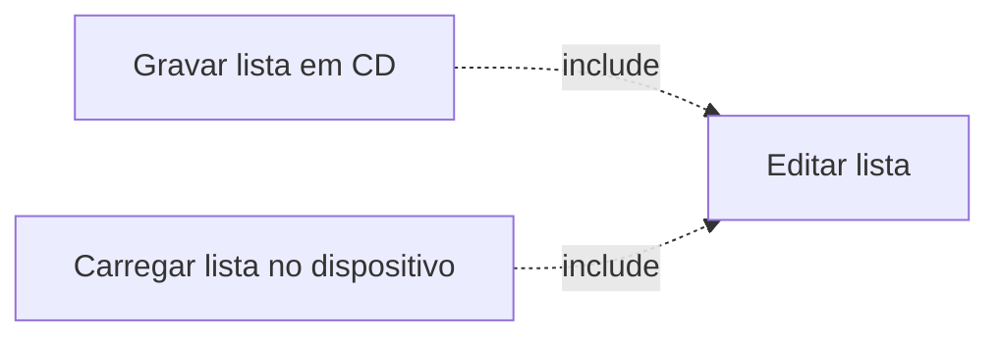
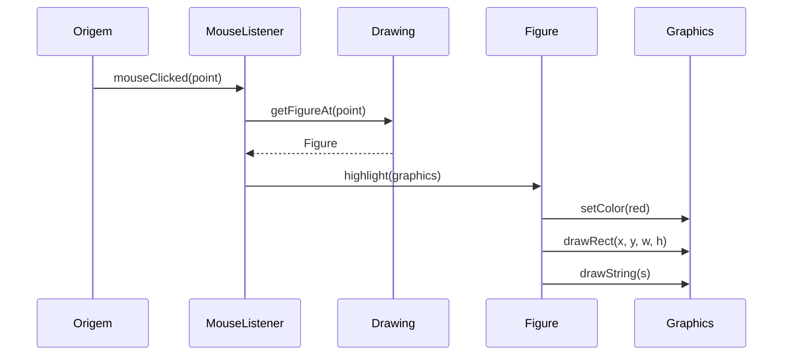
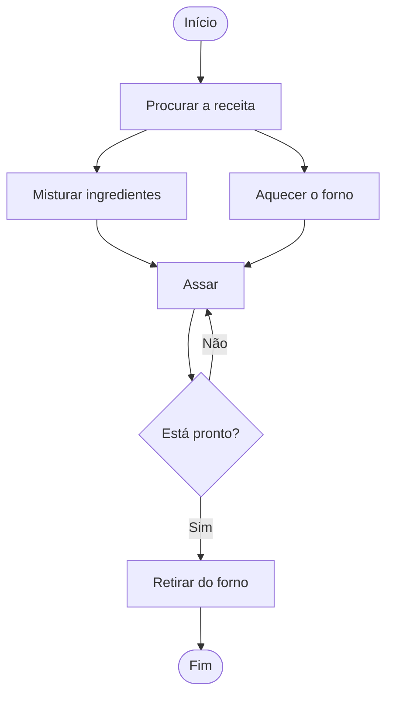
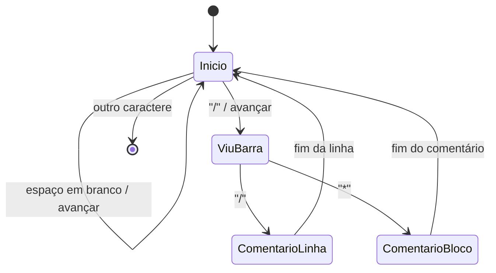
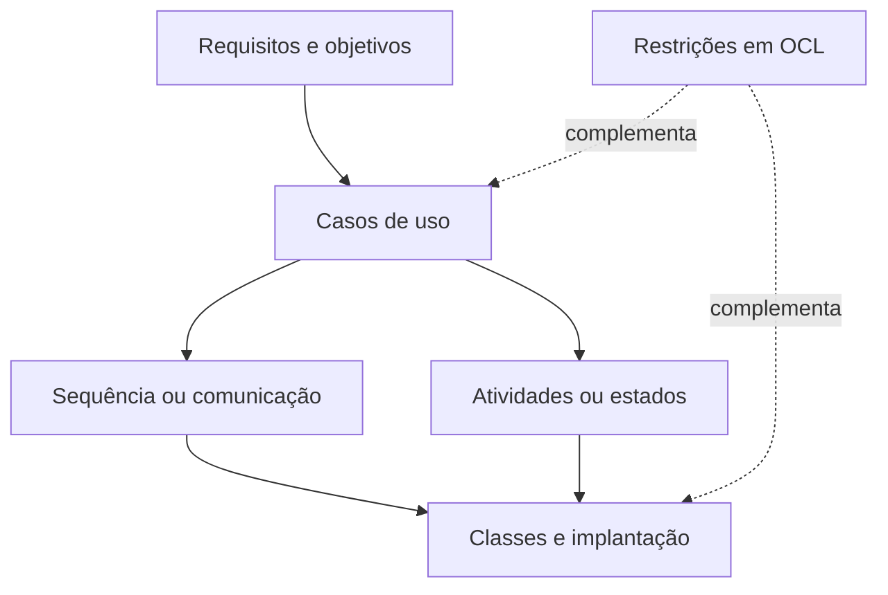

# Apêndice 1 — Introdução à UML

> [!info] Conceito
> A UML é uma linguagem padronizada de modelagem utilizada para visualizar, especificar, construir e documentar sistemas de software.

## 1. Visão geral da UML

A **UML** (*Unified Modeling Language*, ou Linguagem de Modelagem Unificada) fornece um vocabulário visual para representar diferentes aspectos de um sistema. Assim como os arquitetos elaboram plantas para orientar uma construção, os arquitetos de software utilizam diagramas UML para comunicar a estrutura, o comportamento e a distribuição dos componentes de um software.

A UML foi desenvolvida na década de 1990 por **Grady Booch, Jim Rumbaugh e Ivar Jacobson**, reunindo diferentes notações de modelagem utilizadas pela indústria. Em 1997, a UML 1.0 foi apresentada ao **OMG** (*Object Management Group*), organização responsável pela manutenção de especificações empregadas na área da computação. Posteriormente, a UML tornou-se também um padrão ISO.

A UML 2.3 disponibiliza treze tipos de diagramas. O apêndice concentra-se nos seguintes:

- diagrama de classes;
- diagrama de implantação;
- diagrama de casos de uso;
- diagrama de sequência;
- diagrama de comunicação;
- diagrama de atividades;
- diagrama de estados.

Esses diagramas oferecem perspectivas complementares. Alguns representam a estrutura estática do sistema, enquanto outros mostram seu comportamento dinâmico.

| Perspectiva | Diagramas apresentados |
|---|---|
| Estrutura estática | Classes e implantação |
| Funcionalidades externas | Casos de uso |
| Interações entre objetos | Sequência e comunicação |
| Fluxos e comportamentos | Atividades e estados |
| Restrições formais | OCL |

A UML possui muitos elementos opcionais. O projetista pode omitir detalhes que não sejam importantes para o aspecto modelado, evitando diagramas excessivamente congestionados. Portanto, a ausência de uma informação no diagrama não significa necessariamente que ela não exista no sistema; pode significar apenas que foi suprimida daquela representação.

> [!tip] Resumindo
> A UML não é um único diagrama, mas uma linguagem formada por diferentes representações, cada uma voltada para determinado aspecto do sistema.

## 2. Diagramas de classes

> [!info] Conceito
> O diagrama de classes apresenta a visão estática ou estrutural do sistema, mostrando classes, atributos, operações e relações entre classes.

Uma classe é representada por uma caixa dividida horizontalmente. As três seções mais comuns são:

1. **nome da classe**;
2. **atributos da classe**;
3. **operações ou comportamentos da classe**.

Os atributos representam propriedades que um objeto possui, calcula ou obtém de outros objetos. As operações descrevem aquilo que os objetos da classe podem fazer e geralmente são implementadas como métodos.



### 2.1 Atributos, operações e visibilidade

Um atributo pode apresentar nome, tipo e nível de visibilidade. O tipo aparece depois do nome, separado por dois-pontos. As operações também podem indicar visibilidade, parâmetros e tipo de retorno.

| Símbolo | Visibilidade |
|---|---|
| `-` | privada (*private*) |
| `#` | protegida (*protected*) |
| `~` | pacote (*package*) |
| `+` | pública (*public*) |

Os elementos estáticos ou pertencentes à classe podem ser representados sublinhados. Classes e métodos abstratos são indicados em itálico.

Uma interface pode ser identificada pelo estereótipo `<<interface>>` acima de seu nome ou por um pequeno círculo vazio.

> [!info] Estereótipo
> Um estereótipo acrescenta um significado específico a um elemento UML. Ele normalmente aparece entre sinais de menor e maior duplicados, como `<<interface>>`.

A caixa de uma classe também pode possuir uma quarta seção destinada às suas responsabilidades. Essa seção é útil durante a transição dos cartões CRC para os diagramas de classes, permitindo registrar responsabilidades antes da definição dos atributos e das operações que as realizarão.

### 2.2 Generalização e realização

A **generalização** corresponde à relação de herança. Ela é representada por uma linha contínua com uma ponta triangular vazia apontando da subclasse para a superclasse.

A **realização** representa a implementação de uma interface por uma classe. Ela utiliza uma linha tracejada com uma ponta triangular vazia apontando para a interface.



### 2.3 Associações e navegabilidade

Uma **associação** indica uma relação estrutural entre duas classes e é representada por uma linha contínua. A associação e suas extremidades podem possuir rótulos para indicar o papel exercido por cada classe.

Uma seta em uma extremidade indica **navegabilidade unidirecional**: a classe localizada na origem conhece ou consegue acessar a classe para a qual a seta aponta. Uma associação sem setas geralmente representa navegabilidade bidirecional, embora também possa significar que essa informação foi omitida por não ser importante.

Um atributo que tenha outra classe como tipo pode ser representado de duas maneiras:

- como um atributo dentro da classe;
- como uma associação entre as duas classes.

A representação como atributo é adequada para tipos primitivos. A associação costuma ser mais apropriada quando a classe relacionada desempenha um papel importante no projeto.

### 2.4 Dependência

A **dependência** é representada por uma linha tracejada. Uma classe depende de outra quando uma alteração na segunda pode exigir modificações na primeira.

As associações já implicam dependência. Portanto, não é necessário adicionar uma linha de dependência quando uma associação já estiver representada.

A dependência explícita é especialmente útil para relações transitórias, nas quais uma classe utiliza outra ocasionalmente, mas não mantém com ela uma relação estrutural duradoura. Um exemplo é uma classe que recebe temporariamente um objeto `Date` como parâmetro de um método.

### 2.5 Multiplicidade

A **multiplicidade** indica quantos objetos de uma classe podem estar associados a um objeto da outra classe.

| Notação | Significado |
|---|---|
| `0..1` | zero ou um |
| `1` | exatamente um |
| `1..*` | um ou mais |
| `0..*` ou `*` | zero ou mais |

Quando a multiplicidade é maior que um, os objetos relacionados provavelmente serão mantidos em alguma coleção, como uma lista ou um conjunto. Normalmente, essa classe de coleção não precisa aparecer no diagrama, pois sua presença pode ser inferida pela multiplicidade.

### 2.6 Agregação e composição

A **agregação** é uma associação especial que representa uma relação entre todo e parte. Ela é indicada por um losango vazio na extremidade correspondente ao todo. As partes podem continuar existindo independentemente do objeto agregador.

A **composição** representa uma relação mais forte de propriedade e utiliza um losango preenchido. Nesse caso, as partes não possuem função independente e seu ciclo de vida está vinculado ao objeto composto.

No exemplo do apêndice:

- uma universidade agrega edifícios, pois eles podem continuar existindo e receber outra utilização mesmo que a instituição deixe de existir;
- uma universidade é composta por cursos, pois os cursos não possuem finalidade independente da instituição que os oferece.

> [!warning] Atenção
> Na agregação, a parte pode existir independentemente do todo. Na composição, a parte acompanha o ciclo de vida do objeto proprietário.

### 2.7 Anotações e restrições

Uma anotação UML é representada por uma caixa com um canto dobrado, conectada a outro elemento por uma linha pontilhada. Ela pode conter comentários, explicações ou restrições.

Quando uma anotação expressa uma restrição, seu conteúdo é colocado entre chaves, como:

`{deve ocorrer em um edifício}`

> [!tip] Resumindo
> O diagrama de classes mostra a organização estrutural do sistema: quais classes existem, o que possuem, o que fazem e como se relacionam.

## 3. Diagramas de implantação

> [!info] Conceito
> O diagrama de implantação representa a distribuição física do sistema entre dispositivos de hardware e ambientes de execução.

Esse diagrama é útil quando o software está distribuído entre diferentes equipamentos. O exemplo apresentado descreve uma aplicação de renderização gráfica baseada na Web, constituída por:

- um computador cliente executando o navegador;
- um servidor Web;
- um equipamento separado responsável pela renderização.

A separação da renderização é necessária porque essa atividade pode exigir elevado poder computacional.



Os dispositivos são representados por caixas identificadas com `<<device>>`. Os caminhos de comunicação são mostrados por linhas, que podem indicar o protocolo ou o tipo de rede utilizado.

Um dispositivo pode conter:

- **artefatos**, normalmente arquivos de software executados no equipamento;
- **valores rotulados**, com dados como fornecedor e sistema operacional;
- **ambientes de execução**, representados por `<<execution environment>>`, como sistemas operacionais ou plataformas capazes de hospedar programas.

> [!tip] Resumindo
> O diagrama de implantação responde onde cada parte do software será executada e como os dispositivos envolvidos se comunicarão.

## 4. Casos de uso

> [!info] Conceito
> Um caso de uso descreve como um usuário interage com o sistema para alcançar determinado objetivo.

Os casos de uso ajudam a determinar as funcionalidades e características do software sob o ponto de vista do usuário. Como exemplo, o apêndice apresenta uma aplicação de gerenciamento de música digital que permite:

- baixar arquivos MP3 e armazená-los na biblioteca;
- capturar músicas transmitidas em *streaming*;
- organizar a biblioteca;
- excluir músicas;
- criar listas de reprodução;
- gravar listas de músicas em CD;
- transferir listas para um iPod ou reprodutor MP3;
- converter músicas entre os formatos MP3 e AAC.

Um caso de uso contém os passos necessários para atingir um objetivo específico. As variações desses passos formam diferentes **cenários**. Por exemplo, durante a gravação de uma lista em CD, pode existir um cenário alternativo para a situação em que todas as músicas não cabem na mídia.

> [!warning] Atenção
> O caso de uso é a descrição da interação necessária para atingir um objetivo. O cenário representa um caminho específico possível dentro dessa descrição.

## 5. Diagrama de casos de uso

> [!info] Conceito
> O diagrama de casos de uso fornece uma visão geral das funcionalidades do sistema, dos atores participantes e das relações entre os casos de uso.

Os **atores** representam categorias de usuários ou outros elementos que interagem externamente com o sistema. Sistemas complexos podem apresentar vários atores. Uma máquina de venda automática, por exemplo, pode envolver:

- clientes;
- profissionais de manutenção;
- fornecedores responsáveis pelo abastecimento.

Os casos de uso são representados por elipses e ligados aos atores por linhas. O limite do sistema é mostrado por um retângulo:

- os casos de uso permanecem dentro do retângulo;
- os atores permanecem fora dele.

Essa fronteira reforça que os atores são externos ao sistema, embora interajam com suas funcionalidades.



### 5.1 Relacionamento `<<include>>`

Casos de uso diferentes podem possuir uma sequência de passos em comum. Para evitar duplicação, esses passos são reunidos em um caso de uso reutilizável, incluído nos demais.

No sistema de música, gravar uma lista em CD e transferi-la para um dispositivo exigem a edição prévia da lista de músicas. Assim, essas funcionalidades incluem o caso de uso `Editar lista de músicas`.



O relacionamento `<<include>>` é representado por uma seta tracejada direcionada do caso de uso que inclui para o caso de uso incluído.

Esse conceito complementa a aula em vídeo: a inclusão representa um comportamento obrigatório e reutilizável. Quando o caso de uso principal é executado, o caso incluído também participa obrigatoriamente do processo.

### 5.2 Importância da descrição textual

O diagrama geral é útil para verificar se todas as funcionalidades do sistema foram consideradas. Entretanto, sua principal limitação é não apresentar os passos detalhados dos casos de uso.

Esses detalhes devem ser armazenados em descrições textuais separadas. Segundo o material, a principal contribuição dos casos de uso para o desenvolvimento de software está nessas descrições, pois elas permitem compreender claramente os objetivos e as interações do sistema.

> [!warning] Atenção
> O diagrama oferece uma visão geral, mas não substitui a descrição textual dos casos de uso. É no texto que ficam os passos, as condições e os cenários alternativos.

> [!tip] Relação com a aula
> A aula enfatizou a identificação dos atores e dos requisitos funcionais. O apêndice acrescenta que cada caso de uso deve ser descrito textualmente, incluindo o fluxo principal e suas possíveis variações.

## 6. Diagramas de sequência

> [!info] Conceito
> O diagrama de sequência representa as comunicações dinâmicas entre objetos, destacando a ordem temporal na qual as mensagens são enviadas.

Enquanto os diagramas de classes e de implantação mostram estruturas estáticas, o diagrama de sequência mostra o comportamento dos objetos durante a execução de uma tarefa. Ele pode ser empregado para detalhar as interações de um caso de uso ou de um cenário específico.

Cada participante aparece em uma caixa na parte superior do diagrama. A linha tracejada vertical abaixo da caixa é sua **linha de vida**. O tempo avança de cima para baixo.

As chamadas de métodos são representadas por setas horizontais entre os participantes. As setas podem ser identificadas com:

- nome do método;
- parâmetros;
- tipos dos parâmetros;
- tipo de retorno.



Uma **barra de ativação** pode ser desenhada sobre a linha de vida para indicar o período durante o qual o objeto está executando um método.

O retorno de uma chamada pode ser representado por uma seta tracejada. No entanto, é comum omiti-lo quando o método não retorna valor, evitando detalhes pouco relevantes.

Uma mensagem cuja origem seja desconhecida ou irrelevante pode ser representada por um círculo preto ligado a uma seta.

### 6.1 Frames de interação

Quando a interação contém laços, condições ou outras estruturas de controle, podem ser utilizados **frames de interação**. Eles são retângulos que envolvem uma parte do diagrama e indicam o tipo de estrutura.

Entre os principais frames apresentados estão:

- `loop`: repetição;
- `opt`: comportamento opcional.

As condições entre colchetes são denominadas **guardas**. A execução do conteúdo do frame depende de a guarda possuir valor verdadeiro.

Para destacar todas as figuras localizadas dentro de um retângulo, por exemplo, o sistema pode percorrer repetidamente os objetos `Figure` e destacar apenas aqueles que interceptam a área selecionada.

> [!tip] Clareza do modelo
> Quando uma interação pode seguir caminhos muito diferentes, pode ser mais claro elaborar um diagrama de sequência separado para cada possibilidade, em vez de concentrar toda a lógica em um único diagrama.

### 6.2 Recursos adicionais

Os diagramas de sequência também permitem representar:

- mensagens síncronas e assíncronas;
- mensagens que um objeto envia para si próprio;
- criação de objetos;
- destruição ou término da utilização de objetos;
- múltiplas estruturas de controle.

As mensagens síncronas utilizam pontas de seta preenchidas, enquanto as assíncronas utilizam pontas em traço. A criação pode ser indicada por `<<create>>`, e a destruição por um `X` no final da linha de vida.

> [!tip] Resumindo
> O diagrama de sequência mostra quem envia cada mensagem, quem a recebe e em qual ordem temporal a interação acontece.

## 7. Diagramas de comunicação

> [!info] Conceito
> O diagrama de comunicação também representa mensagens entre objetos, mas destaca suas relações estruturais em vez de privilegiar a linha temporal.

Esse diagrama era denominado **diagrama de colaboração** na UML 1.x. Os objetos são representados por retângulos e ligados por linhas que indicam suas associações.

As mensagens aparecem como setas e recebem numeração hierárquica para mostrar sua ordem e seu aninhamento:

- `1` indica a mensagem inicial;
- `1.1` indica a primeira mensagem provocada pela mensagem 1;
- `1.2` indica a segunda mensagem provocada pela mensagem 1;
- `1.2.1` indica uma mensagem chamada durante a execução de 1.2.

No exemplo do programa de desenho, a ordem é:

1. `mouseClicked(point)`;
2. `getFigureAt(point)`;
3. `highlight(graphics)`;
4. `setColor(red)`;
5. `drawRect(x,y,w,h)`;
6. `drawString(s)`.

A numeração evidencia tanto a sequência quanto o aninhamento das chamadas.

Também é possível acrescentar letras aos números para representar diferentes sequências de comandos ou *threads*.

| Necessidade principal | Diagrama mais adequado |
|---|---|
| Enfatizar a ordem temporal das mensagens | Sequência |
| Enfatizar as relações entre os objetos | Comunicação |

> [!tip] Resumindo
> Os diagramas de sequência e de comunicação podem representar a mesma interação. A escolha depende de qual aspecto precisa receber maior destaque.

## 8. Diagramas de atividades

> [!info] Conceito
> O diagrama de atividades mostra o fluxo de controle entre as ações executadas pelo sistema e permite representar sequências, decisões e atividades concorrentes.

O diagrama de atividades é semelhante a um fluxograma, mas possui recursos específicos para mostrar atividades executadas paralelamente.

Seus principais elementos são:

- **nó inicial:** círculo preto que marca o começo da atividade;
- **nó de ação:** retângulo arredondado que representa uma tarefa;
- **fluxo de controle:** seta que indica a sequência entre ações;
- **nó final:** círculo preto envolvido por outro círculo;
- **fork:** divisão do fluxo em atividades concorrentes;
- **join:** sincronização de atividades concorrentes;
- **nó de decisão:** escolha do caminho com base em uma condição;
- **raias:** divisão das responsabilidades entre participantes.

### 8.1 Fork e atividades concorrentes

O **fork** é uma barra da qual partem dois ou mais fluxos. Ele indica que as atividades seguintes podem ser executadas concorrentemente, por diferentes *threads* ou até por computadores distintos.

No exemplo da preparação de um bolo, as seguintes ações podem ocorrer paralelamente:

- misturar os ingredientes secos;
- misturar os ingredientes molhados;
- aquecer o forno.

### 8.2 Join e sincronização

O **join** reúne dois ou mais fluxos concorrentes. A ação seguinte somente pode começar depois que todos os fluxos recebidos estiverem concluídos.

No exemplo:

- os ingredientes secos e molhados precisam estar preparados antes de serem combinados;
- a mistura deve estar pronta e o forno aquecido antes que o bolo seja assado.

### 8.3 Decisões e guardas

O nó de decisão representa uma ramificação condicionada. Cada fluxo de saída contém uma condição entre colchetes. O fluxo prossegue pela saída cuja condição seja verdadeira.

Após assar o bolo, por exemplo:

- se estiver pronto, ele será retirado do forno;
- se não estiver pronto, permanecerá assando.

As condições devem abranger todas as possibilidades, garantindo que exatamente um caminho seja escolhido.



### 8.4 Raias

As **raias** (*swimlanes*) dividem o diagrama em faixas correspondentes aos participantes. Todas as ações inseridas em determinada faixa são de responsabilidade do participante indicado.

Elas são úteis quando é importante mostrar não apenas quais ações são realizadas, mas também quem executa cada uma delas.

> [!tip] Resumindo
> O diagrama de atividades é apropriado para representar processos com sequência, paralelismo, sincronização, decisões e divisão de responsabilidades.

## 9. Diagramas de estados

> [!info] Conceito
> O diagrama de estados representa os estados de um objeto, as transições entre esses estados e as ações realizadas em resposta a eventos.

O comportamento de um objeto frequentemente depende de seu estado atual, determinado pelos valores de suas variáveis em determinado momento. O mesmo evento pode provocar comportamentos diferentes conforme o estado do objeto.

O exemplo do apêndice utiliza uma parte de um compilador Java responsável por ignorar:

- espaços;
- tabulações;
- novas linhas;
- retornos;
- comentários de linha;
- comentários de bloco.

Quando o componente encontra `/`, ainda não sabe se o caractere representa:

- uma divisão;
- parte do operador `/=`;
- o início de um comentário de linha `//`;
- o início de um comentário de bloco `/*`.

Por isso, ele precisa registrar o caractere encontrado e mudar de estado enquanto examina o caractere seguinte.

### 9.1 Elementos do diagrama de estados

Os estados são representados por retângulos arredondados. O pseudoestado inicial é um círculo preto que aponta para o primeiro estado.

As setas entre os estados representam transições. Uma transição pode ser rotulada da seguinte maneira:

`evento / atividade`

- **evento:** ocorrência que dispara a transição;
- **atividade:** ação executada quando a transição acontece.

Todos os componentes do rótulo são opcionais.

O estado final é indicado por um círculo preto envolvido por outro círculo e representa o encerramento do comportamento modelado.

### 9.2 Funcionamento do exemplo do compilador

O objeto inicia no estado `start`. Se encontrar um espaço em branco, avança para o próximo caractere e retorna ao estado inicial.

Se encontrar `/`, muda para um estado intermediário:

- se o próximo caractere também for `/`, entra no estado de comentário de linha;
- se o próximo caractere for `*`, entra no estado de comentário de bloco;
- se for outro caractere, a `/` não inicia um comentário e precisa ser devolvida ao fluxo por uma operação de retrocesso, denominada `pushback`.

Depois de ignorar um comentário ou uma sequência de espaços em branco, o componente retorna ao estado inicial, pois pode encontrar imediatamente outro espaço ou comentário.



O diagrama ajuda a descobrir situações esquecidas ou inesperadas, pois permite verificar se todos os eventos possíveis foram considerados em cada estado.

### 9.3 Estado de atividade

Normalmente, um objeto permanece em determinado estado aguardando um evento. Entretanto, um **estado de atividade** executa continuamente determinada ação, denominada `do-activity`.

Essa ação é indicada na parte inferior do estado:

`do/atividade`

A atividade pode:

- terminar antes de ocorrer uma transição;
- ser interrompida se o objeto deixar o estado antes de sua conclusão.

O exemplo utiliza uma chamada telefônica colocada em espera. Enquanto permanece no estado de espera, o sistema toca música por dez segundos. Se uma tecla de cancelamento for pressionada antes desse período, a música é interrompida e ocorre a transição para outro estado.

Uma transição sem evento ocorre imediatamente em estados normais ou assim que a `do-activity` termina em um estado de atividade.

> [!tip] Resumindo
> O diagrama de estados é especialmente útil quando o comportamento depende do histórico e do estado atual do objeto.

## 10. Object Constraint Language — OCL

> [!info] Conceito
> A OCL é uma linguagem formal que complementa os diagramas UML, permitindo especificar restrições de maneira precisa e sem ambiguidades.

Os diagramas gráficos nem sempre são suficientes para expressar todas as condições de um projeto. Restrições escritas somente em linguagem natural podem gerar interpretações inconsistentes ou ambíguas.

A **OCL** (*Object Constraint Language*) utiliza uma gramática formal, combinando conceitos de teoria dos conjuntos e linguagens de especificação com uma sintaxe semelhante à de linguagens de programação.

Uma instrução OCL simples pode conter quatro partes:

1. **contexto:** situação ou elemento para o qual a instrução é válida;
2. **propriedade:** característica do contexto, como um atributo;
3. **operação:** manipulação ou qualificação da propriedade;
4. **palavras-chave:** elementos condicionais, como `if`, `then`, `else`, `and`, `or`, `not` e `implies`.

### 10.1 Condições de guarda

A OCL pode formalizar uma condição de guarda. Em um sistema de impressão, por exemplo, a autorização de um trabalho pode depender de o cliente possuir autoridade para aprovar seu custo.

```text
customer
    self.authorizationAuthority = 'yes'
```

A expressão declara que o atributo `authorizationAuthority` do cliente precisa possuir o valor `yes` para que a condição seja satisfeita.

### 10.2 Pré-condições e pós-condições

A OCL também permite declarar condições que devem ser verdadeiras antes ou depois de uma operação.

- **pré-condição (`pre`):** deve ser satisfeita antes da execução;
- **pós-condição (`post`):** deve ser satisfeita depois da execução;
- **invariante (`inv`):** condição que deve permanecer válida no contexto especificado.

No exemplo do sistema de impressão, o trabalho somente poderá ser autorizado se:

- o limite de custo for maior que zero;
- o prazo solicitado for válido;
- o trabalho ainda não estiver autorizado;
- o custo calculado não exceder o limite;
- a data de entrega não ultrapassar o prazo solicitado.

Uma pós-condição como:

```text
self.jobAuthorization = 'yes'
```

não realiza uma atribuição diretamente. Ela declara que, ao término da operação, `jobAuthorization` deverá possuir o valor `yes`.

> [!warning] Atenção
> Em OCL, o sinal `=` expressa uma condição que deve ser verdadeira; não representa necessariamente um comando de atribuição como em algumas linguagens de programação.

> [!tip] Resumindo
> A OCL acrescenta precisão formal aos modelos UML, principalmente na definição de guardas, invariantes, pré-condições e pós-condições.

## 11. Relação entre os diagramas

> [!info] Conceito
> Os diagramas UML não competem entre si. Eles apresentam perspectivas complementares do mesmo sistema.

| Diagrama | Principal pergunta respondida |
|---|---|
| Classes | Quais classes existem e como se relacionam? |
| Implantação | Em quais dispositivos e ambientes o sistema será executado? |
| Casos de uso | Quais objetivos os atores alcançam por meio do sistema? |
| Sequência | Em qual ordem temporal os objetos trocam mensagens? |
| Comunicação | Como os objetos relacionados colaboram por meio de mensagens? |
| Atividades | Qual é o fluxo de ações, decisões e atividades paralelas? |
| Estados | Como o comportamento do objeto varia conforme seu estado? |
| OCL | Quais condições formais e restrições devem ser satisfeitas? |

Um caso de uso pode, por exemplo, ser complementado por:

- uma descrição textual com seu fluxo principal e seus cenários alternativos;
- um diagrama de sequência mostrando a ordem das mensagens;
- um diagrama de comunicação destacando as relações entre os objetos;
- um diagrama de atividades mostrando o fluxo das ações;
- um diagrama de estados quando o comportamento depender do estado de um objeto;
- um diagrama de classes apresentando os elementos estruturais envolvidos;
- expressões OCL formalizando restrições e condições.



# Síntese final

> [!summary] Síntese
> A UML oferece diferentes diagramas para representar a estrutura, o comportamento, as interações e a distribuição física de um sistema. Cada diagrama seleciona uma perspectiva específica e pode omitir detalhes que não sejam relevantes ao objetivo da modelagem.

Os principais pontos do apêndice são:

- a UML é uma linguagem padronizada de modelagem e documentação de software;
- diagramas de classes representam classes, atributos, operações e relações estruturais;
- generalização representa herança, enquanto realização representa a implementação de uma interface;
- associações podem possuir navegabilidade, papéis e multiplicidades;
- agregação e composição expressam diferentes intensidades da relação entre todo e parte;
- diagramas de implantação mostram a distribuição do software entre dispositivos e ambientes de execução;
- casos de uso descrevem interações realizadas para alcançar objetivos;
- cenários representam caminhos específicos ou variações de um caso de uso;
- diagramas de casos de uso oferecem uma visão geral das funcionalidades e da fronteira do sistema;
- `<<include>>` permite reutilizar sequências obrigatórias compartilhadas por diferentes casos de uso;
- as descrições textuais são mais importantes para o detalhamento do que o diagrama geral;
- diagramas de sequência enfatizam a ordem temporal das mensagens;
- diagramas de comunicação enfatizam as relações entre os objetos participantes;
- diagramas de atividades representam ações, decisões, paralelismo, sincronização e responsabilidades;
- diagramas de estados representam comportamentos dependentes do estado atual de um objeto;
- a OCL complementa os elementos gráficos com restrições formais e não ambíguas;
- os diferentes diagramas devem ser utilizados em conjunto, conforme os aspectos do sistema que precisam ser compreendidos e comunicados.