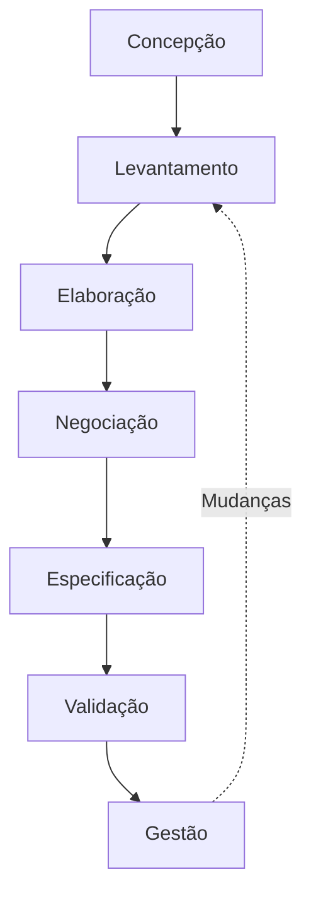
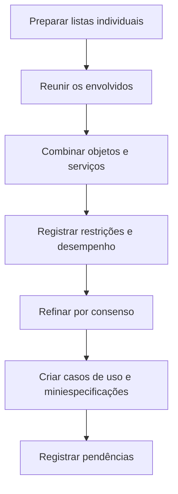
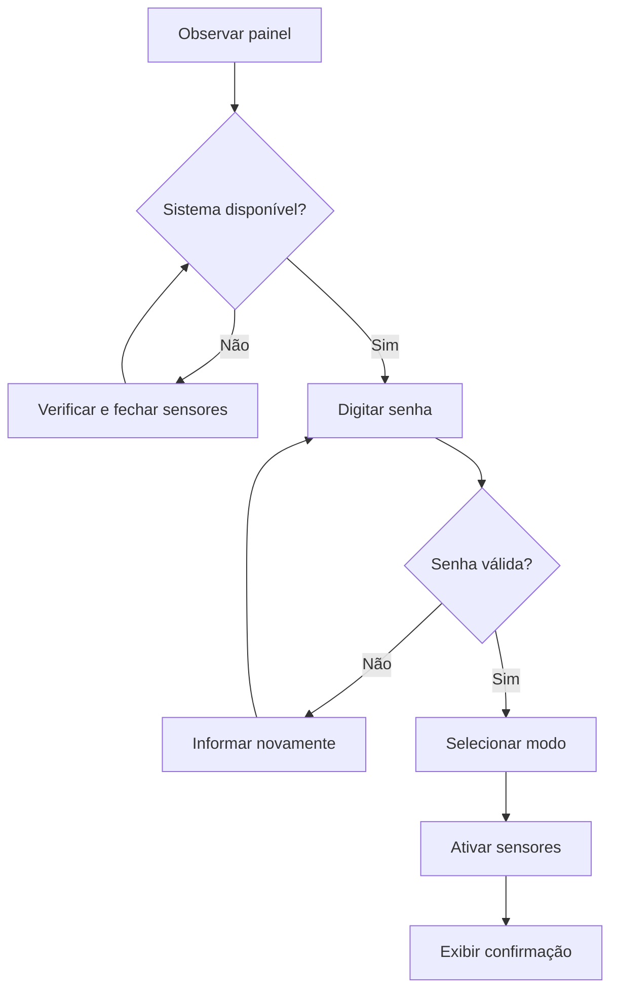
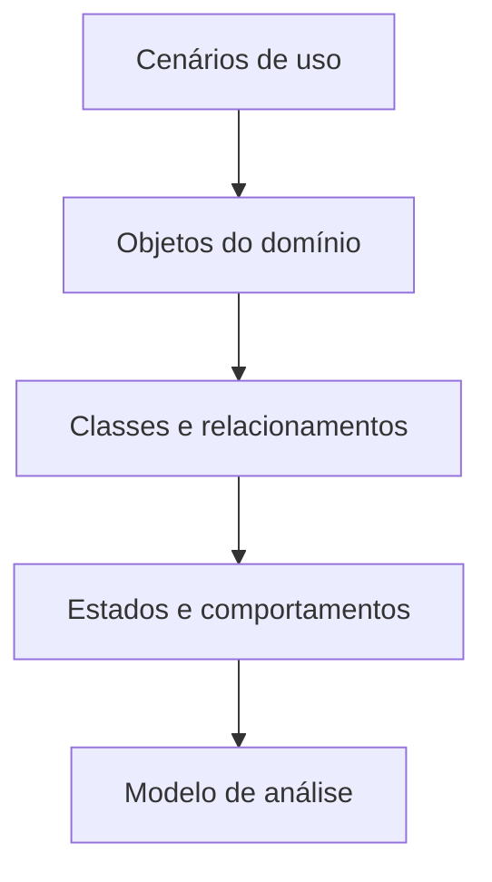
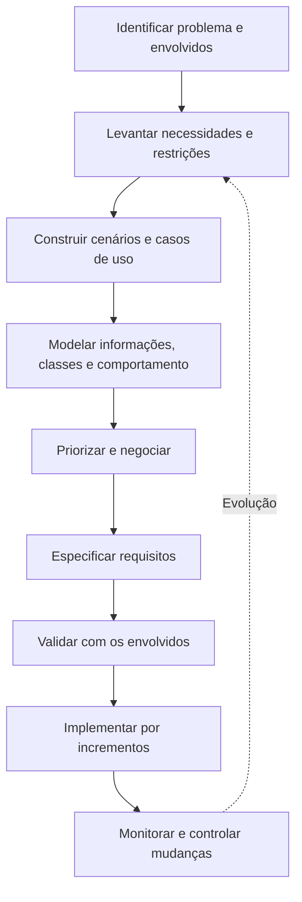

# Entendendo os requisitos

## 1. Importância da engenharia de requisitos

> [!info] Conceito
> A engenharia de requisitos reúne tarefas e técnicas destinadas a compreender o problema, identificar as necessidades dos envolvidos e estabelecer uma base confiável para o projeto e a construção do software.

Entender corretamente os requisitos está entre as atividades mais difíceis da Engenharia de Software. Clientes e usuários nem sempre sabem expressar com clareza aquilo de que precisam e, mesmo quando conseguem fazê-lo, suas necessidades podem mudar ao longo do projeto.

O desenvolvimento de um sistema tecnicamente sofisticado não será bem-sucedido se resolver o problema errado. Por isso, antes da implementação, é necessário compreender:

- o impacto do software sobre o negócio;
- o problema que precisa ser resolvido;
- as necessidades dos clientes e usuários;
- as restrições técnicas e organizacionais;
- as funções e características esperadas;
- como os usuários interagirão com o sistema;
- as prioridades que orientarão o desenvolvimento.

A engenharia de requisitos começa durante a comunicação com os envolvidos e continua na atividade de modelagem. Ela deve ser adaptada ao tamanho, à complexidade e às características de cada projeto.

> [!warning] Atenção
> Começar a programar sem compreender suficientemente o problema pode produzir um software funcional que não atende às necessidades reais do cliente.

---

## 2. Tarefas da engenharia de requisitos

A engenharia de requisitos abrange sete tarefas principais:

1. **Concepção**
2. **Levantamento**
3. **Elaboração**
4. **Negociação**
5. **Especificação**
6. **Validação**
7. **Gestão**

Essas tarefas não precisam ocorrer de forma estritamente sequencial. Algumas podem ser realizadas paralelamente ou retomadas à medida que surgem novas informações.

### Concepção

A concepção estabelece um entendimento inicial sobre:

- o problema;
- as pessoas que necessitam da solução;
- a natureza da solução esperada;
- a abrangência preliminar do projeto;
- a viabilidade inicial;
- a comunicação entre os envolvidos e a equipe de software.

Um projeto normalmente começa quando uma necessidade de negócio é identificada ou quando surge uma oportunidade de produto, serviço ou mercado.

### Levantamento

O levantamento, também denominado **elicitação de requisitos**, procura descobrir:

- os objetivos do sistema;
- as necessidades dos envolvidos;
- as funções esperadas;
- as restrições;
- o ambiente de utilização;
- os critérios de desempenho;
- os requisitos funcionais e não funcionais.

Apesar de parecer suficiente perguntar ao cliente o que ele deseja, o levantamento é uma atividade complexa, pois os envolvidos podem não conhecer completamente o problema ou não conseguir comunicar suas necessidades.

### Elaboração

Na elaboração, as informações obtidas são refinadas e transformadas em um modelo mais detalhado dos requisitos. São identificados:

- cenários de utilização;
- entidades do domínio;
- classes de análise;
- atributos;
- operações ou serviços;
- relacionamentos;
- fluxos de informação;
- estados e comportamentos.

A elaboração deve descrever suficientemente o problema para orientar o projeto, sem antecipar indevidamente as decisões de projeto e implementação.

### Negociação

A negociação procura conciliar:

- requisitos conflitantes;
- diferentes prioridades;
- funcionalidades desejadas;
- custos;
- prazos;
- riscos;
- recursos humanos e tecnológicos disponíveis.

Os requisitos podem ser eliminados, combinados, adiados ou modificados para que se alcance uma solução viável e aceitável.

### Especificação

A especificação registra o entendimento alcançado. Ela pode assumir diferentes formas:

- documento em linguagem natural;
- modelos gráficos;
- modelo matemático formal;
- casos de uso;
- protótipos;
- combinação desses artefatos.

O formato e o nível de formalidade dependem do tamanho, da complexidade, da criticidade e do contexto do software.

### Validação

A validação verifica se os requisitos:

- representam as necessidades dos envolvidos;
- estão completos;
- são claros e não ambíguos;
- não apresentam inconsistências;
- são viáveis;
- podem ser testados;
- seguem os padrões definidos para o projeto.

### Gestão

A gestão de requisitos identifica, controla e acompanha os requisitos e suas mudanças ao longo do ciclo de vida do sistema.

| Tarefa | Questão principal |
|---|---|
| Concepção | Qual é o problema e quem precisa da solução? |
| Levantamento | O que os envolvidos realmente necessitam? |
| Elaboração | Como representar e detalhar essas necessidades? |
| Negociação | O que é prioritário e viável? |
| Especificação | Como registrar os requisitos? |
| Validação | Os requisitos estão corretos e verificáveis? |
| Gestão | Como acompanhar requisitos e mudanças? |

---

## 3. Dificuldades do levantamento de requisitos

Os problemas enfrentados durante o levantamento podem ser agrupados em três categorias.

### Problemas de escopo

Ocorrem quando os limites do sistema são definidos de maneira inadequada. Clientes e usuários também podem apresentar detalhes técnicos prematuros que desviam a atenção dos objetivos gerais.

### Problemas de entendimento

Ocorrem quando os envolvidos:

- não sabem exatamente do que precisam;
- desconhecem as possibilidades e limitações tecnológicas;
- não compreendem completamente o domínio;
- têm dificuldade para comunicar suas necessidades;
- omitem informações consideradas “óbvias”;
- apresentam requisitos ambíguos;
- solicitam requisitos impossíveis de testar;
- entram em conflito com outros envolvidos.

### Problemas de volatilidade

Ocorrem porque requisitos, prioridades e necessidades mudam ao longo do tempo. A volatilidade não pode ser completamente eliminada, mas precisa ser administrada.

> [!tip] Resumindo
> O levantamento de requisitos deve ser organizado para controlar problemas de escopo, entendimento e mudança.

---

## 4. Estabelecimento da base de trabalho

> [!info] Conceito
> Antes de detalhar os requisitos, a equipe precisa identificar os envolvidos, compreender seus diferentes pontos de vista e estabelecer uma forma colaborativa de trabalho.

### Identificação dos envolvidos

Um **envolvido** ou *stakeholder* é qualquer pessoa ou organização que tenha interesse direto ou indireto no sistema ou que possa beneficiar-se dele.

Entre os envolvidos, podem estar:

- gerentes de operações;
- gerentes de produto;
- profissionais de marketing;
- clientes internos e externos;
- usuários;
- consultores;
- engenheiros de produto;
- desenvolvedores;
- testadores;
- equipes de suporte e manutenção.

Cada envolvido possui expectativas, benefícios pretendidos e riscos diferentes. A lista inicial deve ser ampliada perguntando a cada participante quem mais deveria ser consultado.

### Reconhecimento dos pontos de vista

Os requisitos são analisados sob perspectivas diferentes:

| Envolvido | Interesse predominante |
|---|---|
| Marketing | Recursos capazes de atrair o mercado |
| Gerência comercial | Custo, prazo e oportunidade de lançamento |
| Usuários | Facilidade de aprendizagem e utilização |
| Engenheiros de software | Arquitetura, infraestrutura e viabilidade técnica |
| Suporte e manutenção | Facilidade de correção e evolução |

Os pontos de vista podem revelar necessidades complementares, mas também requisitos inconsistentes ou conflitantes. Todas as contribuições devem ser registradas e classificadas antes da decisão sobre o conjunto final.

### Colaboração

A colaboração busca identificar:

- áreas de concordância;
- requisitos comuns;
- conflitos;
- inconsistências;
- prioridades relativas.

Ela não significa necessariamente que todas as decisões serão tomadas por um comitê. Um responsável pelo produto ou defensor do projeto pode ter a decisão final, depois de considerar as contribuições.

Uma técnica possível é a distribuição de **pontos de prioridade**. Cada envolvido recebe uma quantidade limitada de pontos e os distribui entre os requisitos. A soma indica a importância relativa atribuída pelo grupo.

---

## 5. Questões iniciais e comunicação com os envolvidos

As primeiras perguntas devem ser **livres de contexto**, isto é, formuladas sem pressupor antecipadamente uma solução técnica.

### Perguntas sobre os envolvidos e os objetivos

- Quem solicitou este trabalho?
- Quem utilizará a solução?
- Qual benefício econômico se espera?
- Existe alguma solução alternativa disponível?

### Perguntas sobre o problema

- Como seria uma saída considerada satisfatória?
- Quais problemas a solução deverá resolver?
- Em qual ambiente de negócios ela será utilizada?
- Existem restrições de desempenho?
- Quais resultados demonstrariam que o sistema foi bem-sucedido?

### Metaperguntas sobre a comunicação

- Esta é a pessoa correta para responder?
- As respostas fornecidas são oficiais?
- As perguntas são relevantes?
- Existe outra pessoa que possa fornecer informações adicionais?
- Há alguma pergunta importante que não foi feita?

A reunião inicial pode adotar o formato de perguntas e respostas. Entretanto, as reuniões seguintes devem combinar colaboração, resolução de problemas, negociação e especificação.

> [!warning] Atenção
> Entrevistar apenas um usuário pode produzir uma visão parcial do sistema. Quando houver muitos usuários, a amostra consultada deve ser representativa.

---

## 6. Requisitos não funcionais

> [!info] Conceito
> Requisitos não funcionais descrevem atributos de qualidade, desempenho, segurança e restrições gerais aplicáveis ao sistema.

Exemplos de aspectos não funcionais:

- usabilidade;
- confiabilidade;
- disponibilidade;
- desempenho;
- segurança;
- privacidade;
- integridade;
- manutenibilidade;
- testabilidade;
- compatibilidade;
- restrições tecnológicas;
- restrições arquiteturais.

Esses requisitos podem ser mais difíceis de identificar porque os envolvidos tendem a concentrar-se nas funcionalidades. Entretanto, um sistema com as funções corretas pode ser inadequado se for inseguro, lento, difícil de usar ou impossível de manter.

Uma abordagem para identificar requisitos não funcionais consiste em:

1. estabelecer diretrizes de Engenharia de Software;
2. listar os requisitos não funcionais relevantes;
3. relacionar cada requisito às diretrizes;
4. identificar relações complementares, sobrepostas, conflitantes ou independentes;
5. priorizar os requisitos;
6. selecionar um conjunto coerente.

> [!warning] Atenção
> Expressões como “o sistema deve ser amigável” não são suficientemente precisas. Sempre que possível, os atributos de qualidade devem possuir critérios objetivos de avaliação.

---

## 7. Rastreabilidade

> [!info] Conceito
> Rastreabilidade é o registro das relações entre os requisitos e os demais artefatos da Engenharia de Software.

Um requisito pode estar relacionado a:

- objetivos do negócio;
- casos de uso;
- componentes da arquitetura;
- classes;
- funcionalidades;
- código-fonte;
- casos de teste;
- documentação;
- solicitações de mudança.

Uma matriz de rastreabilidade apresenta os requisitos nas linhas e os demais artefatos nas colunas. As células indicam quais relações existem.

| Requisito | Caso de uso | Componente | Caso de teste |
|---|---|---|---|
| R01 | UC01 | Autenticação | CT01 |
| R02 | UC02 | Monitoramento | CT02 e CT03 |
| R03 | UC03 | Notificações | CT04 |

A rastreabilidade ajuda a:

- verificar se todos os requisitos foram implementados;
- confirmar se existem testes correspondentes;
- avaliar o impacto de mudanças;
- manter a continuidade entre as fases;
- acompanhar a evolução do sistema.

À medida que aumenta a quantidade de requisitos e artefatos, a manutenção manual da matriz se torna mais difícil, podendo exigir ferramentas especializadas.

---

## 8. Coleta colaborativa de requisitos

A coleta colaborativa reúne engenheiros de software e outros envolvidos para identificar o problema e desenvolver uma visão inicial da solução.

As reuniões devem seguir algumas diretrizes:

- contar com participantes técnicos e não técnicos;
- possuir regras de preparação e participação;
- utilizar uma agenda suficientemente organizada;
- permitir a livre apresentação de ideias;
- contar com um facilitador;
- empregar mecanismos de registro, como planilhas, quadros, cartões ou ferramentas colaborativas.

Antes da reunião, cada participante pode preparar listas de:

- objetos pertencentes ao ambiente;
- objetos produzidos ou utilizados pelo sistema;
- serviços ou funções;
- restrições;
- critérios de desempenho.

Durante a reunião:

1. as listas individuais são apresentadas;
2. os itens repetidos são combinados;
3. novas ideias são acrescentadas;
4. inicialmente, evita-se excluir ou criticar sugestões;
5. o facilitador coordena a discussão;
6. o grupo refina a lista;
7. os itens são descritos por miniespecificações ou casos de uso;
8. questões sem solução imediata são registradas como pendências.

### Exemplo: CasaSegura

O capítulo utiliza o sistema **CasaSegura** para ilustrar o levantamento de requisitos. Na função de segurança domiciliar, foram identificados objetos como:

- painel de controle;
- detectores de fumaça;
- sensores de portas e janelas;
- detectores de movimento;
- alarme;
- eventos;
- display;
- computador;
- números e ligações telefônicas.

Entre os serviços, encontram-se:

- configurar o sistema;
- programar o painel;
- monitorar sensores;
- acionar o alarme;
- realizar uma ligação;
- consultar informações.

As restrições e os critérios de desempenho podem determinar que:

- o sistema identifique sensores inoperantes;
- conecte-se a uma linha telefônica;
- possua facilidade de uso;
- reconheça um evento em até determinado intervalo;
- utilize prioridades para os eventos.

---

## 9. Disponibilização da função de qualidade — QFD

> [!info] Conceito
> A disponibilização da função de qualidade, ou QFD (*Quality Function Deployment*), traduz as necessidades do cliente em requisitos técnicos do software.

O QFD concentra-se naquilo que representa valor para o cliente e procura maximizar sua satisfação.

Os requisitos são classificados em três grupos:

### Requisitos normais

São objetivos e necessidades explicitamente declarados. Quando implementados, proporcionam a satisfação esperada.

### Requisitos esperados

São considerados básicos e normalmente não são mencionados pelo cliente. Sua presença pode não causar entusiasmo, mas sua ausência produz forte insatisfação.

### Requisitos fascinantes

Superam as expectativas do cliente. Não são essenciais, mas podem aumentar significativamente a satisfação e diferenciar o produto.

| Tipo | Característica | Efeito |
|---|---|---|
| Normal | Declarado pelo cliente | Produz a satisfação esperada |
| Esperado | Implícito e básico | Sua ausência provoca insatisfação |
| Fascinante | Supera expectativas | Gera elevada satisfação |

O QFD utiliza fontes como:

- observação;
- entrevistas;
- pesquisas;
- dados históricos;
- relatórios de problemas;
- manifestações dos clientes.

Essas informações são organizadas na chamada **tabela da voz do cliente** e examinadas por meio de matrizes e métodos de avaliação.

> [!warning] Atenção
> Requisitos fascinantes podem diferenciar o produto, mas sua inclusão indiscriminada pode provocar crescimento descontrolado do escopo.

---

## 10. Cenários e jornadas de usuário

À medida que os requisitos são levantados, torna-se necessário compreender como as diferentes classes de usuários utilizarão as funcionalidades.

Os cenários descrevem um roteiro de utilização do sistema e permitem identificar:

- o objetivo do usuário;
- as interações necessárias;
- as respostas do sistema;
- as informações manipuladas;
- as condições normais;
- as exceções.

Nos processos ágeis, os requisitos podem ser registrados como **jornadas** ou **histórias de usuário**, redigidas na linguagem do próprio usuário. Elas descrevem requisitos simples que podem ser selecionados para o próximo incremento.

Essa abordagem:

- aproxima a equipe dos usuários;
- facilita a priorização;
- permite escolher pequenos grupos de requisitos;
- favorece entregas incrementais;
- concentra a comunicação no valor esperado.

Entretanto, histórias muito breves podem não representar suficientemente:

- metas globais do negócio;
- requisitos não funcionais;
- segurança;
- desempenho;
- necessidades de evolução futura.

Por isso, conforme a complexidade e a criticidade do sistema, pode ser necessário complementar as histórias com outros artefatos.

---

## 11. Artefatos do levantamento de requisitos

Os artefatos produzidos variam conforme o tamanho e a complexidade do sistema. Entre os principais, estão:

1. declaração de necessidade e viabilidade;
2. definição da abrangência ou do escopo;
3. lista de clientes, usuários e demais envolvidos;
4. descrição do ambiente técnico;
5. lista de requisitos organizada por função;
6. restrições do domínio;
7. cenários de utilização;
8. casos de uso;
9. protótipos;
10. lista de questões pendentes.

Todos os artefatos devem ser revisados pelas pessoas que participaram do levantamento.

> [!tip] Resumindo
> O levantamento não produz necessariamente um único documento. Seu resultado é um conjunto de artefatos que registra o problema, os envolvidos, o escopo, os requisitos, as restrições e as formas de utilização.

---

## 12. Métodos orientados a serviços

No desenvolvimento orientado a serviços, o sistema é compreendido como um conjunto de serviços oferecidos aos usuários ou a outros sistemas.

Um serviço pode variar de uma função simples a uma interface complexa. O levantamento procura identificar:

- quais serviços devem ser prestados;
- quem recebe cada serviço;
- quais são os pontos de contato;
- quais experiências o usuário espera;
- quais qualidades o serviço deve possuir.

Podem ser utilizadas técnicas como:

- estudos etnográficos;
- observação do usuário em seu ambiente;
- oficinas de inovação;
- protótipos de alta fidelidade;
- jornadas de usuário;
- análise da percepção da marca.

Cada ponto de contato representa uma oportunidade de interação entre o usuário e o sistema. Os requisitos relacionados a esses pontos devem ser rastreáveis aos serviços globais.

---

## 13. Desenvolvimento de casos de uso

> [!info] Conceito
> Um caso de uso descreve, sob o ponto de vista de um ator, como o sistema responde a uma solicitação em determinadas condições.

O caso de uso representa um contrato de comportamento entre o ator e o sistema. Ele pode ser apresentado como:

- narrativa textual;
- descrição de tarefas;
- modelo estruturado;
- diagrama;
- combinação desses recursos.

### Atores

Um **ator** é uma pessoa, dispositivo ou sistema externo que se comunica com o sistema analisado. O ator representa um **papel**, e não necessariamente uma pessoa específica.

Um mesmo usuário pode assumir diferentes papéis. Por exemplo, um operador pode atuar como:

- programador;
- testador;
- monitorador;
- diagnosticador.

Os atores podem ser:

- **primários:** interagem diretamente com o sistema para alcançar uma meta;
- **secundários:** oferecem suporte para que os atores primários realizem suas atividades.

### Perguntas para desenvolver um caso de uso

- Quem é o ator primário?
- Quem são os atores secundários?
- Qual é a meta do ator?
- Quais são as precondições?
- O que inicia o caso de uso?
- Quais tarefas principais são executadas?
- Que informações são consultadas, produzidas ou modificadas?
- Quais variações podem ocorrer?
- Quais exceções precisam ser tratadas?
- Que mudanças externas devem ser comunicadas?
- Que informações o ator espera receber?

---

## 14. Estrutura detalhada de um caso de uso

Um caso de uso completo pode apresentar os seguintes campos:

| Campo | Finalidade |
|---|---|
| Nome | Identifica a interação |
| Ator primário | Indica quem inicia ou recebe o principal benefício |
| Meta no contexto | Explica o objetivo |
| Precondições | Define o que deve ser verdadeiro antes da execução |
| Disparador | Indica o evento inicial |
| Cenário principal | Descreve o fluxo normal |
| Exceções | Registra desvios e respostas alternativas |
| Prioridade | Indica a importância |
| Disponibilidade | Define em qual incremento será implementado |
| Frequência de uso | Informa quantas vezes deve ocorrer |
| Canal com o ator | Define o meio de interação |
| Atores secundários | Identifica participantes de apoio |
| Questões em aberto | Registra decisões ainda não tomadas |

### Exemplo: iniciar o monitoramento do CasaSegura

**Caso de uso:** IniciarMonitoramento  
**Ator primário:** proprietário.  
**Meta:** ativar o monitoramento dos sensores.  
**Precondição:** o sistema deve reconhecer a senha e os sensores.  
**Disparador:** o proprietário decide ativar o alarme.

#### Cenário principal

1. O proprietário observa o painel de controle.
2. Introduz a senha.
3. Seleciona o modo “em casa” ou “fora de casa”.
4. O sistema ativa os sensores correspondentes.
5. A luz vermelha confirma que o sistema foi armado.

#### Exceções

- O painel informa que o sistema não está disponível porque algum sensor está aberto.
- A senha informada está incorreta.
- A senha não é reconhecida e precisa ser reprogramada.
- O modo “em casa” ativa somente os sensores periféricos.
- O modo “fora de casa” ativa todos os sensores.

> [!warning] Atenção
> As exceções não são detalhes dispensáveis. Elas descrevem situações que desviam do fluxo principal e determinam como o sistema deve responder.

---

## 15. Relação entre a aula e o capítulo

A aula anterior apresentou a documentação do caso de uso **Cadastrar disciplina**, enquanto o capítulo desenvolve os fundamentos teóricos e metodológicos que justificam essa documentação.

A relação pode ser observada da seguinte maneira:

| Conteúdo da aula | Fundamentação apresentada no capítulo |
|---|---|
| Ator primário | Papel externo que inicia a interação |
| Precondição | Situação que deve existir antes do cenário |
| Cenário principal | Sequência normal para atingir a meta |
| Exceções | Desvios e situações alternativas |
| Prioridade | Resultado da classificação e negociação |
| Primeiro incremento | Organização incremental dos requisitos |
| Regras de negócio | Restrições do domínio |
| Requisitos não funcionais | Qualidades e restrições gerais |
| Documento de requisitos | Uma das formas de especificação |
| Revisão dos requisitos | Atividade de validação |

No caso de uso **Cadastrar disciplina**, visto na aula:

- o **gestor** é o ator primário;
- a autenticação constitui a **precondição**;
- selecionar o curso, informar os dados e confirmar a inclusão formam o **cenário principal**;
- a ausência de curso e a duplicidade do nome constituem **exceções**;
- a obrigatoriedade de associar a disciplina a um curso representa uma **regra do domínio**;
- a classificação como essencial expressa sua **prioridade e importância**.

O capítulo amplia essa visão ao mostrar que os casos de uso são apenas um dos artefatos da engenharia de requisitos e devem estar relacionados aos objetivos, requisitos, regras, modelos e testes do sistema.

---

## 16. Construção do modelo de análise

> [!info] Conceito
> O modelo de análise representa os domínios informacional, funcional e comportamental do sistema em determinado momento.

O modelo é atualizado à medida que:

- os desenvolvedores aprendem mais sobre o problema;
- os envolvidos refinam aquilo que desejam;
- novos requisitos são descobertos;
- conflitos são resolvidos;
- mudanças são aprovadas.

Por isso, o modelo não é uma representação definitiva. Alguns elementos tornam-se estáveis, enquanto outros permanecem voláteis.

A utilização de diferentes representações permite examinar o sistema sob diversos pontos de vista e descobrir omissões, ambiguidades e inconsistências.

### Elementos baseados em cenários

Descrevem o sistema do ponto de vista dos usuários. Incluem:

- jornadas de usuário;
- casos de uso;
- diagramas de casos de uso;
- diagramas de atividades.

Normalmente, são os primeiros elementos construídos e fornecem informações para os demais modelos.

### Elementos baseados em classes

Representam objetos do domínio agrupados segundo atributos e comportamentos comuns.

Um diagrama de classes pode apresentar:

- nome da classe;
- atributos;
- operações;
- relacionamentos;
- colaborações.

No exemplo CasaSegura, uma classe `Sensor` pode possuir atributos como nome, tipo, localização e área, além de operações para identificar, habilitar, desabilitar e reconfigurar.

### Elementos comportamentais

Representam como o sistema ou uma classe reage aos eventos. Um **estado** é um modo de comportamento observável, e os eventos provocam transições entre estados.

Os modelos comportamentais podem indicar:

- estados;
- eventos;
- transições;
- condições;
- ações executadas;
- atividades realizadas durante cada estado.

---

## 17. Padrões de análise

> [!info] Conceito
> Padrões de análise são soluções reutilizáveis para problemas recorrentes de requisitos dentro de um domínio.

Os padrões podem representar:

- classes recorrentes;
- funções;
- comportamentos;
- estruturas de informação;
- relacionamentos típicos.

Seus principais benefícios são:

1. acelerar o desenvolvimento do modelo de análise;
2. reutilizar soluções examinadas anteriormente;
3. registrar vantagens e limitações;
4. facilitar a transformação do modelo de análise em modelo de projeto;
5. reduzir omissões;
6. aumentar a consistência entre projetos semelhantes.

Os padrões devem ser armazenados em repositórios e identificados por nomes que permitam sua localização e reutilização.

---

## 18. Engenharia de requisitos ágil

A engenharia de requisitos ágil procura transferir continuamente as necessidades dos envolvidos para a equipe de desenvolvimento, sem depender inicialmente de uma documentação extensa.

Seus requisitos:

- podem surgir ou ser refinados no início de cada iteração;
- são frequentemente registrados como histórias de usuário;
- são priorizados conforme o valor;
- são selecionados para incrementos;
- podem ser validados por protótipos funcionais.

A abordagem é adequada a ambientes em que:

- os requisitos mudam rapidamente;
- a tecnologia ainda não é completamente conhecida;
- os clientes têm dificuldade para expressar suas necessidades;
- a compreensão melhora após a utilização de protótipos.

A engenharia de requisitos e o projeto são intercalados. Contudo, isso não elimina a necessidade de considerar metas do negócio, arquitetura, segurança, desempenho e evolução.

> [!tip] Resumindo
> No desenvolvimento ágil, os requisitos não deixam de existir; eles são descobertos, detalhados, priorizados e validados progressivamente.

---

## 19. Requisitos de sistemas autoadaptativos

Sistemas autoadaptativos podem:

- reconfigurar-se;
- ampliar funcionalidades;
- proteger-se;
- recuperar-se de falhas;
- modificar seu comportamento;
- ocultar grande parte da complexidade interna dos usuários.

Seus requisitos devem representar a variabilidade e a flexibilidade necessárias. Essa variabilidade pode envolver:

- tempo;
- localização;
- perfil do usuário;
- domínio de aplicação;
- contexto operacional;
- condições ambientais;
- comportamentos predefinidos.

Quanto maior a variação que o requisito precisa admitir, maior tende a ser a complexidade do sistema.

---

## 20. Negociação de requisitos

> [!info] Conceito
> A negociação busca estabelecer um conjunto de requisitos que atenda às necessidades prioritárias dos envolvidos dentro das restrições reais do projeto.

A negociação deve equilibrar:

- funcionalidade;
- desempenho;
- qualidade;
- custo;
- prazo;
- disponibilidade de pessoal;
- riscos;
- oportunidade de mercado.

O objetivo é obter uma solução **ganha-ganha**, na qual:

- os envolvidos recebem um produto que atende à maioria de suas necessidades;
- a equipe trabalha com orçamento e prazo realistas;
- os conflitos são resolvidos sem comprometer a qualidade essencial.

As atividades básicas são:

1. identificar os principais envolvidos;
2. determinar as condições de ganho de cada um;
3. negociar condições de ganho mutuamente aceitáveis.

### Diretrizes para negociar

- reconhecer que a negociação não é uma competição;
- preparar uma estratégia;
- ouvir ativamente;
- compreender os interesses da outra parte;
- concentrar-se no problema;
- evitar conflitos pessoais;
- procurar alternativas criativas;
- assumir compromisso com o acordo.

### Processo de *handshake*

O *handshake* substitui a simples transferência unilateral de uma especificação por uma comunicação bidirecional:

1. a equipe propõe uma solução;
2. apresenta impactos, limitações e objetivos;
3. os representantes do cliente avaliam a proposta;
4. identificam funcionalidades ausentes;
5. solicitam esclarecimentos;
6. as partes refinam requisitos e alternativas;
7. os requisitos são considerados suficientes quando a solução é aceita.

---

## 21. Monitoramento de requisitos

O desenvolvimento incremental exige acompanhamento contínuo dos requisitos. O monitoramento abrange cinco tarefas:

1. **Depuração distribuída:** identifica erros e suas causas.
2. **Verificação em tempo de execução:** verifica se o software atende à especificação.
3. **Validação em tempo de execução:** avalia se o sistema atende às metas do usuário.
4. **Monitoramento da atividade comercial:** verifica se o sistema satisfaz os objetivos do negócio.
5. **Evolução e projeto colaborativo:** fornece informações aos envolvidos durante a evolução.

O monitoramento favorece a validação incremental. O sistema em operação pode fornecer dados sobre desempenho, comportamento e satisfação dos usuários, permitindo orientar os incrementos seguintes.

---

## 22. Validação dos requisitos

A validação utiliza principalmente revisões técnicas realizadas por:

- engenheiros de software;
- clientes;
- usuários;
- testadores;
- outros envolvidos.

Durante a revisão, procura-se identificar:

- ambiguidades;
- omissões;
- inconsistências;
- conflitos;
- informações incorretas;
- requisitos impossíveis;
- detalhes técnicos prematuros;
- ausência de critérios de teste.

### Lista de verificação

- Os requisitos estão alinhados aos objetivos globais?
- Estão no nível de abstração adequado?
- Cada requisito é realmente necessário?
- Os limites estão claramente definidos?
- A fonte de cada requisito foi identificada?
- Existem conflitos?
- O requisito é tecnicamente viável?
- Pode ser testado?
- Os requisitos não funcionais estão claros?
- O modelo representa informações, funções e comportamentos?
- Há rastreabilidade com os objetivos e demais artefatos?
- A especificação é fácil de consultar?
- Os padrões reutilizados foram validados?

### Qualidades esperadas de um requisito

| Qualidade | Significado |
|---|---|
| Clareza | Não permite interpretações indevidas |
| Completude | Contém as informações necessárias |
| Consistência | Não contradiz outros requisitos |
| Viabilidade | Pode ser implementado no contexto do projeto |
| Necessidade | Contribui para os objetivos do sistema |
| Testabilidade | Pode ser verificado por critérios definidos |
| Rastreabilidade | Possui origem e relações identificadas |
| Priorização | Tem importância e urgência conhecidas |

> [!example] Exemplo de requisito inadequado
> “O software deve ser amigável” é ambíguo e difícil de testar. Ele precisa ser complementado por critérios observáveis, como tempo de aprendizagem, taxa de conclusão de tarefas ou avaliação de usuários.

---

## 23. Especificação de requisitos de software — SRS

Uma **SRS** (*Software Requirements Specification*) é um artefato utilizado quando é necessário especificar detalhadamente o software antes do projeto.

Ela pode ser indicada quando:

- o desenvolvimento é realizado por terceiros;
- a falta de especificação pode causar graves problemas comerciais;
- o sistema é muito complexo;
- o produto é crítico para o negócio;
- existe necessidade contratual ou regulatória.

Uma estrutura possível contém:

1. introdução;
2. finalidade;
3. convenções;
4. público-alvo;
5. escopo;
6. referências;
7. perspectiva do produto;
8. características;
9. classes de usuários;
10. ambiente operacional;
11. restrições de projeto e implementação;
12. documentação do usuário;
13. hipóteses e dependências;
14. características do sistema;
15. interfaces externas;
16. requisitos de desempenho;
17. segurança e privacidade;
18. integridade;
19. atributos de qualidade;
20. glossário;
21. modelos de análise;
22. lista de questões pendentes.

Essa estrutura complementa o conteúdo da aula sobre o documento de requisitos, mostrando que a documentação pode reunir requisitos, interfaces, características, restrições e modelos.

> [!warning] Atenção
> Nem todo projeto exige uma SRS extensa. A formalidade deve ser proporcional ao risco, à complexidade e à necessidade de comunicação.

---

## 24. Erros comuns na engenharia de requisitos

O capítulo apresenta três erros que devem ser evitados.

### Recursite

Consiste em priorizar a quantidade de funcionalidades em detrimento da qualidade global do produto.

Consequências:

- funções entregues sem qualidade suficiente;
- baixa confiabilidade;
- dificuldade de operação;
- segurança inadequada;
- insatisfação dos usuários.

Cada função entregue deve possuir os atributos de qualidade necessários.

### Flexibilitite

Ocorre quando o sistema recebe mecanismos excessivos de configuração e adaptação.

Consequências:

- complexidade desnecessária;
- dificuldade de configuração;
- desempenho inferior;
- testes mais difíceis;
- manutenção e gerenciamento mais complexos.

A flexibilidade não deve ser utilizada como desculpa para adiar decisões importantes.

### Desempenhite

Ocorre quando o desempenho recebe atenção excessiva em prejuízo de outros atributos.

Podem ser indevidamente prejudicados:

- manutenibilidade;
- segurança;
- confiabilidade;
- simplicidade;
- testabilidade.

O desempenho deve ser estabelecido de acordo com necessidades reais do negócio e equilibrado com os demais requisitos de qualidade.

| Erro          | Problema central                         | Correção                                |
| ------------- | ---------------------------------------- | --------------------------------------- |
| Recursite     | Quantidade de funções acima da qualidade | Entregar funções completas e confiáveis |
| Flexibilitite | Configuração e adaptação excessivas      | Limitar a flexibilidade ao necessário   |
| Desempenhite  | Otimização acima dos demais atributos    | Equilibrar desempenho e qualidade       |

---

## 25. Síntese integrada do processo

A engenharia de requisitos não consiste apenas em registrar aquilo que o cliente declara. Ela é um processo investigativo, colaborativo e iterativo no qual os envolvidos e a equipe:

- definem o problema;
- identificam metas;
- estabelecem o escopo;
- descobrem requisitos explícitos e implícitos;
- reconhecem requisitos funcionais e não funcionais;
- criam cenários;
- desenvolvem casos de uso;
- modelam informações e comportamentos;
- resolvem conflitos;
- definem prioridades;
- especificam resultados;
- validam o entendimento;
- acompanham mudanças.

---

## 26. Conclusão

> [!summary] Síntese
> A engenharia de requisitos estabelece a base para que o sistema correto seja projetado, desenvolvido, testado e mantido.

O capítulo amplia o conteúdo da aula ao demonstrar que a documentação de requisitos e dos casos de uso integra um processo mais abrangente. Esse processo começa com a identificação do problema e dos envolvidos, passa pelo levantamento, elaboração, negociação e especificação e continua com a validação, a gestão e o monitoramento dos requisitos.

Casos de uso são fundamentais porque descrevem o sistema sob a perspectiva dos atores. Para serem completos, devem apresentar metas, precondições, disparadores, cenários principais, exceções, prioridades, atores secundários e questões pendentes.

Entretanto, os casos de uso não devem ser empregados isoladamente. Eles precisam relacionar-se aos objetivos do negócio, requisitos funcionais e não funcionais, regras do domínio, modelos de análise, componentes do projeto e casos de teste.

A qualidade do sistema depende da qualidade do entendimento construído entre os envolvidos. Requisitos claros, necessários, viáveis, consistentes, testáveis, priorizados e rastreáveis reduzem o risco de desenvolver um produto que funcione tecnicamente, mas não resolva o problema para o qual foi criado.