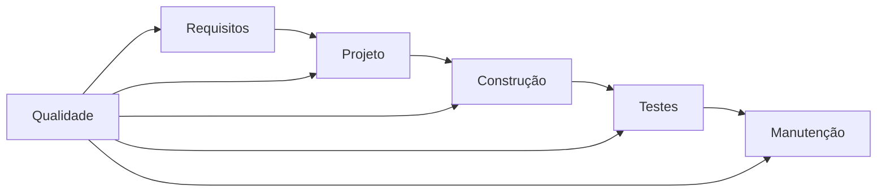
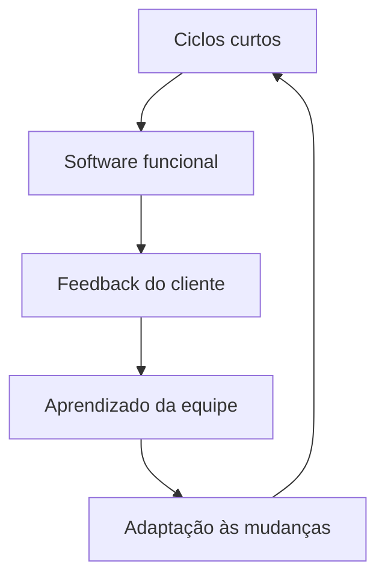
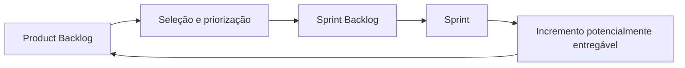
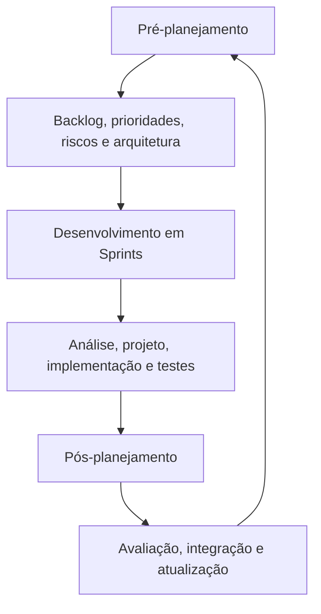
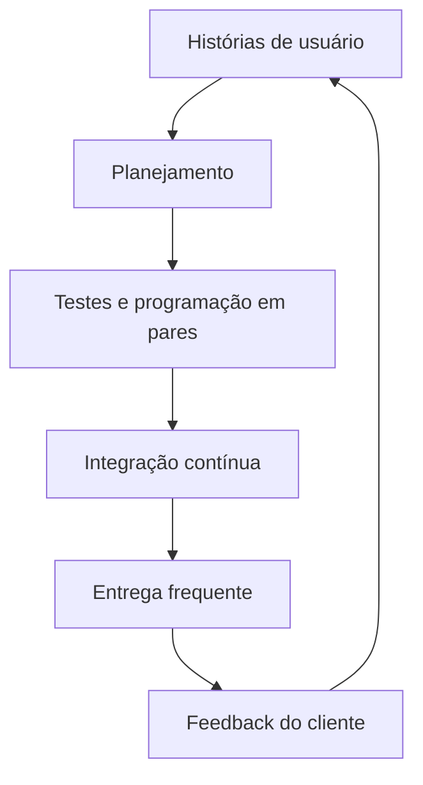

# Qualidade e abordagens ágeis no desenvolvimento de software

## Visão geral

> [!info] Conceito
> A escolha da abordagem de desenvolvimento depende do contexto do projeto, da equipe, das tecnologias empregadas e da cultura organizacional.

O desenvolvimento de software pode utilizar abordagens clássicas ou ágeis. As metodologias clássicas geralmente adotam processos mais rígidos e documentação extensa. As abordagens ágeis, por sua vez, enfatizam flexibilidade, simplicidade, colaboração e adaptação contínua. Nenhuma abordagem é universalmente superior: deve-se escolher aquela mais adequada às características do projeto e da organização.

O conteúdo aborda quatro temas principais:

1. qualidade de software;
2. abordagens ágeis;
3. Scrum;
4. Extreme Programming (XP).

---

## Qualidade de software

> [!info] Conceito
> Qualidade de software é o conjunto de características que permite ao produto satisfazer necessidades explícitas e implícitas.

Segundo a NBR 13596, a qualidade corresponde à totalidade das características de um produto de software que determinam sua capacidade de atender às necessidades declaradas pelo cliente e também àquelas que, embora não tenham sido diretamente expressas, são necessárias para o uso adequado do sistema.

Avaliar a qualidade de um software é uma tarefa complexa, pois envolve eficiência, eficácia, confiabilidade, utilidade e outros requisitos que influenciam a aquisição e a utilização do produto. Essa avaliação deve alcançar tanto o sistema completo quanto suas partes, como módulos, componentes e *plugins*.

A globalização e o aumento da concorrência tornam os usuários mais exigentes. Nesse contexto, modelos reconhecidos de qualidade ajudam os clientes a comparar produtos e tomar decisões, enquanto permitem aos fornecedores melhorar seus sistemas e demonstrar sua confiabilidade.

### Benefícios da avaliação de software

A avaliação oferece vantagens para os diferentes envolvidos:

- **Desenvolvedor:** identifica comportamentos indesejados, como *bugs*, orienta melhorias e fornece parâmetros para a evolução do produto.
- **Fornecedor:** demonstra a confiabilidade do software e pode utilizar relatórios de avaliação para agregar valor comercial.
- **Cliente:** conhece o nível de qualidade do produto e dispõe de melhores informações para decidir sobre sua aquisição.

> [!tip] Resumindo
> A avaliação transforma a qualidade em informação útil para corrigir o software, demonstrar sua confiabilidade e apoiar decisões de compra.

---

## Perspectivas da qualidade

> [!info] Conceito
> A qualidade é multifacetada porque pode ser analisada segundo diferentes referências e interesses.

Kitchenham apresenta cinco perspectivas para compreender a qualidade:

| Perspectiva | Significado |
|---|---|
| Transcendental | A qualidade pode ser reconhecida, embora seja difícil defini-la objetivamente. |
| Baseada no usuário | A qualidade depende da utilidade do produto e de sua capacidade de satisfazer necessidades. |
| Baseada na produção | A qualidade corresponde à conformidade do produto com o projeto e as especificações. |
| Baseada no produto | A qualidade é determinada pelas características e pelos atributos internos do produto. |
| Baseada no valor | A qualidade depende da relação entre excelência, preço e custo aceitável. |

A finalidade geral da qualidade é satisfazer o cliente, mas os critérios utilizados nessa avaliação podem variar. Um usuário pode valorizar a facilidade de uso, enquanto o produtor pode concentrar-se na conformidade com as especificações. Já uma avaliação baseada em valor considera quanto o cliente está disposto a pagar pelo nível de excelência oferecido.

> [!warning] Atenção
> Um software pode estar tecnicamente de acordo com as especificações e, mesmo assim, não ser considerado adequado pelo usuário. Por isso, a qualidade não deve ser analisada por uma única perspectiva.

---

## Qualidade como parte da Engenharia de Software

> [!info] Conceito
> A qualidade não é uma atividade isolada realizada somente no fim do projeto; ela participa de todo o processo de Engenharia de Software.

Organizações como a American Society for Quality Control (ASQC), a Associação Brasileira de Normas Técnicas (ABNT) e a International Organization for Standardization (ISO) estudam e regulamentam a qualidade.

O SWEBOK organiza a Engenharia de Software em áreas de conhecimento relacionadas a requisitos, gerência, projeto, métodos e ferramentas, construção, processos, testes, qualidade, manutenção e gerência de configuração. Embora exista uma área especificamente dedicada à qualidade, todas as demais também contribuem para ela.

Assim, a qualidade deve ser considerada desde a definição dos requisitos até a manutenção do sistema, passando pelo projeto, pela construção e pelos testes.

O diagrama mostra que a qualidade influencia todas as etapas do desenvolvimento, e não apenas a verificação do produto concluído.

---

## Modelos de maturidade e melhoria de processos

> [!info] Conceito
> Modelos de maturidade organizam a evolução dos processos em níveis, permitindo ampliar progressivamente o controle e a qualidade.

### CMMI

O **Capability Maturity Model Integration (CMMI)** é um modelo internacional que busca aumentar o controle da qualidade no desenvolvimento de software por meio de cinco níveis:

| Nível | Denominação |
|---:|---|
| 1 | Inicial |
| 2 | Gerenciado |
| 3 | Definido |
| 4 | Gerenciado Quantitativamente |
| 5 | Otimizado |

A progressão representa a passagem de processos inicialmente pouco controlados para processos definidos, mensurados e continuamente aperfeiçoados.

### MPS.BR

O **Melhoria do Processo de Software Brasileiro (MPS.BR)** é voltado à melhoria e à avaliação dos processos de software. Seus níveis são organizados de forma progressiva:

| Nível | Denominação |
|---:|---|
| G | Parcialmente Gerenciado |
| F | Gerenciado |
| E | Parcialmente Definido |
| D | Largamente Definido |
| C | Definido |
| B | Gerenciado Quantitativamente |
| A | Em Otimização |

Tanto o CMMI quanto o MPS.BR adotam uma evolução sequencial, de baixo para cima (*bottom-up*), na qual cada estágio alcançado representa maior maturidade e controle dos processos.

> [!tip] Resumindo
> CMMI e MPS.BR relacionam a melhoria da qualidade ao aumento gradual da maturidade dos processos organizacionais.

---

## Abordagens ágeis

> [!info] Conceito
> Abordagens ágeis utilizam ciclos curtos, colaboração e feedback frequente para entregar valor e responder rapidamente às mudanças.

Os métodos ágeis trabalham com processos empíricos, isto é, processos que evoluem com base na experiência, na observação dos resultados e no aprendizado obtido durante o projeto. O desenvolvimento ocorre por meio de interações ou iterações curtas e constantes, permitindo que partes funcionais do sistema sejam entregues e avaliadas ao longo do trabalho.

Essas abordagens são especialmente adequadas quando os requisitos mudam com frequência. Em vez de considerar toda alteração como uma falha do planejamento, a agilidade procura incorporá-la ao processo e utilizá-la para aumentar o valor entregue ao cliente.

A comunicação entre as pessoas e o retorno contínuo sobre o trabalho são essenciais. O cliente participa ativamente, colaborando com a equipe e ajudando a verificar se o produto corresponde ao nível esperado de qualidade.

As metodologias ágeis apresentam semelhanças com o modelo espiral, pois também trabalham de maneira iterativa. Entretanto, representam uma filosofia de desenvolvimento mais ampla, orientada por valores e princípios, e não apenas um processo técnico.

---

## Manifesto Ágil

> [!info] Conceito
> O Manifesto Ágil orienta o desenvolvimento para a entrega contínua de software funcional e valioso ao cliente.

### Valores

Os valores apresentados pelo Manifesto Ágil priorizam:

- indivíduos e interações mais que processos e ferramentas;
- software funcionando mais que documentação excessiva;
- colaboração com o cliente mais que negociação de contratos;
- resposta às mudanças mais que seguir um planejamento fechado.

Os elementos situados à direita continuam tendo importância, mas os elementos à esquerda recebem maior prioridade.

### Princípios

Os princípios ágeis incluem:

1. satisfazer o cliente por meio da entrega contínua e oportuna de software de valor;
2. aceitar mudanças nos requisitos, mesmo em fases avançadas do desenvolvimento;
3. entregar software funcional frequentemente e em intervalos curtos;
4. manter a colaboração diária entre a área de negócios e a equipe de desenvolvimento;
5. construir projetos ao redor de pessoas motivadas, oferecendo apoio, ambiente adequado e confiança;
6. valorizar a comunicação direta, especialmente a conversa face a face;
7. utilizar o software funcionando como principal medida de progresso;
8. manter um ritmo de desenvolvimento sustentável;
9. dedicar atenção contínua à excelência técnica e à qualidade do projeto;
10. evitar trabalhos e funcionalidades que provavelmente não serão utilizados;
11. incentivar equipes auto-organizadas, capazes de produzir melhores arquiteturas, requisitos e projetos;
12. refletir periodicamente sobre o trabalho e adaptar o comportamento da equipe para aumentar sua eficácia.

Esse ciclo demonstra como entregas frequentes possibilitam avaliação, aprendizado e adaptação contínua.

Entre as abordagens ágeis citadas estão Scrum, Extreme Programming (XP) e *Feature Driven Development* (FDD). A escolha depende da equipe e do tipo de software desenvolvido.

> [!tip] Resumindo
> A agilidade concentra-se em entregar valor, aprender com o feedback e ajustar o projeto continuamente.

---

## Scrum

> [!info] Conceito
> Scrum é um *framework* de trabalho adaptativo para lidar com problemas complexos e desenvolver produtos de maneira produtiva, criativa e orientada à qualidade.

O Scrum foi desenvolvido por Ken Schwaber, Jeff Sutherland e Mike Beedle entre as décadas de 1980 e 1990. Seu objetivo é permitir que equipes trabalhem com flexibilidade em ambientes sujeitos a mudanças.

O desenvolvimento de software envolve variáveis técnicas e ambientais, como requisitos, recursos e tecnologias, que podem se modificar durante o projeto. Isso torna o processo complexo e parcialmente imprevisível. O Scrum procura controlar essas variáveis continuamente para que o produto desenvolvido permaneça útil ao cliente.

Embora possa apoiar o gerenciamento de projetos e fornecer indicadores de acompanhamento, o Scrum não é apresentado como uma metodologia rígida. Ele consiste em um conjunto simples de práticas auto-organizadas e heurísticas para enfrentar problemas complexos e situações imprevistas, sem exigir grandes volumes de documentação.

### Times Scrum

Os times são pequenos, auto-organizáveis e interdisciplinares. Reúnem profissionais com as habilidades necessárias para transformar os requisitos definidos pelo **Product Owner** em uma parte potencialmente entregável do produto ao término da Sprint.

A auto-organização significa que a própria equipe coordena a execução do trabalho. A interdisciplinaridade permite que diferentes competências — como projeto, programação, engenharia e garantia da qualidade — estejam disponíveis dentro do time.

### Elementos do fluxo Scrum

- **Product Backlog:** conjunto de requisitos e funcionalidades esperadas para o produto.
- **Sprint Backlog:** seleção dos itens que serão desenvolvidos durante uma Sprint.
- **Sprint:** ciclo de desenvolvimento com duração limitada, geralmente entre uma semana e um mês.
- **Reuniões diárias:** encontros rápidos para acompanhar o trabalho e discutir informações relevantes.
- **Incremento potencialmente entregável:** resultado funcional produzido ao final da Sprint.
- **Product Owner:** responsável por orientar os requisitos e as prioridades do produto.

Durante a Sprint, a equipe utiliza práticas de Engenharia de Software e realiza reuniões diárias para acompanhar o progresso. O resultado deve atender aos padrões de qualidade e representar uma parte funcional do produto.

> [!warning] Atenção
> O Scrum trabalha com um horizonte curto porque planejar detalhadamente períodos longos em ambientes complexos aumenta o risco de o planejamento perder validade.

---

## Fases do ciclo de vida do Scrum

> [!info] Conceito
> O ciclo do Scrum pode ser compreendido pelas fases de pré-planejamento, desenvolvimento e pós-planejamento.

### 1. Pré-planejamento — *Pre-game phase*

Os requisitos são registrados no *backlog*, priorizados e estimados conforme o esforço necessário. Também são definidos:

- equipe de desenvolvimento;
- ferramentas utilizadas;
- riscos do projeto;
- necessidades de treinamento;
- arquitetura inicial do sistema.

Alterações nos requisitos e os possíveis riscos associados também são identificados.

### 2. Desenvolvimento — *Game phase*

As variáveis técnicas e ambientais são continuamente observadas e controladas. Diferentemente de abordagens que analisam essas condições somente no começo do projeto, o Scrum mantém o controle durante o desenvolvimento para responder às mudanças.

O software é construído em Sprints, com duração entre uma semana e um mês. Em cada ciclo, novas funcionalidades são adicionadas e podem ser realizadas atividades de análise, projeto, implementação e testes.

### 3. Pós-planejamento — *Post-game phase*

São promovidos encontros de avaliação e controle do progresso. Também podem ocorrer:

- integração com outros módulos e sistemas;
- realização de testes;
- atualização da documentação;
- verificação dos resultados produzidos.

### Três visões do Scrum

A estrutura apresentada diferencia três níveis relacionados:

- **Visão do projeto:** fornece a orientação global do trabalho.
- **Visão do produto:** abrange o Product Backlog, a atuação do Product Owner e o incremento entregue.
- **Visão do processo:** inclui Sprint Backlog, práticas de Engenharia de Software, Sprints e reuniões diárias.

Essas visões se relacionam: o processo executado dentro das Sprints contribui para a evolução do produto, que, por sua vez, deve permanecer alinhado à visão geral do projeto.

> [!tip] Resumindo
> O Scrum converte prioridades do produto em ciclos curtos de trabalho, acompanhados diariamente, que produzem incrementos funcionais e potencialmente entregáveis.

---

## Extreme Programming — XP

> [!info] Conceito
> Extreme Programming é uma metodologia ágil voltada ao desenvolvimento rápido, ao feedback contínuo e à satisfação do cliente.

A **Extreme Programming (XP)**, ou Programação Extrema, emprega artefatos para apoiar a atualização e a manutenção do sistema. Um dos principais é a **User Story**, ou história de usuário, utilizada para registrar requisitos funcionais e não funcionais. Ela também pode apoiar a especificação de modelos, diagramas e métricas de software.

A XP destaca-se pelo:

- feedback constante;
- desenvolvimento incremental;
- incentivo à comunicação;
- desenvolvimento orientado por testes;
- programação em pares;
- contato frequente com o cliente.

Seus quatro valores fundamentais são:

| Valor | Aplicação |
|---|---|
| Comunicação | Favorece a cooperação e reduz falhas de entendimento. |
| Simplicidade | Prioriza a solução mais simples que satisfaça os requisitos atuais. |
| Feedback | Permite avaliar rapidamente o produto e corrigir o direcionamento. |
| Coragem | Sustenta decisões como alterar código, rever planos e enfrentar problemas do projeto. |

---

## As 12 práticas da XP

### 1. Planejamento

> [!info] Conceito
> O planejamento define o que precisa ser feito agora e o que pode ser adiado.

A XP trabalha com os requisitos atuais, evitando antecipar funcionalidades futuras ainda incertas. A área de negócios decide escopo, conteúdo das versões e datas de entrega. Os desenvolvedores definem estimativas, processo de desenvolvimento e cronograma detalhado. As duas áreas devem cooperar durante o projeto.

### 2. Entregas frequentes

Versões pequenas e funcionais devem ser entregues regularmente, contendo os requisitos de maior valor para o negócio. O material recomenda entregas mensais ou, no máximo, a cada dois meses. Isso possibilita feedback rápido, reduz surpresas e aumenta a probabilidade de o resultado atender ao cliente.

### 3. Metáfora

A metáfora descreve o sistema sem recorrer excessivamente a termos técnicos. Sua finalidade é criar uma compreensão compartilhada e orientar o desenvolvimento.

### 4. Projeto simples

O software deve possuir a solução mais simples capaz de satisfazer os requisitos atuais. Funcionalidades futuras somente devem ser implementadas quando se tornarem necessidades reais.

> [!warning] Atenção
> Projeto simples não significa software sem qualidade. Significa evitar complexidade criada para necessidades que ainda não existem.

### 5. Testes

A validação ocorre durante todo o desenvolvimento. Os programadores criam primeiro os testes e depois desenvolvem o código necessário para atendê-los, prática relacionada ao **Test Driven Development (TDD)**.

### 6. Refatoração

Refatorar é melhorar e simplificar a estrutura interna do código sem retirar funcionalidades. Deve ser realizado quando a equipe identifica uma oportunidade concreta de aperfeiçoamento.

### 7. Programação em pares

Dois desenvolvedores trabalham no mesmo computador. Um controla o teclado e implementa o código, enquanto o outro observa, identifica possíveis erros e pensa estrategicamente em melhorias. Os papéis devem ser alternados.

Essa prática também promove aprendizado contínuo entre os integrantes.

### 8. Propriedade coletiva

O código pertence a toda a equipe. Qualquer integrante pode modificá-lo para agregar valor, desde que realize os testes necessários. Isso distribui o conhecimento e reduz os impactos provocados pela saída de um membro do projeto.

### 9. Integração contínua

O sistema é integrado e construído várias vezes ao dia. As modificações são incorporadas em pequenos conjuntos, permitindo identificar mais facilmente a origem de falhas. Se os testes falharem depois de uma integração, a última equipe que adicionou código pode localizar e corrigir o problema com maior rapidez.

### 10. Semana de 40 horas

A XP procura manter um ritmo sustentável. Horas extras não devem ocorrer continuamente. Se forem necessárias durante duas semanas consecutivas, isso indica um problema no projeto que deve ser resolvido por meio de planejamento e ajustes, e não pela sobrecarga permanente das pessoas.

### 11. Cliente presente

O cliente deve participar durante todo o desenvolvimento e estar disponível para esclarecer requisitos. Essa proximidade reduz atrasos, interpretações equivocadas e a construção de funcionalidades incorretas.

### 12. Código padrão

A equipe deve adotar padrões comuns para o código e sua arquitetura. A padronização facilita o compartilhamento, a compreensão e a manutenção do sistema por todos os programadores.

O ciclo evidencia a relação entre requisitos atuais, desenvolvimento colaborativo, validação permanente e aprendizado obtido com cada entrega.

---

## Relação entre Scrum e XP

> [!info] Conceito
> Scrum organiza o trabalho em ciclos e acompanha o projeto, enquanto XP oferece práticas diretamente ligadas à construção e à qualidade do código.

Scrum e XP compartilham valores ágeis, como ciclos curtos, adaptação, comunicação, colaboração e entregas frequentes. Entretanto, apresentam focos distintos:

| Aspecto | Scrum | Extreme Programming |
|---|---|---|
| Foco principal | Organização e acompanhamento do trabalho | Práticas de desenvolvimento e qualidade do código |
| Unidade de trabalho | Sprint | Entregas incrementais e frequentes |
| Requisitos | Product Backlog e Sprint Backlog | Histórias de usuário |
| Acompanhamento | Reuniões diárias e avaliação do progresso | Feedback contínuo, testes e integração |
| Práticas técnicas destacadas | Práticas de Engenharia de Software dentro das Sprints | TDD, programação em pares, refatoração e integração contínua |
| Participação do cliente | Representada principalmente pelo Product Owner | Cliente presente durante o desenvolvimento |
| Documentação | Estrutura simples, sem grandes volumes | Utiliza artefatos essenciais, como histórias de usuário |

As abordagens podem contribuir para a qualidade por caminhos complementares. O Scrum fornece uma estrutura adaptativa para priorizar e acompanhar entregas, enquanto a XP incorpora práticas técnicas que procuram prevenir defeitos e manter o código simples, testado e integrado.

---

## Trabalho em equipe e competências humanas

> [!info] Conceito
> O sucesso das abordagens ágeis depende tanto das práticas técnicas quanto da colaboração entre as pessoas.

A produtividade em ambientes ágeis exige trabalho coletivo efetivo. Por isso, a gestão de pessoas e o desenvolvimento de competências socioemocionais são importantes. Comunicação, confiança, responsabilidade compartilhada, motivação e capacidade de adaptação influenciam diretamente a qualidade do processo e do produto.

No Scrum, isso aparece nos times auto-organizáveis e interdisciplinares. Na XP, manifesta-se na programação em pares, na propriedade coletiva do código, no contato permanente com o cliente e no ritmo sustentável.

---

## Modelagem de processos com Bizagi

> [!info] Conceito
> A modelagem de processos permite representar atividades, responsáveis e pontos de decisão de forma estruturada.

O Bizagi Modeler é apresentado como uma plataforma gratuita e intuitiva para modelar processos de negócio. Ele utiliza funcionalidades baseadas na notação **BPMN**, permitindo representar fluxos, responsáveis, processos e indicadores relacionados à tomada de decisão.

Essa ferramenta pode ser utilizada para simular fluxos automatizados e ampliar a compreensão sobre como as atividades de um processo se relacionam.

---

## Síntese final

> [!summary] Síntese
> A qualidade de software resulta da combinação entre atendimento às necessidades do cliente, controle dos processos, práticas técnicas adequadas, avaliação contínua e colaboração entre os envolvidos.

A qualidade pode ser analisada pelas perspectivas transcendental, do usuário, da produção, do produto e do valor. Como cada perspectiva enfatiza critérios diferentes, sua avaliação deve considerar tanto as características internas do software quanto sua utilidade, conformidade e custo.

Modelos como CMMI e MPS.BR procuram elevar a qualidade por meio da evolução gradual da maturidade dos processos. Já as abordagens ágeis lidam com mudanças mediante ciclos curtos, entregas funcionais, comunicação e feedback constante.

O Scrum estrutura o trabalho por meio de backlog, Sprints, reuniões diárias, times auto-organizáveis e incrementos potencialmente entregáveis. A XP complementa a agilidade com práticas técnicas e colaborativas, como histórias de usuário, TDD, programação em pares, refatoração, propriedade coletiva, integração contínua e presença do cliente.

Em conjunto, os conceitos estudados mostram que desenvolver software com qualidade não significa apenas eliminar defeitos no produto final. Significa organizar pessoas, processos e práticas para entregar continuamente um sistema útil, funcional, adaptável e alinhado às necessidades do cliente.