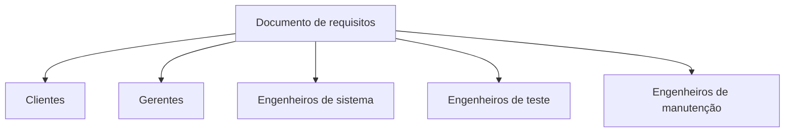
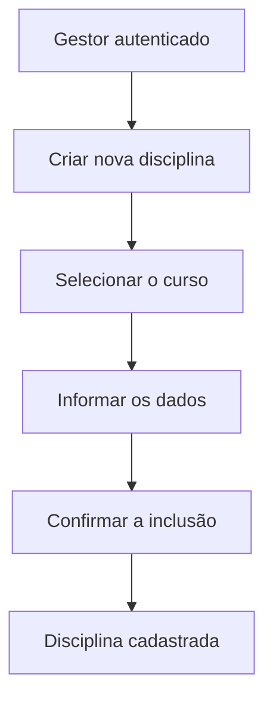
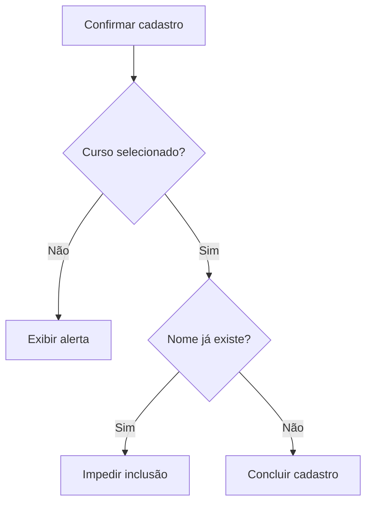
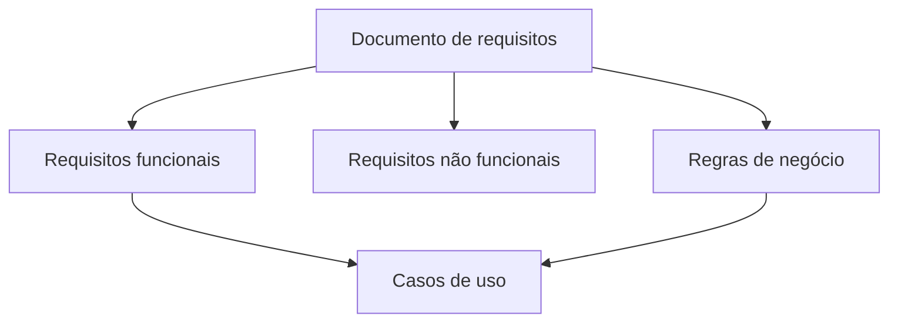

# Documento e especificação de requisitos

## 1. Documento de requisitos

> [!info] Conceito
> O documento de requisitos reúne a especificação do que se espera do sistema e serve como referência para os diferentes participantes do projeto.

O documento de requisitos registra as necessidades, funcionalidades, restrições e regras relacionadas ao sistema que será desenvolvido. Ele pode conter diferentes níveis e tipos de requisitos:

- **Requisitos de cliente:** expressam as necessidades apresentadas pelo cliente.
- **Requisitos de negócio:** representam regras e objetivos próprios da organização.
- **Requisitos de sistema:** detalham características técnicas e comportamentos esperados do sistema.
- **Requisitos de usuário:** descrevem os serviços e recursos necessários sob a perspectiva de quem utilizará o sistema.

Esse documento não é utilizado apenas durante a análise inicial. Ele também orienta o planejamento, o desenvolvimento, os testes e a manutenção do software.

> [!tip] Resumindo
> O documento de requisitos funciona como uma referência comum para alinhar clientes, gestores, desenvolvedores, testadores e responsáveis pela manutenção.

---

## 2. Usuários do documento de requisitos

> [!info] Conceito
> Diferentes participantes consultam o documento de requisitos com objetivos específicos ao longo do projeto.

### Clientes do sistema

Os clientes especificam e analisam os requisitos para verificar se o sistema atenderá às suas necessidades. Eles também podem solicitar alterações quando identificam que alguma necessidade não foi contemplada adequadamente.

### Gerentes

Os gerentes usam os requisitos para planejar pedidos de proposta, estimar e organizar o desenvolvimento e acompanhar o projeto. A classificação e a prioridade dos requisitos ajudam a definir a ordem de implementação das funcionalidades.

### Engenheiros de sistema

Os engenheiros de sistema consultam os requisitos para compreender o sistema que deverá ser desenvolvido. A documentação orienta as decisões de análise, arquitetura, projeto e implementação.

### Engenheiros de teste

Os engenheiros de teste utilizam os requisitos como base para preparar testes de validação. Esses testes verificam se o comportamento implementado corresponde ao que foi solicitado.

### Engenheiros de manutenção

Os engenheiros de manutenção usam o documento para entender o funcionamento do sistema e os relacionamentos entre suas diferentes partes. Isso facilita a correção de defeitos, a adaptação do software e a implementação de melhorias.

> [!tip] Resumindo
> Um mesmo requisito pode orientar a validação pelo cliente, o planejamento gerencial, o desenvolvimento, os testes e a manutenção.

---

## 3. Estrutura do documento de requisitos

> [!info] Conceito
> O documento pode seguir uma estrutura padronizada, mas o padrão deve ser adaptado às necessidades e às características de cada projeto.

Não existe a obrigação de empregar todos os itens de uma estrutura de referência. O engenheiro de software deve avaliar quais seções são adequadas ao projeto e ajustar o documento ao seu contexto.

Uma estrutura possível para o documento contém:

1. **Prefácio:** apresenta informações iniciais sobre o documento, como público-alvo e histórico de versões.
2. **Introdução:** explica os objetivos, o escopo e o contexto geral do sistema.
3. **Glossário:** define termos técnicos, abreviações e expressões próprias do domínio.
4. **Definição dos requisitos de usuário:** descreve as necessidades dos usuários em uma linguagem mais acessível.
5. **Arquitetura do sistema:** apresenta uma visão geral dos principais componentes e de seus relacionamentos.
6. **Especificação dos requisitos do sistema:** detalha os requisitos funcionais, não funcionais, interfaces e restrições.
7. **Modelos do sistema:** representa aspectos do sistema por meio de modelos, diagramas ou descrições estruturadas.
8. **Evolução do sistema:** registra suposições e mudanças que podem afetar o sistema no futuro.
9. **Apêndices:** reúne informações complementares relevantes.
10. **Índice:** facilita a localização das informações no documento.

Uma organização mais sintética pode concentrar-se nas seguintes informações:

- introdução;
- visão geral do sistema;
- requisitos funcionais;
- requisitos não funcionais;
- requisitos de interface;
- regras de negócio.

> [!warning] Atenção
> Um padrão é uma referência para organizar o documento, não uma estrutura rígida que precise ser reproduzida integralmente em todos os projetos.

---

## 4. Principais categorias registradas no documento

> [!info] Conceito
> A especificação precisa distinguir o que o sistema deve fazer, as condições sob as quais deve funcionar e as regras existentes no domínio do negócio.

### Requisitos funcionais

Os requisitos funcionais descrevem **o que o sistema deve fazer**. Eles representam funcionalidades, serviços, operações ou comportamentos que devem ser oferecidos aos usuários.

Exemplos apresentados para um sistema de controle acadêmico:

- permitir a manutenção do cadastro de cursos;
- permitir a manutenção do cadastro de professores;
- permitir a manutenção do cadastro de alunos;
- permitir a associação de professores aos cursos;
- permitir a associação de alunos aos cursos.

### Requisitos não funcionais

Os requisitos não funcionais representam restrições ou características relacionadas à execução, à tecnologia, ao ambiente e à disponibilidade do sistema. Eles não descrevem diretamente uma funcionalidade de negócio, mas determinam como o sistema deverá ser desenvolvido ou operado.

Exemplos apresentados:

- o sistema deverá ser acessado por um navegador web;
- o sistema será desenvolvido em Java;
- os dados serão armazenados em um banco de dados MySQL;
- o sistema deverá estar acessível de segunda a sexta-feira, das 7h às 22h;
- o servidor deverá possuir pelo menos 10 GB de espaço livre em disco.

### Requisitos de interface

Os requisitos de interface estabelecem como o sistema deve interagir com usuários, outros sistemas, dispositivos ou componentes externos. Eles descrevem os meios e as condições de comunicação entre o sistema e seu ambiente.

### Regras de negócio

As regras de negócio são condições próprias da organização ou do domínio e existem independentemente da implantação do sistema. O software deve respeitá-las ao executar suas funcionalidades.

No exemplo do sistema acadêmico, foram apresentadas as seguintes regras:

- um curso presencial possui duração de seis meses;
- um curso de educação a distância possui duração de dois meses;
- os alunos de cursos presenciais devem residir na cidade onde está localizada a universidade;
- os alunos de cursos a distância podem residir em qualquer localidade;
- a matrícula somente pode ser realizada se o aluno tiver cursado as disciplinas que constituem pré-requisitos para o curso.

| Categoria | Pergunta principal | Exemplo |
|---|---|---|
| Requisito funcional | O que o sistema deve fazer? | Cadastrar alunos |
| Requisito não funcional | Sob quais condições ou restrições o sistema funcionará? | Ser acessível por navegador web |
| Requisito de interface | Como ocorrerá a interação com pessoas ou outros componentes? | Interface utilizada para acessar o sistema |
| Regra de negócio | Qual regra do domínio deve ser respeitada? | Exigir disciplinas que são pré-requisitos |

> [!warning] Atenção
> Uma regra de negócio não é criada pelo sistema. Ela já pertence ao domínio da organização, e o sistema é desenvolvido para aplicá-la ou fiscalizá-la.

---

## 5. Documentação de casos de uso

> [!info] Conceito
> Um caso de uso documenta uma interação entre um ator e o sistema para alcançar um objetivo específico.

A aula apresentou como estudo de caso a funcionalidade **Cadastrar disciplina**, pertencente a um sistema de controle acadêmico.

A documentação do caso de uso identifica:

- o nome do caso de uso;
- o ator primário;
- as pré-condições;
- o cenário principal;
- as exceções;
- a prioridade ou importância para o sistema.

### Caso de uso: cadastrar disciplina

**Ator primário:** gestor do sistema.

O ator primário é a pessoa ou entidade que inicia a interação para alcançar o objetivo descrito pelo caso de uso.

**Pré-condição:** o gestor deve estar autenticado no sistema.

A pré-condição representa uma situação que precisa ser verdadeira antes da execução do caso de uso. Nesse exemplo, o cadastro não pode começar enquanto o gestor não estiver conectado ao sistema.

### Cenário principal

O cenário principal, também chamado informalmente de **caminho feliz**, descreve a sequência normal de ações quando nenhum erro ou impedimento ocorre:

1. O gestor seleciona a opção de criar uma nova disciplina.
2. O gestor seleciona o curso ao qual a disciplina pertence.
3. O gestor informa os dados da disciplina.
4. O gestor confirma a inclusão da disciplina.

O cenário funciona como uma sequência ordenada de passos executados para atingir o objetivo do caso de uso.

> [!tip] Resumindo
> O cenário principal mostra a interação esperada entre o ator e o sistema quando todas as condições necessárias são satisfeitas.

---

## 6. Exceções do caso de uso

> [!info] Conceito
> As exceções representam situações que desviam do cenário principal e exigem uma resposta específica do sistema.

O caso de uso não deve registrar somente a sequência ideal. Também precisa considerar erros, omissões e conflitos que possam impedir a conclusão da operação.

### Curso não selecionado

Se o gestor tentar cadastrar a disciplina sem selecionar um curso, o sistema deverá emitir um alerta informando que a seleção é obrigatória. Essa exceção decorre da regra segundo a qual uma disciplina precisa estar associada a um curso.

### Disciplina com nome já existente

Se já existir uma disciplina com o nome informado, o sistema não deverá permitir uma nova inclusão com esse mesmo nome. O fluxo normal é interrompido para evitar a duplicidade dos dados.

O caso de uso **Cadastrar disciplina** foi classificado como essencial, pois corresponde a uma função necessária ao funcionamento do sistema acadêmico apresentado.

> [!warning] Atenção
> Documentar apenas o caminho feliz torna a especificação incompleta, pois o sistema também precisa definir como responderá a situações inválidas.

---

## 7. Classificação dos requisitos por importância

> [!info] Conceito
> A classificação por importância indica o impacto da ausência de um requisito sobre o funcionamento do sistema.

Os requisitos podem ser classificados como **essenciais**, **importantes** ou **desejáveis**.

### Essencial

É o requisito sem o qual o sistema não funciona adequadamente. Por representar uma necessidade indispensável, precisa estar presente para que os objetivos fundamentais do sistema sejam atendidos.

### Importante

É o requisito cuja ausência não impede totalmente o funcionamento do sistema, mas faz com que ele opere com restrições. Embora não seja indispensável, sua implementação melhora significativamente a solução.

### Desejável

É um requisito complementar. Sua ausência não compromete o funcionamento do sistema, pois corresponde a um acréscimo ou melhoria que pode ser implementado posteriormente.

| Importância | Consequência de não implementar |
|---|---|
| Essencial | O sistema não funciona conforme sua finalidade fundamental |
| Importante | O sistema funciona, mas apresenta restrições |
| Desejável | O sistema continua funcionando sem comprometimento essencial |

> [!tip] Resumindo
> A importância demonstra quanto o sistema depende do requisito para cumprir sua finalidade.

---

## 8. Classificação dos requisitos por prioridade

> [!info] Conceito
> A prioridade determina a ordem em que os requisitos deverão ser implementados.

Os requisitos podem receber prioridade:

- **alta:** devem ser implementados primeiro ou imediatamente;
- **média:** podem ser implementados depois dos itens mais urgentes;
- **baixa:** podem ser adiados sem prejuízo imediato ao planejamento.

Essa classificação auxilia o gestor e a equipe de desenvolvimento na organização das entregas. Ela permite decidir quais requisitos serão implementados primeiro, considerando as necessidades do projeto.

> [!warning] Atenção
> Importância e prioridade estão relacionadas, mas expressam ideias diferentes: a importância indica o impacto da ausência do requisito; a prioridade determina sua posição na ordem de implementação.

---

## 9. Aplicação no sistema de controle acadêmico

> [!info] Conceito
> O estudo de caso mostra como requisitos funcionais, não funcionais, regras de negócio e casos de uso podem ser organizados em uma especificação coerente.

Os requisitos funcionais determinam os cadastros e as associações que o sistema deve realizar. Os requisitos não funcionais definem o ambiente tecnológico e operacional. As regras de negócio estabelecem condições sobre duração dos cursos, residência dos estudantes e pré-requisitos de matrícula.

O caso de uso transforma parte desses requisitos em uma interação detalhada. No cadastro de disciplinas, por exemplo, o gestor realiza uma sequência de ações, enquanto o sistema verifica regras e trata exceções.

A qualidade da documentação depende da integração entre essas informações. Uma funcionalidade não deve ser descrita isoladamente das condições técnicas, regras de negócio e situações excepcionais que influenciam sua execução.

---

## Síntese final

> [!summary] Síntese
> O documento de requisitos registra o que o sistema deve fazer, suas restrições, suas interfaces e as regras do domínio. Ele orienta todos os envolvidos no projeto e pode ser adaptado às necessidades de cada sistema.

A documentação de requisitos constitui uma base para o planejamento, o desenvolvimento, a validação, os testes e a manutenção do software. Sua estrutura pode incluir introdução, glossário, requisitos de usuário, arquitetura, especificação detalhada, modelos, evolução, apêndices e índice.

Os requisitos funcionais descrevem as funcionalidades do sistema; os requisitos não funcionais estabelecem condições e restrições; os requisitos de interface regulam as interações externas; e as regras de negócio expressam condições próprias do domínio.

Os casos de uso detalham como um ator interage com o sistema para alcançar determinado objetivo. Uma documentação adequada deve apresentar ator, pré-condições, cenário principal, exceções e relevância do caso de uso.

Por fim, os requisitos podem ser classificados por importância — essenciais, importantes ou desejáveis — e por prioridade — alta, média ou baixa. Essas classificações ajudam a compreender o impacto de cada requisito e a definir uma ordem racional de implementação.