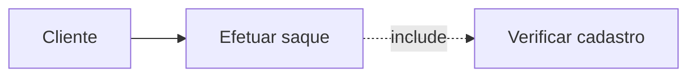
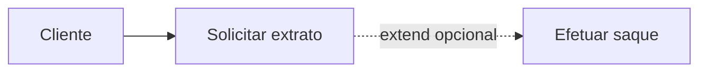
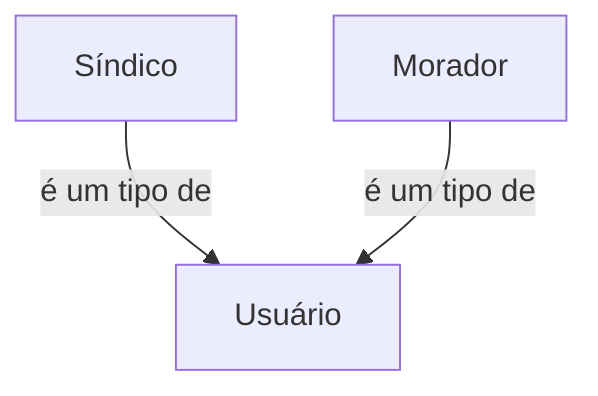
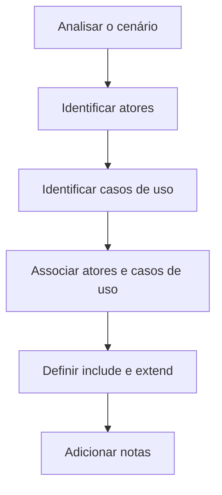
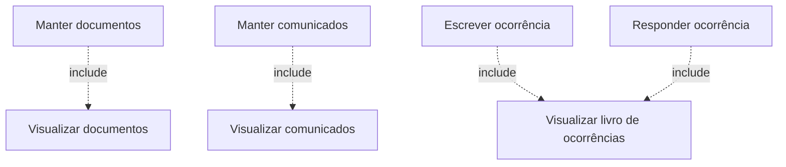

# Diagrama de Casos de Uso

> [!info] Conceito
> O diagrama de casos de uso é um diagrama da UML utilizado para representar, de maneira simples, as funcionalidades que um sistema oferece aos seus usuários ou a outros elementos externos.

## 1. Finalidade do diagrama de casos de uso

UML (*Unified Modeling Language*, ou Linguagem de Modelagem Unificada) é uma linguagem visual empregada para representar diferentes aspectos de um sistema. Entre seus diagramas está o diagrama de casos de uso, cuja finalidade é descrever **o que o sistema deve fazer**.

Por apresentar as funcionalidades de forma visual e relativamente simples, esse diagrama pode ser utilizado na comunicação com o cliente e com os demais interessados no projeto. Ele permite visualizar os **requisitos funcionais**, isto é, os serviços, ações e comportamentos que devem ser fornecidos pelo sistema.

> [!tip] Resumindo
> O diagrama de casos de uso mostra as funcionalidades do sistema e quem interage com elas, sem detalhar como essas funcionalidades serão implementadas internamente.

## 2. Elementos do diagrama

> [!info] Conceito
> Os elementos fundamentais do diagrama são os atores, os casos de uso e as associações existentes entre eles. Também podem ser representados relacionamentos entre os próprios casos de uso.

### 2.1 Caso de uso

Um **caso de uso** representa uma função ou um serviço que o sistema deve executar. Ele corresponde, portanto, a uma ação disponibilizada pelo sistema, como:

- acessar o sistema;
- cadastrar um documento;
- reservar um espaço;
- visualizar um comunicado;
- escrever no livro de ocorrências.

Os casos de uso normalmente recebem nomes formados por um verbo e seu complemento, pois representam ações executadas com a participação de algum ator.

### 2.2 Ator

Um **ator** é um elemento externo que interage com o sistema. Embora frequentemente represente uma pessoa ou um tipo de usuário, também pode corresponder a:

- um dispositivo;
- outro sistema;
- qualquer entidade externa que troque informações com o sistema modelado.

O ator representa um **papel desempenhado na interação**, e não necessariamente uma pessoa específica.

### 2.3 Associação

A **associação** é representada por uma linha que liga um ator a um caso de uso. Ela indica que aquele ator participa da execução da funcionalidade representada.

Por exemplo, uma associação entre o ator `Usuário` e o caso de uso `Cadastrar` significa que o usuário interage com o sistema para realizar um cadastro.

### 2.4 Relacionamento `<<include>>`

O relacionamento `<<include>>` indica que a execução de um caso de uso inclui, obrigatoriamente, a execução de outro. Dessa forma, quando o caso de uso principal é executado, o caso incluído também deve ser realizado.

No exemplo apresentado, para efetuar um saque é obrigatório verificar o cadastro do cliente. Portanto, `Efetuar saque` inclui `Verificar cadastro`.

### 2.5 Relacionamento `<<extend>>`

O relacionamento `<<extend>>` representa um comportamento opcional. Nesse caso, a execução de um caso de uso pode acrescentar outro comportamento, dependendo da situação.

No exemplo da aula, ao solicitar um extrato, o cliente pode também efetuar um saque. Essa execução adicional não é obrigatória.

> [!warning] Atenção
> `<<include>>` representa uma execução obrigatória e reutilizada pelo caso de uso principal. `<<extend>>` representa um comportamento adicional que pode ocorrer, mas não é obrigatório.

### 2.6 Generalização ou herança entre atores

A generalização indica que um ator especializado é um tipo de outro ator mais geral. O ator especializado herda as possibilidades de interação do ator geral e pode possuir interações específicas.

No estudo de caso, `Síndico` e `Morador` são tipos de `Usuário`. Por isso, ambos podem executar as funcionalidades associadas ao usuário geral, além das funções próprias de cada papel.

## 3. Etapas para montar um diagrama de casos de uso

> [!info] Conceito
> A construção do diagrama começa pela análise do cenário e pela identificação de quem interage com o sistema e de quais ações o sistema deve oferecer.

A prática apresentada na aula compreende as seguintes etapas:

1. **Identificar os atores do sistema:** localizar os usuários, dispositivos e sistemas externos que interagem com a aplicação.
2. **Identificar os casos de uso:** extrair as funcionalidades a partir dos requisitos funcionais.
3. **Associar os atores aos casos de uso:** indicar quais atores participam de cada funcionalidade.
4. **Estabelecer relacionamentos entre os casos de uso:** verificar a existência de comportamentos obrigatórios, representados por `<<include>>`, ou opcionais, representados por `<<extend>>`.
5. **Adicionar notas quando necessário:** registrar comentários ou informações complementares, inclusive requisitos não funcionais relacionados ao modelo.

> [!tip] Dica prática
> Na descrição textual do cenário, os substantivos podem ajudar a localizar os atores, enquanto os verbos ajudam a identificar as ações que poderão originar casos de uso.

## 4. Estudo de caso: Sistema de Gestão Condominial

> [!info] Conceito
> O estudo de caso mostra como transformar uma descrição textual de um sistema em atores, requisitos funcionais, requisitos não funcionais, regras de negócio e casos de uso.

O sistema de gestão condominial deve ser acessado por usuários que podem desempenhar os papéis de **síndico** ou **morador**. O acesso ocorre mediante login e senha.

O síndico pode cadastrar documentos, enviar mensagens, manter comunicados e responder às ocorrências registradas pelos moradores. O morador pode consultar documentos e comunicados e escrever no livro de ocorrências. Tanto o síndico quanto o morador podem reservar espaços do condomínio.

### 4.1 Identificação dos atores

Os atores são encontrados procurando, na descrição do cenário, os elementos que interagem com o sistema. Foram identificados:

- **Usuário:** ator geral que acessa o sistema;
- **Síndico:** tipo especializado de usuário;
- **Morador:** tipo especializado de usuário.

Embora o termo `Usuário` apareça no cenário, os papéis concretos de interação são desempenhados pelo síndico e pelo morador. Esses dois atores herdam as funcionalidades comuns associadas ao usuário geral.

### 4.2 Identificação dos requisitos funcionais

Os requisitos funcionais foram identificados a partir das ações executadas pelos atores. A aula organizou essas funcionalidades da seguinte forma:

| Código | Requisito funcional |
|---|---|
| RF 01 | O usuário acessa o sistema informando login e senha. |
| RF 02 | O síndico cadastra documentos, como atas de assembleia, balancetes e contratos. |
| RF 03 | O morador visualiza documentos. |
| RF 04 | O morador e o síndico reservam espaços do condomínio. |
| RF 05 | O síndico envia mensagens aos moradores. |
| RF 06 | O síndico cadastra comunicados. |
| RF 07 | Os moradores visualizam comunicados. |
| RF 08 | O morador escreve no livro de ocorrências digital. |
| RF 09 | O síndico visualiza o livro de ocorrências e responde às ocorrências. |

A identificação e a numeração dos requisitos ajudam a organizar a especificação e facilitam a correspondência entre a descrição textual e o diagrama.

> [!tip] Resumindo
> Os requisitos funcionais correspondem às ações que os atores realizam com o sistema. No cenário, verbos como acessar, cadastrar, visualizar, reservar, enviar, escrever e responder indicam possíveis funcionalidades.

## 5. Modelagem do sistema condominial

> [!info] Conceito
> Depois da identificação dos atores e das funcionalidades, o diagrama mostra quais casos de uso pertencem a cada ator e quais funcionalidades dependem de outras.

### 5.1 Funcionalidades comuns

Como `Síndico` e `Morador` são especializações de `Usuário`, ambos podem acessar o sistema. Além disso, os dois podem reservar espaços do condomínio.

### 5.2 Funcionalidades do síndico

O síndico pode:

- manter documentos;
- reservar espaços;
- enviar mensagens aos moradores;
- manter comunicados;
- visualizar o livro de ocorrências;
- responder às ocorrências registradas pelos moradores.

A expressão **manter documentos** reúne operações como cadastrar, alterar e excluir documentos. De forma semelhante, **manter comunicados** pode representar as operações necessárias ao gerenciamento dos comunicados.

### 5.3 Funcionalidades do morador

O morador pode:

- visualizar documentos;
- reservar espaços;
- visualizar comunicados;
- visualizar o livro de ocorrências;
- escrever no livro de ocorrências digital.

### 5.4 Aplicação do relacionamento `<<include>>`

Para manter documentos, o síndico precisa visualizar os documentos existentes. Assim, `Manter documentos` inclui obrigatoriamente `Visualizar documentos`.

Essa relação corresponde ao comportamento comum de uma interface de gerenciamento: primeiro são apresentados os documentos cadastrados e, a partir dessa visualização, o usuário escolhe cadastrar um novo documento, alterar um existente ou excluí-lo.

O mesmo princípio é aplicado aos comunicados: a manutenção dos comunicados inclui sua visualização.

No livro de ocorrências, tanto escrever uma ocorrência quanto responder a uma ocorrência exigem sua visualização. Por isso, essas funcionalidades incluem `Visualizar livro de ocorrências`.

> [!warning] Atenção
> O uso de `<<include>>` deve representar uma dependência obrigatória entre funcionalidades. Ele não deve ser utilizado apenas porque dois casos de uso possuem alguma relação genérica.

## 6. Requisitos funcionais e não funcionais

> [!info] Conceito
> Os requisitos funcionais descrevem o que o sistema deve fazer. Os requisitos não funcionais estabelecem condições, tecnologias, limites e características que orientam como o sistema deve operar ou ser construído.

O acesso ao sistema com login e senha é uma funcionalidade oferecida ao usuário e, portanto, foi apresentado como requisito funcional. Os demais itens relacionados à plataforma, às tecnologias, à capacidade e à infraestrutura são requisitos não funcionais:

| Código | Requisito não funcional |
|---|---|
| RNF 01 | O sistema será acessado por meio de um navegador web. |
| RNF 02 | O sistema será desenvolvido utilizando a linguagem Java. |
| RNF 03 | Os dados serão armazenados em um banco de dados MySQL. |
| RNF 04 | O sistema deverá suportar até 250 usuários simultâneos. |
| RNF 05 | O servidor deverá possuir, no mínimo, 1 GB de memória RAM para a JVM. |
| RNF 06 | O servidor deverá possuir, no mínimo, 20 GB de espaço em disco. |

Esses requisitos não descrevem diretamente serviços solicitados pelos atores. Eles definem restrições tecnológicas, características do ambiente de execução e limites de capacidade da solução.

> [!tip] Resumindo
> “Cadastrar documentos” é um requisito funcional porque representa uma ação do sistema. “Utilizar Java” e “suportar 250 usuários simultâneos” são requisitos não funcionais porque estabelecem condições para a solução.

## 7. Regras de negócio

> [!info] Conceito
> Regras de negócio são condições próprias do domínio em que o sistema será utilizado. Elas existem independentemente da implementação do sistema e determinam como as atividades da organização devem funcionar.

No sistema de gestão condominial foram apresentadas as seguintes regras:

| Código | Regra de negócio |
|---|---|
| RN 01 | O condomínio possui um único síndico. |
| RN 02 | Uma reserva somente pode ser realizada quando o espaço não estiver passando por reforma. |
| RN 03 | Cada reserva pode ser feita por um único morador. |
| RN 04 | O síndico não pode excluir uma mensagem escrita por um morador no livro de ocorrências. |

Essas regras não representam, por si mesmas, funcionalidades ou características técnicas. Elas expressam restrições e políticas do funcionamento do condomínio que deverão ser respeitadas pelo sistema.

> [!warning] Atenção
> Requisitos funcionais, requisitos não funcionais e regras de negócio possuem papéis diferentes: os funcionais definem ações, os não funcionais estabelecem características ou restrições da solução e as regras de negócio refletem normas do domínio.

## 8. Ferramentas para criação dos diagramas

> [!info] Conceito
> Ferramentas de modelagem UML auxiliam na criação e na organização gráfica dos elementos do diagrama de casos de uso.

A aula menciona as seguintes ferramentas:

- **Astah**;
- **ArgoUML**;
- **StarUML**.

Entre elas, o professor recomenda particularmente o Astah. A ferramenta escolhida deve permitir representar corretamente atores, casos de uso, associações, generalizações e relacionamentos como `<<include>>` e `<<extend>>`.

## 9. Leitura recomendada

Para aprofundar a construção de diagramas de casos de uso, a aula recomenda o **Apêndice 1** do livro:

PRESSMAN, Roger S.; MAXIM, Bruce R. *Engenharia de software: uma abordagem profissional*. 8. ed. Rio de Janeiro: AMGH, 2016.

# Síntese final

> [!summary] Síntese
> O diagrama de casos de uso representa visualmente as funcionalidades de um sistema e os atores que interagem com elas. Sua construção parte da análise dos requisitos funcionais, da identificação dos atores e da definição das associações e dependências entre os casos de uso.

Os principais pontos da aula foram:

- o diagrama de casos de uso pertence à UML e descreve o que o sistema deve fazer;
- atores representam papéis externos que interagem com o sistema;
- casos de uso representam funcionalidades;
- associações ligam atores às funcionalidades;
- `<<include>>` indica uma execução obrigatória;
- `<<extend>>` indica um comportamento opcional;
- a generalização permite representar atores especializados, como síndico e morador em relação ao usuário;
- os requisitos funcionais podem ser extraídos das ações descritas no cenário;
- requisitos não funcionais estabelecem características técnicas, limites e restrições da solução;
- regras de negócio representam normas do domínio que existem independentemente do sistema;
- o modelo final permite compreender, de forma organizada, quem pode executar cada funcionalidade e quais dependências existem entre elas.