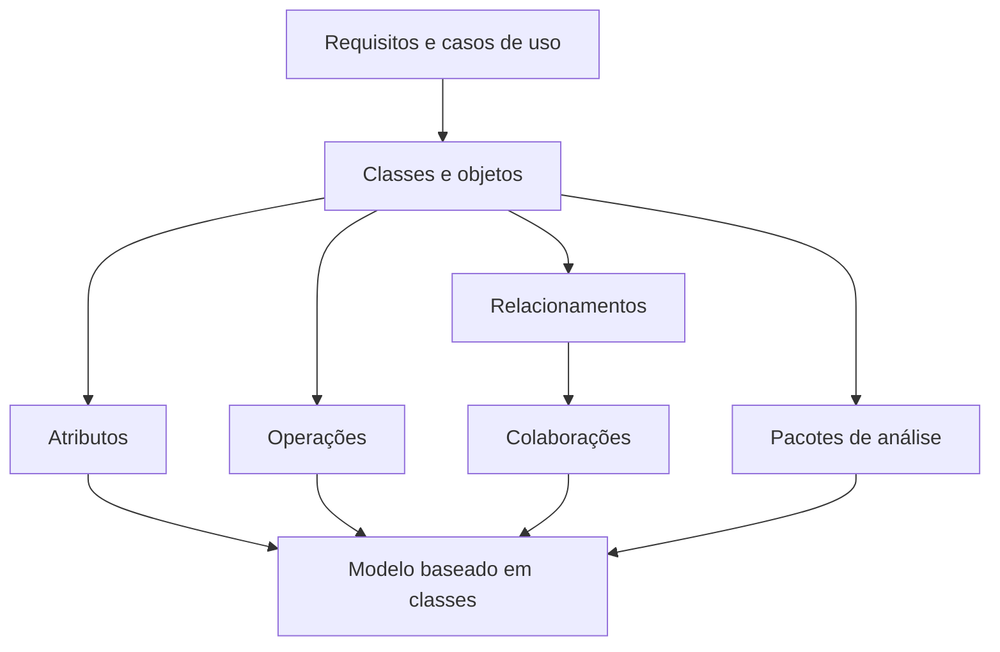
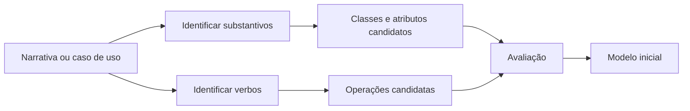
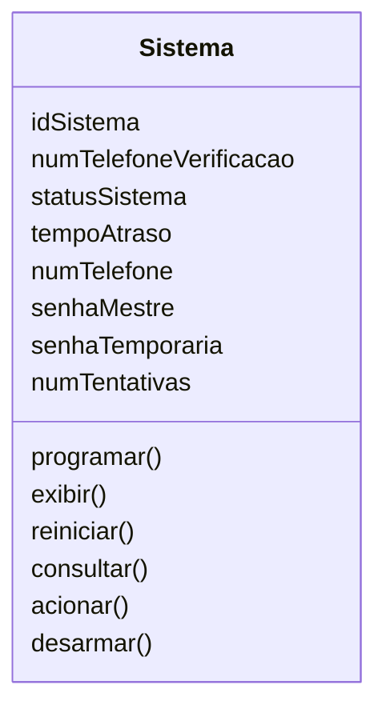
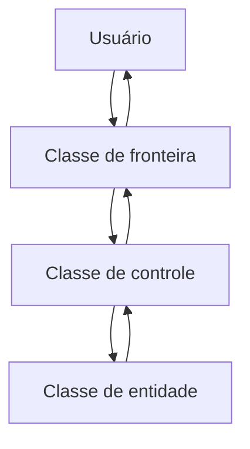
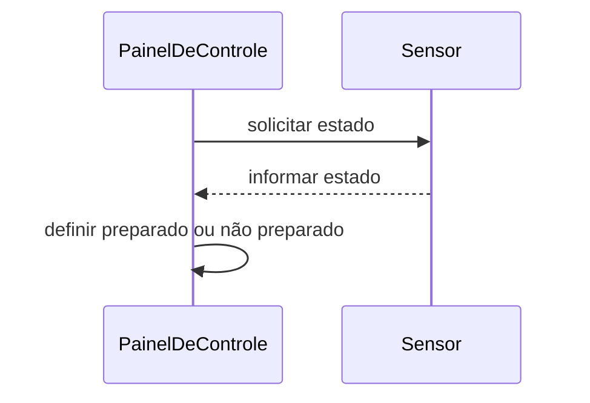
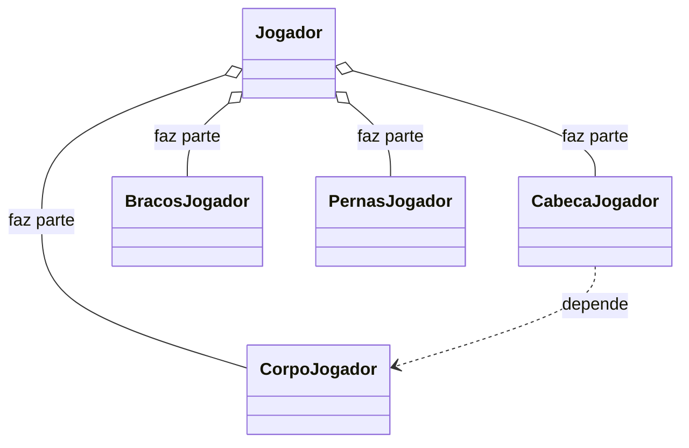
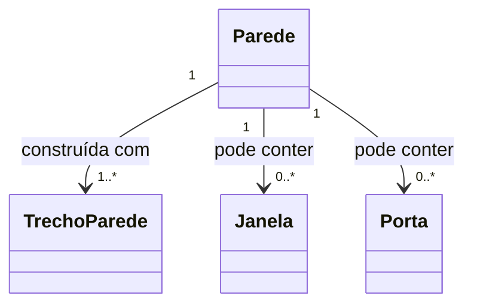
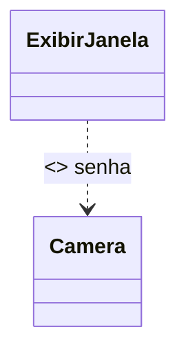
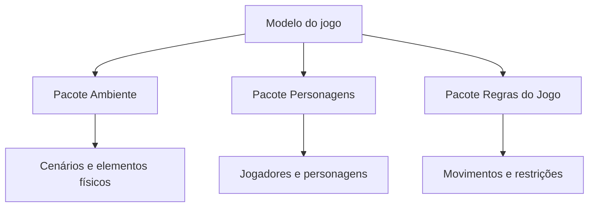
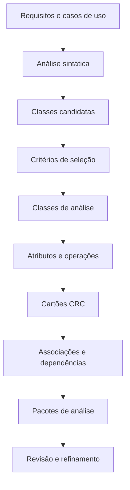

# Capítulo 10 — Modelagem de Requisitos: Métodos Baseados em Classes

## Visão geral da modelagem baseada em classes

> [!info] Conceito
> A modelagem baseada em classes representa os objetos manipulados pelo sistema, suas características, seus comportamentos e as relações estabelecidas entre eles.

Os métodos baseados em classes procuram representar uma aplicação de maneira compreensível tanto para os envolvidos no negócio quanto para os engenheiros de software. O sistema é analisado como um conjunto de **objetos interagentes**, sendo cada objeto uma instância de determinada classe.

Cada objeto possui um **estado**, descrito por seus atributos, e um **comportamento**, definido pelas operações que pode executar. Além disso, as classes podem estabelecer relações hierárquicas e colaborar entre si para cumprir as responsabilidades do sistema.

Os principais elementos desse modelo são:

- classes e objetos;
- atributos;
- operações;
- responsabilidades;
- colaboradores;
- associações;
- dependências;
- cartões CRC;
- pacotes de análise.

À medida que o modelo é refinado, ele deixa de ser apenas uma representação inicial dos requisitos e passa a fornecer uma base para o projeto do software.

> [!tip] Resumindo
> A modelagem baseada em classes transforma os requisitos em uma representação organizada das entidades do sistema, dos dados que elas conhecem e das ações que realizam.

## Importância do modelo baseado em classes

> [!info] Conceito
> O modelo baseado em classes apresenta uma visão do sistema próxima do domínio compreendido pelo cliente e pode ser avaliado antes do desenvolvimento.

O modelo é construído pelo engenheiro de software, ou analista, a partir dos requisitos extraídos dos envolvidos. Sua importância decorre do fato de utilizar objetos identificados na própria visão que o cliente possui da aplicação.

Por ser relativamente simples, o modelo pode ser revisado pelos usuários e gerar feedback antecipado. Isso ajuda a encontrar omissões, inconsistências e interpretações incorretas antes que elas sejam incorporadas ao projeto ou ao código.

As etapas gerais da modelagem são:

1. examinar os requisitos e os cenários de uso;
2. identificar objetos e classes candidatos;
3. determinar atributos e operações;
4. estabelecer responsabilidades e colaborações;
5. representar associações, hierarquias e dependências;
6. agrupar classes relacionadas;
7. revisar clareza, completude e consistência;
8. refinar o modelo.

> [!warning] Atenção
> O primeiro modelo não é definitivo. Classes inicialmente aceitas podem ser eliminadas, enquanto elementos rejeitados podem ser reintegrados após uma compreensão mais completa dos requisitos.

## Identificação das classes de análise

> [!info] Conceito
> Classes de análise são representações das entidades relevantes do domínio do problema e da solução que precisam ser conhecidas ou manipuladas pelo sistema.

Identificar objetos físicos em um ambiente real costuma ser relativamente simples. Entretanto, encontrar as classes corretas em um problema de software pode ser mais difícil, pois muitas entidades são abstratas e aparecem apenas nas descrições dos requisitos.

Uma técnica inicial consiste em examinar os cenários de uso e realizar uma **análise sintática** de suas narrativas. Nessa técnica:

- os substantivos e as frases nominais indicam possíveis classes, objetos ou atributos;
- os verbos indicam possíveis operações;
- os sinônimos devem ser anotados para evitar classes duplicadas.

As classes também podem ser diferenciadas conforme sua participação no problema:

- uma classe necessária para representar elementos do domínio pertence ao **espaço do problema**;
- uma classe necessária para implementar a solução pertence ao **espaço da solução**.

A análise sintática não é infalível, mas fornece um ponto de partida útil para identificar entidades, dados e transformações.

> [!warning] Atenção
> Nem todo substantivo deve tornar-se uma classe, assim como nem todo verbo deve tornar-se uma operação. Todos são inicialmente candidatos e precisam ser avaliados no contexto do problema.

## Formas de manifestação das classes

> [!info] Conceito
> As classes candidatas podem representar diferentes tipos de elementos encontrados no domínio da aplicação.

As classes de análise podem manifestar-se das seguintes maneiras:

| Categoria | Explicação | Exemplos do capítulo |
|---|---|---|
| Entidades externas | Produzem ou consomem informações utilizadas pelo sistema | Pessoas, dispositivos e outros sistemas |
| Coisas | Integram o domínio de informações do problema | Relatórios, exibições e sinais |
| Ocorrências ou eventos | Acontecimentos relevantes para a operação do sistema | Evento de sensor e transferência de propriedade |
| Papéis | Funções desempenhadas pelas pessoas que interagem com o sistema | Gerente, engenheiro e vendedor |
| Unidades organizacionais | Estruturas organizacionais relevantes para a aplicação | Divisão, grupo e equipe |
| Locais | Ambientes que estabelecem o contexto do problema | Chão de fábrica e área de carga |
| Estruturas | Conjuntos ou categorias de objetos relacionados | Sensores, veículos e computadores |

Essa classificação auxilia o analista a reconhecer entidades que não correspondem apenas a objetos físicos. Um evento, um papel desempenhado por uma pessoa ou uma unidade organizacional também pode precisar ser representado como classe.

## Classes e operações não devem ser confundidas

> [!info] Conceito
> Classes representam entidades do domínio, enquanto operações representam ações aplicadas a essas entidades.

Uma classe normalmente não deve possuir um nome procedural imperativo. Em um sistema de imagens médicas, por exemplo, `Imagem` pode ser uma classe porque constitui uma entidade do domínio. Entretanto, `InverterImagem` ou `InversãoDeImagem` tende a representar uma ação, devendo ser modelada como operação da classe `Imagem`, e não como uma classe independente.

A orientação a objetos procura encapsular os dados e as operações relacionadas, mas sem confundir a entidade com a ação realizada sobre ela.

> [!tip] Resumindo
> Classes são, em geral, expressas por substantivos que representam entidades; operações são expressas por verbos que indicam comportamentos.

## Exemplo de análise sintática: CasaSegura

> [!info] Conceito
> O sistema CasaSegura demonstra como os substantivos de uma narrativa podem ser classificados como classes, atributos ou elementos rejeitados.

A narrativa do CasaSegura descreve um sistema de segurança domiciliar que permite ao proprietário configurar o sistema, monitorar sensores e interagir com a aplicação por meio de um computador, painel de controle ou navegador.

Durante a instalação, são configurados os sensores, a senha-mestra e os números de telefone. Quando ocorre um evento de sensor, o sistema aciona um alarme, aguarda o tempo programado e comunica o serviço de monitoramento.

A análise dos substantivos da narrativa produziu os seguintes candidatos:

| Candidato | Classificação inicial |
|---|---|
| Proprietário | Papel ou entidade externa |
| Sensor | Entidade externa |
| Painel de controle | Entidade externa |
| Instalação | Ocorrência |
| Sistema de segurança | Coisa |
| Número e tipo | Possíveis atributos de `Sensor` |
| Senha-mestra | Possível atributo |
| Número de telefone | Possível atributo |
| Evento de sensor | Ocorrência |
| Alarme audível | Entidade externa |
| Serviço de monitoramento | Unidade organizacional ou entidade externa |

A lista é apenas preliminar. Cada elemento precisa ser avaliado antes de sua inclusão definitiva no modelo.

## Critérios para selecionar classes

> [!info] Conceito
> Uma classe candidata deve possuir informações ou comportamentos relevantes e contribuir para o funcionamento do sistema.

Seis características podem ser utilizadas para decidir se um elemento candidato deve tornar-se uma classe de análise:

1. **Informações retidas:** o sistema precisa lembrar informações sobre a entidade para funcionar.
2. **Serviços necessários:** a entidade possui operações identificáveis que modificam ou utilizam seus atributos.
3. **Atributos múltiplos:** a entidade possui várias informações relevantes; se tiver apenas uma, talvez seja melhor representá-la como atributo de outra classe.
4. **Atributos comuns:** os mesmos tipos de atributos aplicam-se a todas as instâncias da classe.
5. **Operações comuns:** as mesmas operações aplicam-se a todas as instâncias.
6. **Requisitos essenciais:** a entidade produz ou consome informações essenciais para a operação do sistema.

Para ser considerada uma classe legítima, a candidata deve satisfazer todas ou quase todas essas características.

No exemplo do CasaSegura, `Sensor`, `PainelDeControle`, `Sistema`, `EventoDeSensor` e `AlarmeAudível` foram aceitos. Elementos como número, tipo, senha-mestra e número de telefone foram rejeitados como classes, pois seriam mais adequadamente representados como atributos.

A decisão depende do contexto. Se cada proprietário tivesse uma senha individual ou fosse reconhecido por voz, por exemplo, `Proprietário` poderia precisar reter informações e executar serviços, tornando-se uma classe legítima.

> [!warning] Atenção
> Rejeitar um candidato como classe não significa excluí-lo do modelo. Ele pode transformar-se em atributo de uma classe aceita.

## Especificação dos atributos

> [!info] Conceito
> Atributos são os dados que descrevem uma classe e definem seu estado no contexto do problema.

Os atributos esclarecem o que uma classe representa. Uma mesma classe pode possuir atributos diferentes em sistemas distintos, porque sua definição depende das necessidades do domínio.

A classe `Jogador`, por exemplo, poderia conter posição, média de rebatidas e número de jogos em um sistema de estatísticas esportivas. Em um sistema de aposentadoria, poderia conter salário médio, crédito para aposentadoria e endereço para correspondência.

Para identificar os atributos, o analista deve estudar os casos de uso e perguntar:

> Quais dados definem completamente esta classe no contexto do problema?

No CasaSegura, a classe `Sistema` possui atributos relacionados à identificação, ao alarme e à ativação:

- `idSistema`;
- `numTelefoneVerificacao`;
- `statusSistema`;
- `tempoAtraso`;
- `numTelefone`;
- `senhaMestre`;
- `senhaTemporaria`;
- `numTentativas`.

Esses atributos podem ser organizados conceitualmente da seguinte maneira:

- **informações de identificação:** ID, telefone de verificação e estado do sistema;
- **informações de resposta do alarme:** tempo de retardo e telefone;
- **informações de ativação e desativação:** senha-mestra, senha temporária e número permitido de tentativas.

Se vários elementos do mesmo tipo estiverem associados a uma classe, eles geralmente não devem ser modelados como um único atributo. Como o CasaSegura possui vários sensores, `Sensor` deve ser uma classe associada a `Sistema`, e não apenas um atributo simples.

> [!tip] Resumindo
> Um dado simples pode ser atributo, mas um elemento com identidade, informações próprias e várias ocorrências tende a ser representado como classe associada.

## Definição das operações

> [!info] Conceito
> Operações definem os comportamentos que os objetos de uma classe podem executar.

As operações podem ser divididas em quatro categorias gerais:

1. operações que manipulam dados, como adicionar, eliminar, selecionar ou reformatar;
2. operações que realizam cálculos;
3. operações que consultam o estado de um objeto;
4. operações que monitoram eventos de controle.

Uma operação atua sobre atributos ou associações e, portanto, precisa conhecer os dados e os relacionamentos relevantes para sua execução.

A identificação inicial das operações também pode ser realizada por meio da análise sintática. Os verbos presentes nos casos de uso indicam possíveis comportamentos. Na narrativa do CasaSegura:

- atribuir número e tipo ao sensor sugere uma operação para `Sensor`;
- programar uma senha-mestra sugere `programar()` para `Sistema`;
- armar e desarmar o sistema sugerem `armar()` e `desarmar()`.

Uma operação genérica, como `programar()`, pode posteriormente ser dividida em suboperações mais específicas, como configurar sensores, cadastrar telefones e definir senhas.

> [!warning] Atenção
> Durante a análise, as operações devem expressar comportamentos relacionados ao problema. Detalhes técnicos de implementação devem ser adiados, sempre que possível, para a etapa de projeto.

## Comunicação entre objetos

> [!info] Conceito
> Objetos colaboram enviando mensagens uns aos outros para solicitar informações ou ações.

Nem todas as responsabilidades podem ser cumpridas isoladamente. Quando um objeto precisa de informações ou serviços de outro, ocorre uma comunicação entre eles.

A análise das mensagens trocadas ajuda a descobrir operações que não foram identificadas apenas pela leitura dos verbos. Também permite determinar quais classes precisam colaborar para realizar cada funcionalidade.

No exemplo do CasaSegura, a classe `Planta` relaciona-se com paredes, portas, janelas, câmeras e segmentos. Cada elemento possui atributos e operações próprios, mas participa da construção e da apresentação da planta.

## Modelagem classe-responsabilidade-colaborador

> [!info] Conceito
> A modelagem CRC organiza cada classe conforme aquilo que ela sabe, aquilo que faz e as classes de que necessita.

**CRC** significa **Classe–Responsabilidade–Colaborador**. O modelo utiliza cartões físicos ou virtuais divididos em três partes:

- nome da classe;
- responsabilidades;
- colaboradores.

As **responsabilidades** correspondem a tudo que a classe sabe ou faz, abrangendo seus atributos e operações relevantes. Os **colaboradores** são as classes que fornecem informações ou executam ações necessárias para que uma responsabilidade seja cumprida.

Um cartão simplificado para a classe `Planta` pode ser representado assim:

| Classe | Planta |
|---|---|
| Responsabilidades | Colaboradores |
| Definir o nome e o tipo da planta | — |
| Gerenciar o posicionamento | — |
| Ampliar ou reduzir a planta | — |
| Incorporar paredes, portas e janelas | Parede |
| Mostrar a posição das câmeras | Câmera |

> [!tip] Resumindo
> O cartão CRC responde a três perguntas: qual é a classe, o que ela deve fazer e com quais outras classes precisa trabalhar.

## Categorias de classes no modelo CRC

> [!info] Conceito
> As classes podem desempenhar papéis de entidade, fronteira ou controle na estrutura do sistema.

### Classes de entidade

As **classes de entidade**, também chamadas classes de negócio ou de modelo, são extraídas diretamente do domínio do problema. Normalmente representam informações que precisam ser armazenadas e persistem durante a execução da aplicação.

Exemplos do CasaSegura incluem `Planta` e `Sensor`.

### Classes de fronteira

As **classes de fronteira** representam a interface entre o sistema e seus usuários. Elas controlam como as informações mantidas pelas entidades são apresentadas ou recebidas.

Uma classe `JanelaCamera`, por exemplo, poderia ser responsável por exibir imagens das câmeras de vigilância.

### Classes de controle

As **classes de controle** gerenciam uma unidade de trabalho do início ao fim. Elas podem coordenar:

- criação e atualização de entidades;
- instanciação de objetos de fronteira;
- comunicação complexa entre objetos;
- validação de dados;
- interação entre usuário e aplicação.

Essas classes normalmente são consideradas com maior profundidade quando a atividade de projeto é iniciada.

## Diretrizes para atribuição de responsabilidades

> [!info] Conceito
> As responsabilidades devem ser distribuídas de modo a preservar a coesão, o encapsulamento e a facilidade de manutenção.

Cinco diretrizes orientam a atribuição de responsabilidades:

### 1. Distribuir a inteligência do sistema

A inteligência corresponde ao que o sistema sabe e consegue fazer. Concentrá-la em poucas classes muito inteligentes produz várias classes com pouca responsabilidade e dificulta alterações.

Uma distribuição mais equilibrada permite que cada classe conheça e faça poucas coisas bem relacionadas, aumentando a coesão e reduzindo os efeitos colaterais das mudanças.

Uma classe com uma lista excessivamente longa de responsabilidades pode precisar ser dividida.

### 2. Declarar responsabilidades genericamente

As responsabilidades devem ser formuladas da maneira mais geral possível. As responsabilidades aplicáveis a todas as subclasses devem ficar nas classes mais altas da hierarquia.

### 3. Manter dados e comportamentos relacionados juntos

As informações e as operações que as manipulam devem residir na mesma classe. Essa diretriz aplica o princípio do **encapsulamento**, mantendo dados e comportamentos relacionados em uma unidade coesa.

### 4. Centralizar cada tipo de informação

As informações sobre determinado item devem ficar sob a responsabilidade de uma única classe. Distribuir os mesmos dados entre várias classes dificulta a manutenção e os testes.

### 5. Compartilhar responsabilidades quando adequado

Classes relacionadas podem precisar executar o mesmo comportamento. Em um jogo, por exemplo, jogador, corpo, braços, pernas e cabeça podem compartilhar responsabilidades de atualização e exibição, embora cada objeto controle sua própria representação.

> [!warning] Atenção
> As responsabilidades de uma mesma classe devem apresentar níveis semelhantes de abstração. Misturar decisões complexas com tarefas administrativas simples pode indicar que uma responsabilidade pertence a outra classe.

## Colaborações entre classes

> [!info] Conceito
> Uma colaboração ocorre quando uma classe precisa solicitar informações ou ações a outra para cumprir uma responsabilidade.

Uma classe pode cumprir uma responsabilidade de duas maneiras:

1. utilizando suas próprias operações para manipular seus atributos;
2. colaborando com outra classe.

Na colaboração, uma classe cliente envia uma solicitação a uma classe servidora. Essa interação representa um contrato: o cliente necessita de uma responsabilidade implementada pelo servidor.

No CasaSegura, `PainelDeControle` precisa determinar se existe algum sensor aberto. Como as informações pertencem aos objetos `Sensor`, o painel só consegue cumprir a responsabilidade `determinarEstadoSensor()` colaborando com essa classe.

## Relações utilizadas para identificar colaboradores

> [!info] Conceito
> As colaborações podem ser reconhecidas por relações de pertencimento, conhecimento ou dependência.

### Relação faz-parte-de

Indica que uma classe constitui parte de uma classe agregada. Em um jogo, `CabeçaJogador`, `CorpoJogador`, `BraçosJogador` e `PernasJogador` fazem parte de `Jogador`.

### Relação tem-conhecimento-de

Ocorre quando uma classe precisa obter informações diretamente de outra. `PainelDeControle`, por exemplo, precisa conhecer o estado dos objetos `Sensor`.

### Relação depende-de

Indica uma dependência que não é adequadamente expressa pelas relações anteriores. Um objeto pode depender das informações de outro mesmo sem conhecê-lo diretamente.

No exemplo do jogo, a posição da cabeça depende da posição do corpo, embora essa informação possa ser intermediada pela classe `Jogador`.

## Revisão do modelo CRC

> [!info] Conceito
> A revisão CRC simula os cenários de uso para verificar se as classes, responsabilidades e colaborações são suficientes.

A revisão pode ser realizada como uma representação dos papéis desempenhados pelos objetos:

1. os participantes recebem subconjuntos de cartões CRC;
2. os cartões de classes que colaboram são distribuídos entre pessoas diferentes;
3. os cenários e casos de uso são organizados;
4. um líder lê cada caso de uso pausadamente;
5. quando uma classe é mencionada, a execução passa ao participante que possui seu cartão;
6. esse participante explica como as responsabilidades da classe atendem ao cenário;
7. quando uma colaboração é necessária, a execução passa ao responsável pela classe colaboradora;
8. se o modelo não satisfizer o caso de uso, os cartões são modificados.

As modificações podem incluir:

- criação de novas classes;
- inclusão ou revisão de responsabilidades;
- identificação de novos colaboradores;
- eliminação de classes desnecessárias;
- correção de associações inadequadas.

O processo continua até que todos os casos de uso sejam satisfeitos pelo conjunto de cartões.

> [!tip] Resumindo
> A simulação dos casos de uso com cartões CRC permite encontrar omissões e erros antes que a estrutura seja transformada em código.

## Associações entre classes

> [!info] Conceito
> Uma associação representa uma relação estrutural entre duas classes.

As associações indicam que objetos de uma classe estão relacionados a objetos de outra. No exemplo do CasaSegura, `Planta` está associada a `Camera` e `Parede`, enquanto `Parede` se relaciona com `TrechoParede`, `Janela` e `Porta`.

Uma associação pode receber uma descrição para esclarecer seu significado, como:

- câmera é colocada na planta;
- parede é parte da planta;
- trecho de parede é usado para construir uma parede.

As associações não devem ser interpretadas apenas como linhas gráficas: elas expressam relações relevantes para os requisitos do sistema.

## Multiplicidade

> [!info] Conceito
> A multiplicidade informa quantos objetos de uma classe podem relacionar-se com objetos de outra.

A multiplicidade é acrescentada à associação para indicar os limites mínimo e máximo da relação.

| Notação | Significado |
|---|---|
| `1` | Exatamente um objeto |
| `0..*` | Zero ou muitos objetos |
| `1..*` | Um ou muitos objetos |

No CasaSegura:

- uma parede é construída por um ou mais trechos de parede;
- uma parede pode possuir nenhuma ou várias janelas;
- uma parede pode possuir nenhuma ou várias portas.

> [!warning] Atenção
> A multiplicidade faz parte do significado do relacionamento. Omiti-la pode deixar indefinida uma importante regra do domínio.

## Dependências e estereótipos

> [!info] Conceito
> Uma dependência indica que uma classe necessita de outra, enquanto o estereótipo acrescenta um significado específico ao relacionamento.

Em uma relação cliente-servidor, a classe cliente pode depender da classe servidora para obter uma informação ou serviço. Essa dependência pode ser representada na UML com uma seta tracejada.

Um **estereótipo** é um mecanismo de extensão da UML que permite atribuir uma semântica personalizada a um elemento. Sua representação utiliza os sinais `<< >>`.

No CasaSegura, a classe `ExibirJanela` depende de `Camera` para apresentar uma imagem. O estereótipo `<<access>>` indica que o acesso à saída da câmera é controlado, e uma restrição informa que uma senha é necessária.

> [!tip] Resumindo
> A associação mostra que as classes estão estruturalmente relacionadas; a dependência mostra que uma classe necessita temporariamente de outra para realizar alguma atividade.

## Pacotes de análise

> [!info] Conceito
> Um pacote de análise agrupa elementos relacionados do modelo para facilitar sua organização e administração.

Sistemas grandes podem possuir numerosas classes e casos de uso. Para tornar o modelo mais compreensível, seus elementos podem ser categorizados e reunidos em **pacotes de análise** com nomes representativos.

Em um jogo, por exemplo, as classes poderiam ser distribuídas em:

- **Ambiente:** árvore, paisagem, rodovia, parede, ponte, prédio, efeitos visuais e cenário;
- **Personagens:** jogador, protagonista, antagonista e papéis de apoio;
- **Regras do jogo:** regras de movimentação e restrições de ação.

A visibilidade dos elementos dentro dos pacotes pode ser representada por símbolos:

| Símbolo | Visibilidade |
|---|---|
| `+` | Elemento público e acessível por outros pacotes |
| `-` | Elemento oculto para os demais pacotes |
| `#` | Elemento acessível apenas aos pacotes contidos no pacote correspondente |

> [!tip] Resumindo
> Os pacotes reduzem a complexidade visual ao organizar classes relacionadas em unidades coerentes.

## Relação entre o capítulo e a aula em vídeo

> [!info] Conceito
> O capítulo aprofunda o processo utilizado na aula para transformar requisitos funcionais em um diagrama de classes.

Na aula, as classes do sistema condominial foram inicialmente extraídas dos substantivos presentes nos requisitos, como `Usuário`, `Morador`, `Síndico`, `Documento`, `Apartamento`, `Mensagem` e `EspaçoReserva`.

O capítulo complementa esse processo ao demonstrar que:

- os substantivos geram apenas classes candidatas;
- cada candidata precisa ser avaliada por critérios de seleção;
- alguns substantivos tornam-se atributos, não classes;
- os verbos ajudam a identificar operações;
- responsabilidades devem ser atribuídas de forma coesa;
- classes colaboram quando não conseguem cumprir uma responsabilidade isoladamente;
- associações devem indicar multiplicidades quando necessário;
- o modelo deve ser revisado e refinado com base nos casos de uso;
- classes relacionadas podem ser organizadas em pacotes.

Aplicando esse raciocínio ao sistema condominial, `Ata`, `Balancete` e `Contrato` são especializações de `Documento`, enquanto `Morador` e `Síndico` são especializações de `Usuário`. Dados como login, senha, número do apartamento e início do mandato devem ser tratados como atributos das classes correspondentes.

Os casos de uso, como reservar espaço, visualizar documento ou responder a uma ocorrência, permitem verificar se as classes possuem responsabilidades e colaboradores suficientes para executar as funcionalidades.

## Processo integrado de modelagem

> [!info] Conceito
> A modelagem baseada em classes evolui dos requisitos textuais para uma estrutura revisável de classes e relacionamentos.

O processo completo apresentado pelo capítulo pode ser sintetizado assim:

Cada etapa melhora progressivamente a representação do sistema. O modelo final deve ser revisado quanto à:

- **correção:** os elementos representam adequadamente o domínio;
- **completude:** os requisitos relevantes foram contemplados;
- **consistência:** não existem contradições entre classes, responsabilidades e relações.

## Síntese final

> [!summary] Síntese
> A modelagem baseada em classes extrai dos requisitos uma estrutura de classes, atributos, operações, responsabilidades e relacionamentos que pode ser compreendida pelo cliente e utilizada posteriormente no projeto do software.

As classes candidatas podem ser encontradas por meio da análise dos substantivos presentes nos casos de uso e nas narrativas de processamento, enquanto os verbos ajudam a identificar operações. Entretanto, esses elementos precisam ser avaliados, pois alguns substantivos representam apenas atributos e alguns verbos não correspondem a operações relevantes.

Os atributos definem o estado dos objetos, e as operações representam seus comportamentos. As responsabilidades devem ser distribuídas de maneira coesa, mantendo na mesma classe as informações e os comportamentos relacionados.

Os cartões CRC ajudam a organizar as classes, suas responsabilidades e seus colaboradores. A simulação dos casos de uso permite verificar se o modelo consegue realizar todas as funcionalidades previstas.

As associações representam relações entre classes, a multiplicidade determina quantos objetos participam dessas relações e as dependências registram quando uma classe necessita dos serviços de outra. Finalmente, os pacotes de análise agrupam classes relacionadas e tornam modelos maiores mais fáceis de compreender e administrar.