# Capítulo 12 — Conceitos de Projeto de Software

## 1. Visão geral do projeto de software

> [!info] Conceito
> O projeto de software reúne princípios, conceitos e práticas usados para transformar requisitos em uma solução implementável e de alta qualidade.

O projeto de software é o ponto em que as necessidades dos envolvidos, as características da aplicação e as decisões técnicas se unem para formar um sistema. Ele cria uma representação do software que orientará a codificação, os testes e as atividades posteriores de manutenção.

Enquanto o modelo de requisitos descreve **o que** deve ser feito em termos de dados, funções e comportamentos, o modelo de projeto indica **como** o sistema será implementado. Para isso, apresenta detalhes sobre:

- arquitetura do software;
- estruturas de dados;
- interfaces;
- componentes;
- distribuição do software no ambiente computacional.

O projeto deve buscar três qualidades comparáveis às propostas por Vitrúvio para construções:

- **Solidez:** o software não deve apresentar defeitos que impeçam seu funcionamento;
- **Comodidade:** o sistema deve ser adequado aos propósitos para os quais foi criado;
- **Deleite:** a experiência de uso deve ser agradável.

Durante o projeto ocorre um movimento de **diversificação** e **convergência**. Primeiro, os projetistas consideram diferentes componentes, soluções, padrões e conhecimentos disponíveis. Depois, analisam e descartam alternativas até convergirem para uma configuração que satisfaça os requisitos.

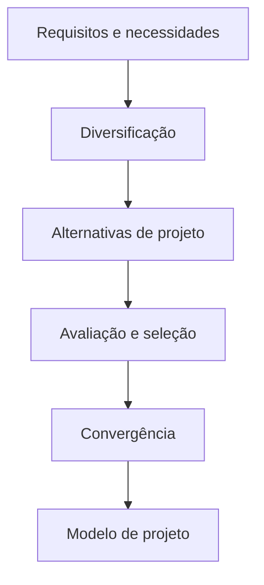

> [!tip] Resumindo
> Projetar software significa examinar alternativas e construir uma representação técnica capaz de orientar a implementação de uma solução adequada aos requisitos.

---

## 2. Projeto no contexto da Engenharia de Software

> [!info] Conceito
> O projeto é a última ação da modelagem e prepara o software para a construção, que envolve geração de código e testes.

O projeto ocupa o núcleo técnico da Engenharia de Software e é realizado independentemente do modelo de processo adotado. Ele começa depois que os requisitos foram analisados e modelados.

Os elementos do modelo de requisitos fornecem as informações utilizadas para construir quatro modelos fundamentais:

1. **Projeto de dados e classes;**
2. **Projeto de arquitetura;**
3. **Projeto de interfaces;**
4. **Projeto de componentes.**

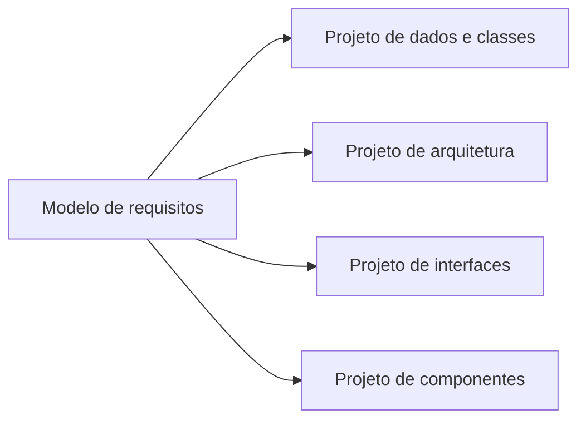

Os elementos baseados em cenários, classes, fluxos e comportamentos são transformados em representações mais próximas da implementação:

| Elemento do projeto | Transformação realizada |
|---|---|
| **Dados e classes** | Transforma classes de análise em classes de projeto e estruturas de dados |
| **Arquitetura** | Define elementos estruturais, relacionamentos, estilos e padrões arquiteturais |
| **Interfaces** | Especifica a comunicação com usuários, outros sistemas e componentes internos |
| **Componentes** | Converte elementos da arquitetura em descrições procedurais detalhadas |

O projeto deve começar pela consideração dos dados, que constituem a base dos demais elementos. Depois, deve ser definida a arquitetura e, sobre essa estrutura, são desenvolvidos os projetos de interfaces e componentes.

### 2.1 Diferença entre projetar e codificar

A codificação expressa o projeto em uma linguagem de programação e representa muito bem estruturas de dados e algoritmos. Entretanto, o código não oferece necessariamente uma visão rápida e abrangente da arquitetura ou da colaboração entre os componentes.

Por isso, projetar e programar são atividades relacionadas, mas não equivalentes. Uma arquitetura desorganizada pode comprometer até mesmo um código tecnicamente bem escrito.

> [!warning] Atenção
> O projeto não é o próprio programa. Ele é um conjunto de representações que permite avaliar a solução antes de investir recursos na implementação.

### 2.2 Importância do projeto

A importância do projeto pode ser resumida pela palavra **qualidade**. É nessa etapa que a qualidade é incorporada à solução e pode ser avaliada antes da geração do código.

Sem um projeto adequado, existe o risco de construir um sistema:

- instável diante de pequenas alterações;
- difícil de testar;
- difícil de manter;
- sujeito à propagação de erros;
- cuja qualidade somente seja descoberta em uma fase avançada;
- incompatível com as restrições de prazo e orçamento.

> [!tip] Resumindo
> O projeto permite encontrar erros, inconsistências e alternativas melhores quando as correções ainda são menos caras.

---

## 3. O processo de projeto

> [!info] Conceito
> O projeto é um processo iterativo que traduz requisitos em uma “planta” para a construção do software.

Inicialmente, o projeto apresenta uma visão holística e abstrata do sistema. Essa visão pode ser diretamente relacionada aos objetivos do software e aos requisitos de dados, funcionalidade e comportamento.

A cada iteração, o modelo é refinado e recebe detalhes progressivamente mais próximos da implementação. Embora a ligação com os requisitos permaneça, ela se torna menos evidente nos níveis técnicos mais baixos.

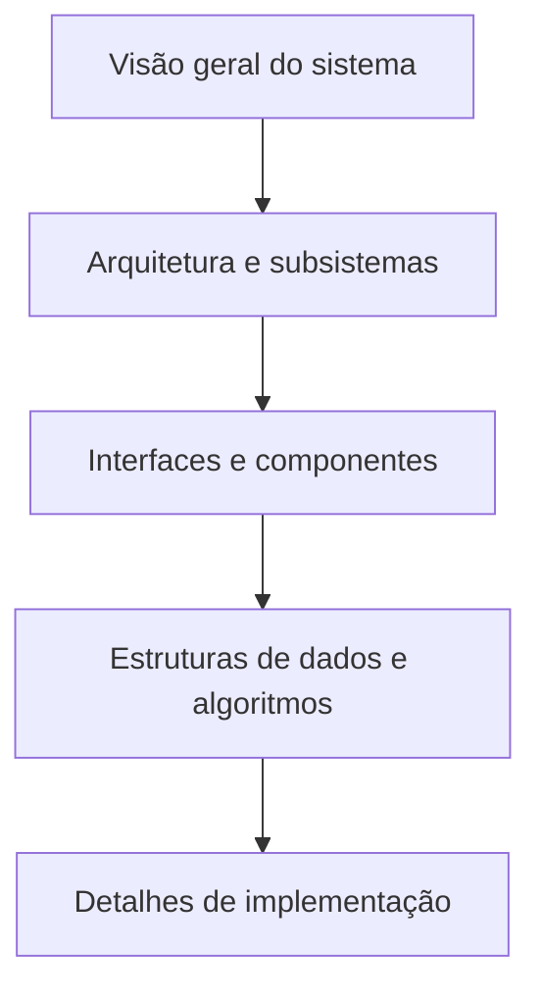

### 3.1 Características de um bom projeto

Um bom projeto deve:

- implementar todos os requisitos explícitos do modelo de requisitos;
- acomodar os requisitos implícitos desejados pelos envolvidos;
- ser legível e compreensível para programadores, testadores e profissionais de suporte;
- fornecer uma visão completa dos domínios de dados, funcional e comportamental;
- utilizar uma arquitetura baseada em estilos ou padrões reconhecíveis;
- permitir implementação e testes evolutivos;
- apresentar organização modular;
- possuir representações distintas de dados, arquitetura, interfaces e componentes;
- usar estruturas de dados adequadas às classes;
- gerar componentes funcionalmente independentes;
- reduzir a complexidade das conexões entre componentes e ambiente externo;
- ser derivado por um método repetível, orientado pelas informações obtidas na análise;
- utilizar uma notação capaz de comunicar seu significado com eficiência.

Essas características não são alcançadas por acaso. Elas dependem da aplicação sistemática de princípios de projeto, métodos e revisões.

---

## 4. Qualidade do projeto e modelo FURPS

> [!info] Conceito
> FURPS organiza a qualidade em funcionalidade, usabilidade, confiabilidade, desempenho e facilidade de suporte.

Os atributos de qualidade devem ser considerados desde o início do projeto, e não apenas depois que a solução estiver pronta. O peso de cada atributo pode variar conforme a aplicação.

| Atributo | Significado |
|---|---|
| **Funcionalidade** | Características, capacidades, abrangência das funções e segurança do sistema |
| **Usabilidade** | Fatores humanos, estética, consistência e documentação |
| **Confiabilidade** | Frequência e gravidade das falhas, precisão dos resultados, recuperação e previsibilidade |
| **Desempenho** | Velocidade de processamento, tempo de resposta, consumo de recursos, vazão e eficiência |
| **Facilidade de suporte** | Extensibilidade, adaptabilidade, reparabilidade, testabilidade, compatibilidade, configuração, instalação e localização de problemas |

A confiabilidade pode considerar medidas como o **tempo médio entre falhas — MTTF (*mean time to failure*)**. Já a facilidade de suporte reúne características normalmente relacionadas à facilidade de manutenção.

Uma aplicação pode privilegiar a funcionalidade e a segurança, enquanto outra pode exigir maior desempenho ou confiabilidade. Em todos os casos, os atributos relevantes precisam orientar as decisões de projeto.

### 4.1 Revisões técnicas

Como ainda não existe software executável durante o projeto, a qualidade é avaliada por meio de **revisões técnicas**. Nessas reuniões, integrantes da equipe examinam os artefatos para localizar:

- erros;
- omissões;
- ambiguidades;
- inconsistências;
- oportunidades de melhoria.

Normalmente participam de duas a quatro pessoas, com papéis definidos:

- **Líder da revisão:** planeja, estabelece a agenda e conduz a reunião;
- **Registrador:** documenta os problemas e decisões;
- **Produtor:** é o responsável pelo artefato examinado;
- **Revisores:** analisam previamente o material e apontam problemas.

Ao final, a equipe decide se o artefato pode integrar o modelo final ou se precisa ser corrigido.

> [!tip] Resumindo
> A revisão técnica permite avaliar o projeto antes da codificação, quando corrigir problemas ainda é relativamente simples e econômico.

---

## 5. Evolução dos métodos de projeto

> [!info] Conceito
> Os métodos de projeto evoluíram da programação modular e do refinamento estruturado para abordagens orientadas a objetos, padrões, aspectos, modelos e testes.

Os primeiros trabalhos sobre projeto enfatizavam programas modulares e refinamento descendente ou *top-down*. Posteriormente, desenvolveram-se abordagens orientadas a objetos.

As tendências mais recentes destacadas no capítulo incluem:

- arquitetura de software;
- padrões arquiteturais e de projeto;
- desenvolvimento orientado a aspectos;
- desenvolvimento dirigido a modelos;
- desenvolvimento dirigido a testes.

Apesar das diferenças, os métodos de projeto normalmente apresentam quatro características comuns:

1. mecanismo para transformar requisitos em uma representação de projeto;
2. notação para representar componentes e interfaces;
3. heurísticas para divisão e refinamento;
4. diretrizes para avaliar a qualidade.

---

## 6. Conjunto genérico de tarefas de projeto

> [!info] Conceito
> As tarefas de projeto conduzem o desenvolvimento desde os dados e a arquitetura até os componentes e a implantação.

Um conjunto genérico de tarefas compreende:

1. Examinar o domínio da informação e projetar estruturas adequadas para os dados e seus atributos;
2. Selecionar um estilo ou padrão de arquitetura apropriado;
3. Dividir o modelo de análise em subsistemas e alocá-los na arquitetura;
4. Criar classes e componentes de projeto;
5. Projetar interfaces com sistemas ou dispositivos externos;
6. Projetar a interface do usuário;
7. Realizar o projeto detalhado dos componentes;
8. Desenvolver o modelo de implantação.

Durante a divisão em subsistemas, é necessário:

- garantir que cada subsistema seja funcionalmente coeso;
- projetar suas interfaces;
- alocar classes e funções de análise aos subsistemas.

Na criação das classes de projeto, deve-se:

- transformar classes de análise em classes implementáveis;
- verificar critérios de qualidade;
- considerar herança;
- definir métodos e mensagens;
- avaliar padrões aplicáveis;
- revisar as classes quando necessário.

O projeto de componentes envolve algoritmos, interfaces e estruturas de dados em baixo nível de abstração. Cada componente deve ser revisado e os erros encontrados precisam ser corrigidos.

---

# Conceitos fundamentais de projeto

## 7. Abstração

> [!info] Conceito
> Abstração permite compreender uma solução em diferentes níveis, destacando o que é relevante e ocultando detalhes desnecessários.

No nível mais elevado, a solução é expressa em termos gerais e usando a linguagem do domínio do problema. Em níveis inferiores, são acrescentados detalhes técnicos até que a solução possa ser implementada diretamente.

Existem duas formas destacadas de abstração:

### 7.1 Abstração procedural

Representa uma sequência de instruções que executa uma função específica, mas oculta suas etapas internas. A operação **abrir uma porta**, por exemplo, representa diversas ações menores sem precisar enumerá-las sempre.

### 7.2 Abstração de dados

É um conjunto nomeado de informações que descreve um objeto. A abstração **porta**, por exemplo, pode reunir atributos como tipo, peso, dimensões e mecanismo de abertura.

A abstração procedural utiliza informações presentes na abstração de dados. Assim, a operação **abrir** depende das características da **porta**, embora o usuário da operação não precise conhecer todos os detalhes internos.

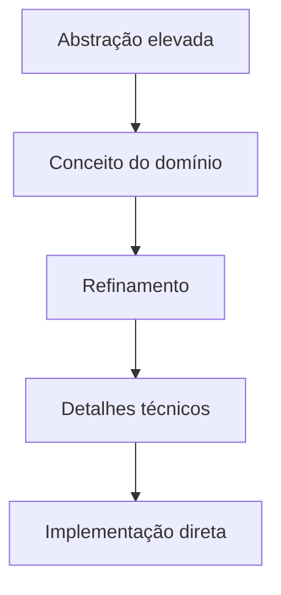

> [!tip] Resumindo
> A abstração controla a complexidade ao permitir que o projetista raciocine sobre funções e dados sem precisar considerar todos os detalhes simultaneamente.

---

## 8. Arquitetura de software

> [!info] Conceito
> Arquitetura é a organização geral do software, incluindo componentes, interações e estruturas de dados.

A arquitetura fornece integridade conceitual ao sistema e serve como base para as tarefas mais detalhadas do projeto. Ela deve especificar:

- **Propriedades estruturais:** componentes, módulos, objetos e formas de interação;
- **Propriedades extrafuncionais:** desempenho, capacidade, confiabilidade, segurança e adaptabilidade;
- **Famílias de sistemas relacionados:** padrões reutilizáveis encontrados em aplicações semelhantes.

A arquitetura pode ser representada por diferentes modelos:

| Modelo | Ênfase |
|---|---|
| **Estrutural** | Organização dos componentes do programa |
| **Framework** | Estruturas e padrões arquiteturais reutilizáveis |
| **Dinâmico** | Mudanças da configuração em resposta a eventos |
| **Processo** | Processos técnicos ou de negócio atendidos pelo sistema |
| **Funcional** | Hierarquia das funções do sistema |

As **linguagens de descrição de arquitetura — ADLs** fornecem mecanismos para representar componentes e suas conexões.

---

## 9. Padrões

> [!info] Conceito
> Um padrão registra a essência de uma solução comprovada para um problema recorrente em determinado contexto.

Um padrão descreve uma estrutura capaz de resolver uma categoria de problemas, considerando o contexto e as forças concorrentes que influenciam sua utilização.

Um padrão deve permitir ao projetista determinar:

1. se ele se aplica ao problema atual;
2. se pode ser reutilizado para economizar tempo;
3. se pode orientar o desenvolvimento de uma solução semelhante, mas adaptada.

> [!warning] Atenção
> Um padrão não é uma solução pronta para ser copiada sem análise. Sua adequação depende do problema, do contexto e das restrições existentes.

---

## 10. Separação por interesses

> [!info] Conceito
> A separação por interesses divide um problema complexo em partes menores que podem ser resolvidas ou otimizadas independentemente.

Um interesse é uma característica ou comportamento especificado nos requisitos. Quando diferentes interesses são isolados, o problema se torna mais administrável.

A complexidade percebida de problemas combinados tende a ser maior que a soma da complexidade de cada parte examinada separadamente. Isso fundamenta a estratégia de **dividir para conquistar**.

A separação por interesses manifesta-se em conceitos como:

- modularidade;
- independência funcional;
- refinamento;
- aspectos.

> [!tip] Resumindo
> Dividir o problema reduz a quantidade de detalhes que precisam ser considerados ao mesmo tempo.

---

## 11. Modularidade

> [!info] Conceito
> Modularidade é a divisão do software em componentes separadamente especificados, que depois são integrados para formar o sistema.

Um software monolítico, composto por um único grande módulo, tende a ser difícil de compreender em razão do número de caminhos de controle, variáveis, referências e responsabilidades.

A modularização facilita:

- planejamento do desenvolvimento;
- definição e entrega de incrementos;
- acomodação de mudanças;
- testes e depuração;
- manutenção;
- redução dos efeitos colaterais das alterações.

Entretanto, modularizar indefinidamente não reduz continuamente o esforço. À medida que os módulos ficam menores, o custo de desenvolvimento de cada módulo diminui, mas o custo de integração aumenta.

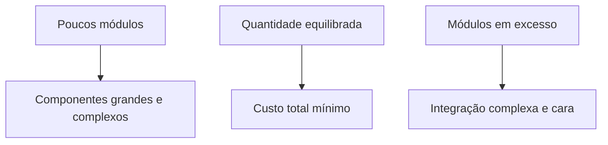

Existe, portanto, uma região de equilíbrio em que o custo total é mínimo. A modularização insuficiente e a modularização excessiva devem ser evitadas.

> [!warning] Atenção
> Modularidade eficaz não significa criar o maior número possível de módulos, mas encontrar uma divisão que equilibre simplicidade interna e custo de integração.

---

## 12. Encapsulamento de informações

> [!info] Conceito
> Encapsulamento oculta os dados e algoritmos internos de um módulo e expõe somente aquilo que outros módulos precisam utilizar.

Os módulos devem ser organizados de modo que suas decisões internas de projeto permaneçam inacessíveis às partes que não necessitam conhecê-las. A interação ocorre por interfaces controladas.

Enquanto a abstração ajuda a definir as entidades procedurais e informativas, o encapsulamento estabelece restrições de acesso aos detalhes internos.

Os principais benefícios aparecem durante os testes e a manutenção. Como os detalhes ficam isolados, uma alteração realizada em determinado módulo tem menor probabilidade de produzir erros em outras partes.

> [!tip] Resumindo
> Outros módulos precisam saber como solicitar um serviço, mas não precisam conhecer como esse serviço é executado internamente.

---

## 13. Independência funcional

> [!info] Conceito
> Um módulo funcionalmente independente possui uma responsabilidade bem definida e evita interações excessivas com outros módulos.

A independência funcional resulta da combinação de separação por interesses, modularidade, abstração e encapsulamento. Ela é alcançada quando cada módulo atende a um subconjunto específico de requisitos e apresenta uma interface simples.

Módulos independentes são mais fáceis de:

- desenvolver;
- compreender;
- testar;
- modificar;
- manter;
- reutilizar.

A independência é avaliada por dois critérios:

### 13.1 Coesão

A coesão indica quanto um módulo se concentra em uma única finalidade. Um módulo com **alta coesão** apresenta responsabilidades pequenas, relacionadas e bem definidas.

Componentes que executam muitas funções não relacionadas devem ser evitados.

### 13.2 Acoplamento

O acoplamento indica o grau de interdependência entre módulos e depende:

- da complexidade das interfaces;
- da forma como um módulo é acessado;
- da quantidade e do tipo de dados transmitidos.

O projeto deve buscar **baixo acoplamento**, pois conexões simples tornam o sistema mais compreensível e reduzem a propagação de erros.

| Critério desejado | Resultado |
|---|---|
| **Alta coesão** | Cada módulo concentra-se em uma responsabilidade |
| **Baixo acoplamento** | Os módulos dependem minimamente uns dos outros |

> [!tip] Resumindo
> Um bom módulo faz poucas coisas relacionadas e depende o mínimo possível dos demais módulos.

---

## 14. Refinamento gradual

> [!info] Conceito
> Refinamento é a elaboração progressiva de uma solução, partindo de uma descrição geral até chegar aos detalhes implementáveis.

O refinamento gradual é uma estratégia descendente ou *top-down*. O processo começa com uma declaração macroscópica da função e, a cada etapa, acrescenta detalhes procedurais.

A abstração e o refinamento são conceitos complementares:

- a **abstração** oculta detalhes desnecessários;
- o **refinamento** revela gradualmente os detalhes necessários.

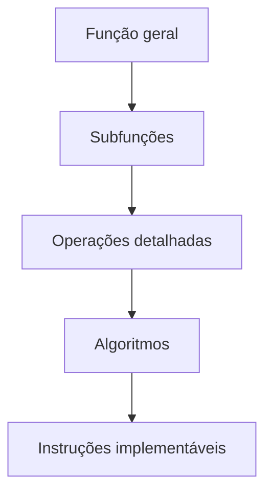

> [!warning] Atenção
> Saltar diretamente para os detalhes finais pode provocar erros, omissões e dificultar a revisão do projeto.

---

## 15. Aspectos e preocupações transversais

> [!info] Conceito
> Um aspecto representa uma preocupação que atravessa diferentes requisitos e componentes do sistema.

Alguns interesses não podem ser isolados facilmente porque se aplicam a diversas partes do software. Eles são chamados de **preocupações transversais**.

No CasaSegura, a visualização das câmeras é uma funcionalidade específica. Entretanto, a exigência de validar o usuário antes do acesso aplica-se a várias funcionalidades. A autenticação constitui, portanto, um aspecto transversal.

Idealmente, um aspecto deve ser implementado como um componente separado. Isso evita que trechos relacionados à mesma preocupação fiquem espalhados ou emaranhados em diversos módulos.

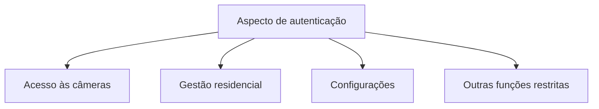

> [!tip] Resumindo
> Aspectos modularizam requisitos que afetam várias partes do sistema, como segurança, autenticação ou registro de operações.

---

## 16. Refatoração

> [!info] Conceito
> Refatoração reorganiza a estrutura interna do projeto ou do código sem alterar seu comportamento externo.

Durante a refatoração, o projeto é examinado para localizar:

- redundâncias;
- elementos não utilizados;
- algoritmos desnecessários ou ineficientes;
- estruturas de dados inadequadas;
- componentes com baixa coesão;
- outras falhas estruturais.

Um componente que executa três funções pouco relacionadas, por exemplo, pode ser dividido em três componentes mais coesos. O resultado tende a ser mais fácil de integrar, testar e manter.

Embora a refatoração procure preservar o comportamento externo, podem ocorrer efeitos colaterais involuntários. Por isso, ferramentas e testes devem ser empregados para detectar possíveis alterações de comportamento.

> [!warning] Atenção
> Refatorar não significa acrescentar uma nova funcionalidade. O objetivo é melhorar a estrutura interna preservando o funcionamento observável do sistema.

---

## 17. Conceitos de projeto orientado a objetos

> [!info] Conceito
> O projeto orientado a objetos organiza o software por meio de classes, objetos, herança, mensagens e polimorfismo.

O paradigma orientado a objetos é amplamente empregado na Engenharia de Software moderna. Seus conceitos são utilizados para modelar elementos do domínio e convertê-los em estruturas técnicas adequadas à implementação.

No CasaSegura, a equipe reconhece que práticas como modularizar o código, manter responsabilidades concentradas, restringir interfaces e reutilizar soluções correspondem a conceitos formais de projeto, mesmo quando são aplicadas intuitivamente.

---

## 18. Classes de projeto

> [!info] Conceito
> Classes de projeto refinam as classes de análise e acrescentam os detalhes técnicos necessários à implementação.

As classes de análise descrevem elementos do domínio do problema em alto nível e concentram-se nos aspectos visíveis aos usuários. Durante o projeto, elas são transformadas em classes mais técnicas.

O capítulo apresenta cinco categorias de classes de projeto:

| Classe | Responsabilidade |
|---|---|
| **Interface do usuário** | Implementar abstrações necessárias à interação humano-computador |
| **Domínio de negócio** | Representar atributos e métodos dos elementos do negócio |
| **Processo** | Implementar operações de baixo nível para gerenciar as classes de negócio |
| **Persistente** | Representar repositórios de dados que permanecem após a execução |
| **Sistema** | Gerenciar e controlar a operação e a comunicação do software com o ambiente |

### 18.1 Características de uma classe bem formada

Uma classe de projeto deve apresentar:

- **Completude:** possuir todos os atributos e métodos necessários;
- **Suficiência:** conter somente os métodos necessários para cumprir sua finalidade;
- **Primitivismo:** cada método deve implementar uma operação específica sem duplicar formas de realizar o mesmo serviço;
- **Alta coesão:** manter um conjunto pequeno e focalizado de responsabilidades;
- **Baixo acoplamento:** colaborar apenas no nível mínimo necessário com outras classes.

A **Lei de Demeter** recomenda que uma unidade se comunique somente com suas classes vizinhas, isto é, que “converse apenas com seus amigos” e não com elementos distantes da estrutura.

### 18.2 Refinamento da classe Planta

No CasaSegura, a classe de análise `Planta` é refinada para representar detalhes de implementação. A solução utiliza segmentos que podem corresponder a paredes ou janelas e estabelece uma relação com câmeras.

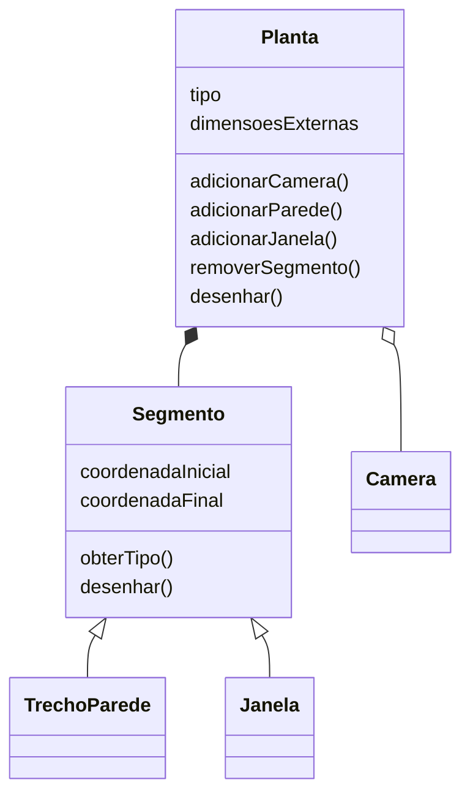

Essa organização permite acrescentar ou remover itens da planta com maior facilidade.

---

## 19. Princípio da inversão da dependência

> [!info] Conceito
> Módulos de alto e baixo nível devem depender de abstrações, e não diretamente uns dos outros.

Em uma arquitetura hierárquica tradicional, módulos de controle de alto nível podem ficar fortemente dependentes de módulos de trabalho de baixo nível. Essa relação gera acoplamento e dificulta alterações e testes.

A inversão da dependência introduz abstrações entre essas partes:

- módulos de alto nível não dependem diretamente dos módulos de baixo nível;
- ambos dependem de abstrações;
- abstrações não dependem de detalhes;
- detalhes dependem de abstrações.

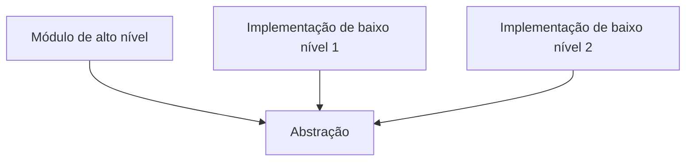

Uma abstração de leitura, por exemplo, pode ser realizada por um teclado ou por um sensor. O módulo principal utiliza a abstração sem precisar conhecer diretamente o dispositivo concreto.

> [!tip] Resumindo
> A inversão da dependência reduz o acoplamento e permite substituir implementações sem alterar os módulos de alto nível.

---

## 20. Projeto para teste

> [!info] Conceito
> O software deve ser projetado de forma que seus componentes possam ser observados, controlados e isolados durante os testes.

No desenvolvimento orientado a testes — **TDD** — os testes são escritos antes do código de produção. O ciclo básico apresentado é:

Quando o projeto é desenvolvido antes dos testes, devem ser criadas **costuras** ou **ganchos de teste**. Esses pontos permitem:

- investigar o estado interno do software em execução;
- controlar determinadas condições;
- isolar o código do ambiente de produção;
- executar experimentos em um contexto controlado.

> [!tip] Resumindo
> Projetar para teste significa fornecer meios para que o código de teste possa observar, controlar e isolar os componentes do sistema.

---

# O modelo de projeto

## 21. Dimensões do modelo de projeto

> [!info] Conceito
> O modelo de projeto evolui tanto ao longo do processo quanto em seu nível de abstração.

O modelo apresenta duas dimensões:

- **Dimensão de processo:** evolução conforme as tarefas de projeto são realizadas;
- **Dimensão de abstração:** transformação dos elementos da análise em representações progressivamente mais detalhadas.

A fronteira entre análise e projeto nem sempre é completamente nítida. Em alguns sistemas, a transição é clara; em outros, o modelo de análise mistura-se gradualmente ao modelo de projeto.

Os elementos arquiteturais geralmente são definidos primeiro. Os projetos de interfaces e componentes podem ser desenvolvidos paralelamente. O projeto de implantação costuma ser detalhado posteriormente.

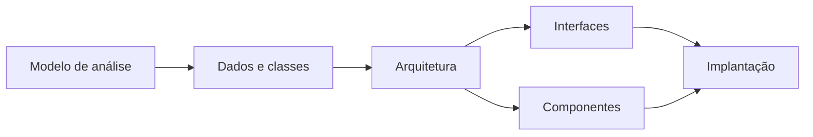

Padrões podem ser aplicados em diferentes momentos, permitindo reutilizar conhecimentos e soluções comprovadas.

---

## 22. Elementos do projeto de dados

> [!info] Conceito
> O projeto de dados transforma a visão dos dados presente nos requisitos em representações adequadas ao armazenamento e ao processamento.

O projeto de dados, também chamado de **arquitetura de dados**, começa em alto nível de abstração e é progressivamente refinado até chegar às estruturas específicas da implementação.

Ele atua em diferentes níveis:

| Nível | Ênfase |
|---|---|
| **Componente** | Estruturas locais e algoritmos que manipulam os dados |
| **Aplicação** | Arquivos, bancos de dados e transformação do modelo de dados |
| **Negócio** | Integração de diferentes bancos em depósitos de dados para descoberta de conhecimento |

A arquitetura dos dados pode influenciar profundamente a própria arquitetura do software.

> [!tip] Resumindo
> A forma como os dados são estruturados condiciona os algoritmos, componentes e decisões arquiteturais do sistema.

---

## 23. Elementos do projeto de arquitetura

> [!info] Conceito
> O projeto arquitetural fornece uma visão geral dos subsistemas, componentes e relacionamentos do software.

A arquitetura é comparada à planta baixa de uma casa. Assim como a planta mostra os cômodos, suas dimensões e ligações, a arquitetura de software mostra suas partes principais e a maneira como se relacionam.

Ela é obtida de três fontes:

1. informações sobre o domínio da aplicação;
2. elementos do modelo de requisitos, como casos de uso, classes, relações e colaborações;
3. estilos arquiteturais e padrões disponíveis.

A representação normalmente mostra subsistemas interligados, que podem possuir arquiteturas internas próprias.

---

## 24. Elementos do projeto de interfaces

> [!info] Conceito
> O projeto de interfaces define como as informações entram, saem e circulam dentro do sistema.

Existem três categorias principais:

1. **Interface do usuário;**
2. **Interfaces externas com sistemas, dispositivos e redes;**
3. **Interfaces internas entre os componentes.**

### 24.1 Interface do usuário

O projeto da interface do usuário ou projeto de usabilidade considera:

- elementos estéticos, como disposição, imagens e mecanismos de interação;
- elementos ergonômicos, como navegação e posicionamento das informações;
- elementos técnicos, como padrões e componentes reutilizáveis.

### 24.2 Interfaces externas

Exigem informações precisas sobre os sistemas e dispositivos que enviam ou recebem dados. Também devem incluir verificação de erros e mecanismos de segurança apropriados.

### 24.3 Interfaces internas

Estão diretamente relacionadas ao projeto dos componentes. Elas estabelecem as operações e mensagens necessárias à colaboração entre as classes.

Na UML, uma interface especifica as operações públicas externamente visíveis de uma classe ou componente, sem apresentar sua estrutura interna.

No CasaSegura, uma interface `Teclado` pode disponibilizar operações como:

- `lerTeclaPressionada()`;
- `decodificarTecla()`.

A classe `PainelControle` realiza essa interface, permitindo que o mesmo comportamento seja acessado por outros elementos, como smartphones e tablets.

> [!warning] Atenção
> A interface não descreve como as operações são implementadas internamente; ela define quais serviços ficam disponíveis para utilização externa.

---

## 25. Elementos do projeto de componentes

> [!info] Conceito
> O projeto de componentes descreve detalhadamente o interior de cada módulo do software.

Esse nível do projeto define:

- estruturas de dados locais;
- detalhes algorítmicos;
- processamento executado;
- interfaces que dão acesso às operações do componente.

Os componentes podem ser representados por diagramas UML. No CasaSegura, o componente `GestãoDeSensor` concentra funções de monitoramento e configuração associadas aos sensores.

Os detalhes também podem ser representados por:

- diagramas de atividades;
- pseudocódigo;
- fluxogramas;
- diagramas de blocos;
- construções de programação estruturada;
- estruturas da própria linguagem de programação.

> [!tip] Resumindo
> A arquitetura mostra as grandes partes; o projeto de componentes explica detalhadamente como cada uma delas funcionará.

---

## 26. Elementos do projeto de implantação

> [!info] Conceito
> O projeto de implantação determina onde os subsistemas e componentes serão executados no ambiente físico.

O diagrama de implantação UML distribui o software entre os elementos computacionais que o sustentarão.

No CasaSegura, são apresentados três ambientes principais:

- **Painel de controle:** abriga funções de segurança;
- **Computador pessoal da residência:** abriga acesso externo, segurança, vigilância, gestão residencial e comunicação;
- **Servidor da CPI:** fornece acesso do proprietário por meio da Internet.

Também podem existir sensores, câmeras e plataformas móveis.

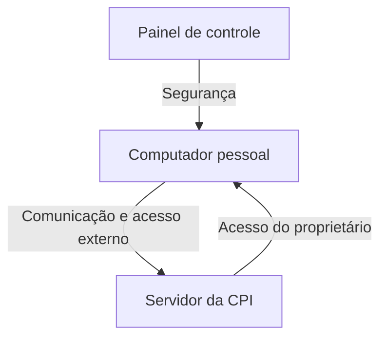

O diagrama pode aparecer em duas formas:

- **Descritor:** apresenta os tipos gerais de ambiente computacional;
- **Instância:** identifica configurações específicas de hardware, sistema operacional e dispositivos.

A forma de instância é normalmente desenvolvida nos estágios finais do projeto ou no início da construção.

---

## 27. Relação entre o capítulo e a aula

> [!info] Conceito
> O capítulo aprofunda os quatro modelos apresentados na aula e acrescenta fundamentos para avaliar sua qualidade.

A aula introduziu a transformação dos requisitos em projetos de dados, arquitetura, interfaces e componentes, utilizando diagramas UML para demonstrar o fluxo das atividades, as interações e as mudanças de estado.

O capítulo amplia esse conteúdo ao explicar:

- os critérios de qualidade que devem orientar o projeto;
- os atributos FURPS;
- abstração, modularidade e encapsulamento;
- coesão e acoplamento;
- padrões e arquitetura;
- refinamento, aspectos e refatoração;
- classes de projeto;
- inversão da dependência;
- projeto para teste;
- implantação no ambiente físico.

Assim, os diagramas apresentados na aula não devem ser vistos apenas como ilustrações. Eles integram um modelo de projeto que precisa ser modular, compreensível, testável, implementável e compatível com os requisitos.

---

## Síntese final

> [!summary] Síntese
> O projeto de software transforma requisitos em uma solução técnica, examinando alternativas e produzindo modelos que orientam a implementação, os testes e a manutenção.

O projeto começa com uma visão ampla e evolui iterativamente para representações detalhadas. Sua qualidade depende da aplicação consciente de princípios como abstração, separação por interesses, modularidade, encapsulamento, alta coesão, baixo acoplamento, refinamento e refatoração.

O modelo de projeto engloba dados, arquitetura, interfaces, componentes e implantação. Esses elementos são relacionados, mas podem ser desenvolvidos em ritmos diferentes. A arquitetura oferece a estrutura geral; os dados estabelecem a base informacional; as interfaces viabilizam a comunicação; os componentes detalham o processamento; e a implantação distribui a solução no ambiente físico.

Um projeto de qualidade deve implementar os requisitos explícitos e implícitos, ser compreensível para programadores e testadores, apresentar uma visão completa do sistema e considerar desde o início funcionalidade, usabilidade, confiabilidade, desempenho e facilidade de suporte. Dessa forma, reduz riscos, limita a propagação de erros e torna o software mais fácil de construir, testar, modificar e manter.

## Referência do material

PRESSMAN, Roger S.; MAXIM, Bruce R. **Engenharia de software: uma abordagem profissional**. 8. ed. Rio de Janeiro: AMGH, 2016. Capítulo 12: Conceitos de projeto.