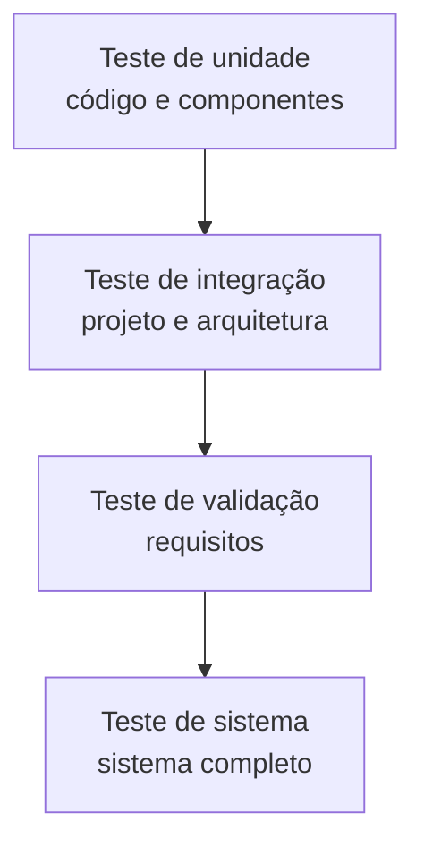
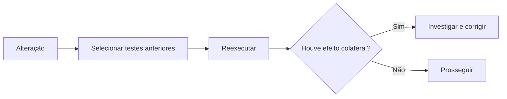
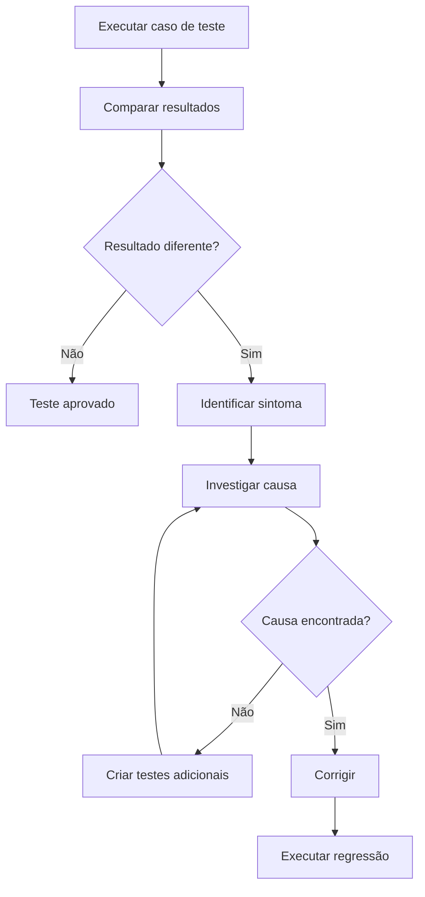

# Capítulo 22 — Estratégias e Teste de Software

## 1. Visão geral da estratégia de teste

> [!info] Conceito
> Uma estratégia de teste é um roteiro que define o que será testado, quando os testes ocorrerão e quais recursos serão necessários.

Uma estratégia de teste de software organiza sistematicamente as atividades utilizadas para revelar erros no produto. Ela deve incorporar:

- planejamento dos testes;
- projeto dos casos de teste;
- execução dos testes;
- coleta e avaliação dos resultados.

A estratégia precisa ser suficientemente flexível para se adaptar às características de cada projeto, mas também deve estabelecer disciplina para permitir planejamento, acompanhamento e controle.

Embora possam existir diferentes estratégias, elas compartilham algumas características:

- revisões técnicas são realizadas para eliminar erros antes dos testes;
- o teste começa nos componentes e progride até o sistema completo;
- técnicas diferentes são aplicadas em momentos distintos;
- desenvolvedores e, em projetos maiores, um grupo independente participam dos testes;
- teste e depuração são atividades diferentes, embora relacionadas.

Uma estratégia completa deve incluir testes de baixo nível, que verificam pequenos segmentos de código, e testes de alto nível, que avaliam as principais funções do sistema em relação às necessidades do cliente.

> [!tip] Resumindo
> A estratégia transforma o teste em uma atividade planejada, progressiva, mensurável e alinhada aos requisitos.

---

## 2. Verificação e validação

> [!info] Conceito
> Verificação avalia se o produto foi construído corretamente; validação avalia se foi construído o produto certo.

O teste de software faz parte de um processo mais abrangente denominado **verificação e validação**, frequentemente representado pela sigla **V&V**.

- **Verificação:** reúne as tarefas que confirmam que o software implementa corretamente determinada função.
- **Validação:** reúne as tarefas que asseguram que o software foi criado de acordo com os requisitos do cliente e pode ser rastreado até eles.

| Atividade | Pergunta central |
|---|---|
| Verificação | Estamos criando o produto corretamente? |
| Validação | Estamos criando o produto certo? |

V&V não se limita à execução de programas. Também envolve:

- revisões técnicas;
- auditorias de qualidade e configuração;
- monitoramento de desempenho;
- simulações;
- estudos de viabilidade;
- revisão de documentos e bases de dados;
- análise de algoritmos;
- testes de desenvolvimento;
- testes de usabilidade;
- testes de qualificação, aceitação e instalação.

O teste ajuda a descobrir erros e fornece informações para avaliar a qualidade, mas não deve ser visto como uma rede de segurança capaz de corrigir práticas deficientes de engenharia. A qualidade precisa ser incorporada ao software durante todo o processo, por meio de bons métodos, ferramentas, revisões e gerenciamento.

> [!warning] Atenção
> O teste pode confirmar e avaliar a qualidade existente, mas não consegue acrescentar qualidade a um produto mal projetado e construído.

---

## 3. Organização dos testes

> [!info] Conceito
> O desenvolvedor testa as unidades e integrações iniciais, enquanto um grupo independente pode fornecer uma avaliação menos influenciada por conflitos de interesse.

Os desenvolvedores conhecem profundamente o software que produziram, mas podem tender a criar testes que demonstrem que o programa funciona, em vez de testes orientados à descoberta de falhas. Isso ocorre porque construir é uma atividade psicologicamente criativa, enquanto testar envolve tentar encontrar pontos nos quais o produto falha.

Essa dificuldade não significa que o desenvolvedor deva deixar de testar. Ele continua responsável pelos testes das unidades individuais e, em muitos casos, pelos testes de integração.

Nos projetos maiores, pode participar um **grupo independente de teste**, denominado **ITG — Independent Test Group**. Sua independência reduz o conflito de interesses existente quando o próprio criador avalia aquilo que construiu.

O ITG não deve receber o software apenas no final. Seus integrantes precisam colaborar com os desenvolvedores durante o projeto, participando da análise, do planejamento e da especificação dos procedimentos de teste. Quando um erro é encontrado, os desenvolvedores continuam responsáveis por realizar a correção.

> [!tip] Resumindo
> A independência melhora a objetividade dos testes, mas não elimina a responsabilidade dos desenvolvedores pela qualidade do software.

---

## 4. Estratégia global: do pequeno para o grande

> [!info] Conceito
> O teste começa nas menores unidades do código e amplia progressivamente seu escopo até alcançar o sistema completo.

Durante o desenvolvimento, parte-se da engenharia de sistemas e dos requisitos em direção ao projeto e ao código. O nível de abstração diminui à medida que o produto se torna mais concreto.

Nos testes, percorre-se o caminho inverso:

1. **Teste de unidade:** verifica componentes, classes ou módulos implementados no código;
2. **Teste de integração:** avalia a combinação dos componentes e a construção da arquitetura;
3. **Teste de validação:** verifica o software em relação aos requisitos;
4. **Teste de sistema:** examina o software integrado a hardware, pessoas, informações e outros elementos.

Essa estratégia permite localizar erros inicialmente em contextos pequenos e controlados. Depois, o escopo é ampliado para verificar interfaces, requisitos e o comportamento global do sistema.

---

## 5. Critérios para conclusão dos testes

> [!info] Conceito
> Não existe uma resposta absoluta para determinar quando todos os testes necessários foram concluídos.

Uma resposta pragmática afirma que o teste nunca termina completamente: o encargo apenas passa do engenheiro de software para o usuário. Sempre que o usuário executa o programa, novas situações de uso testam o software.

Outra resposta é que os testes terminam quando acabam o tempo ou os recursos do projeto. Entretanto, esses critérios não são tecnicamente satisfatórios.

Uma abordagem mais rigorosa utiliza métricas e métodos estatísticos. Nela, selecionam-se testes por amostragem entre as possíveis formas de execução do programa. Os resultados obtidos são empregados em modelos estatísticos para estimar a confiabilidade e orientar a decisão sobre a suficiência dos testes.

> [!warning] Atenção
> Não é possível testar todas as combinações de entradas e situações de uso em sistemas complexos. Por isso, a conclusão deve basear-se em critérios, prioridades, riscos e evidências.

---

## 6. Problemas estratégicos e condições para o sucesso

> [!info] Conceito
> Mesmo uma boa estratégia pode fracassar se os requisitos, objetivos e usuários não estiverem claramente compreendidos.

Uma estratégia bem-sucedida exige que a equipe:

1. especifique os requisitos de maneira quantificável antes dos testes;
2. defina explicitamente os objetivos dos testes;
3. compreenda os usuários e desenvolva perfis para suas diferentes categorias;
4. adote ciclos rápidos de teste;
5. desenvolva software robusto, com recursos que facilitem seu próprio teste;
6. utilize revisões técnicas como filtro anterior à execução;
7. revise tecnicamente a estratégia e os casos de teste;
8. promova a melhoria contínua do processo de teste.

O **teste de ciclo rápido** examina pequenos incrementos de funcionalidade ou qualidade em intervalos curtos. O retorno obtido permite controlar a qualidade e ajustar a estratégia enquanto o desenvolvimento ainda está em andamento.

---

## 7. Estratégia para software convencional

> [!info] Conceito
> Em software convencional, a integração e os testes devem ocorrer incrementalmente.

Esperar que o sistema inteiro seja concluído para somente depois testá-lo é uma abordagem inadequada. A quantidade de erros acumulados dificulta a identificação de suas causas.

A estratégia recomendada ocupa uma posição intermediária: começa testando unidades individuais, prossegue com a integração gradual e termina com a avaliação do sistema completo.

---

## 8. Teste de unidade

> [!info] Conceito
> O teste de unidade concentra a verificação na menor unidade de projeto do software, como um componente ou módulo.

O teste de unidade examina a lógica interna, as estruturas de dados e os caminhos de controle situados dentro dos limites de um componente. Como seu escopo é reduzido, os erros tendem a ser mais fáceis de localizar.

Os principais aspectos examinados são:

- **interface do módulo:** verifica se as informações entram e saem corretamente;
- **estruturas de dados locais:** confirma se os dados temporários mantêm sua integridade;
- **caminhos independentes:** exercita os diferentes caminhos da estrutura de controle;
- **condições-limite:** testa o comportamento nos valores mínimos, máximos e próximos às fronteiras;
- **caminhos de manipulação de erros:** verifica como o componente reage a condições excepcionais.

### 8.1. Testes de fronteira

Muitos erros ocorrem nos limites de processamento, como:

- último elemento de uma coleção;
- primeira ou última repetição de um laço;
- valores máximos ou mínimos permitidos;
- valores imediatamente inferiores ou superiores aos limites.

Por isso, os casos devem utilizar valores logo abaixo, exatamente iguais e logo acima das fronteiras relevantes.

### 8.2. Manipulação de erros

Os caminhos previstos para tratar erros também precisam ser testados. Entre os problemas possíveis estão:

- mensagem de erro confusa;
- mensagem que não corresponde ao erro real;
- interrupção do sistema antes da execução do tratamento;
- processamento incorreto da exceção;
- informações insuficientes para descobrir a causa.

### 8.3. Casos e resultados esperados

Cada caso de teste deve estar associado ao resultado esperado. Isso permite comparar objetivamente o comportamento previsto com o comportamento observado.

### 8.4. Pseudocontroladores e pseudocontrolados

Como um componente geralmente não funciona como programa independente, pode ser necessário criar software auxiliar:

- **pseudocontrolador (*driver*):** simula o módulo que chama o componente testado, envia os dados e apresenta os resultados;
- **pseudocontrolado (*stub*):** substitui temporariamente um módulo subordinado chamado pelo componente.

Esses elementos representam trabalho adicional e não integram necessariamente o produto final. Quando seu desenvolvimento for muito complexo, parte do teste pode ser adiada para a integração.

> [!tip] Resumindo
> O teste de unidade examina interfaces, dados, lógica, limites e tratamento de erros dentro de um componente isolado.

---

## 9. Teste de integração

> [!info] Conceito
> O teste de integração constrói progressivamente a arquitetura enquanto procura erros nas interfaces entre os componentes.

O fato de os módulos funcionarem isoladamente não garante que funcionarão juntos. Durante a integração podem ocorrer:

- perda de dados nas interfaces;
- efeitos adversos de um componente sobre outro;
- subfunções que não produzem a função principal esperada;
- amplificação de imprecisões;
- problemas com estruturas globais;
- incompatibilidades entre componentes.

A abordagem **big bang**, na qual todos os componentes são combinados de uma só vez, dificulta o isolamento das causas dos erros. A integração incremental, por sua vez, monta e testa o programa em pequenas partes.

| Abordagem | Característica | Consequência |
|---|---|---|
| Big bang | Todos os componentes são integrados de uma vez | Erros difíceis de isolar |
| Incremental | Componentes são integrados e testados gradualmente | Erros mais fáceis de localizar e corrigir |

---

## 10. Integração descendente

> [!info] Conceito
> A integração descendente começa no módulo principal e avança para os níveis inferiores da hierarquia de controle.

Na integração **top-down**, o módulo de controle principal é utilizado inicialmente, enquanto os módulos subordinados ainda indisponíveis são substituídos por pseudocontrolados.

Os componentes reais substituem gradualmente os pseudocontrolados. A integração pode seguir duas direções:

- **primeiro em profundidade:** percorre inicialmente um caminho completo de controle;
- **primeiro em largura:** integra primeiro os componentes situados no mesmo nível hierárquico.

O processo compreende:

1. utilizar o módulo principal como controlador;
2. substituir um pseudocontrolado por um componente real;
3. executar os testes;
4. integrar o componente seguinte;
5. realizar testes de regressão;
6. repetir até concluir a estrutura.

Essa abordagem permite testar antecipadamente os pontos superiores de decisão e controle do sistema. Quando se utiliza a integração em profundidade, uma função completa pode ser demonstrada ainda no início.

---

## 11. Integração ascendente

> [!info] Conceito
> A integração ascendente começa pelos módulos mais baixos e avança em direção ao módulo principal.

Na integração **bottom-up**, os componentes dos níveis inferiores são combinados em grupos chamados **agregados** ou **clusters**. Cada agregado realiza uma subfunção do software.

O processo segue estas etapas:

1. combinar componentes de baixo nível em agregados;
2. criar um pseudocontrolador para coordenar as entradas e saídas;
3. testar o agregado;
4. remover os pseudocontroladores;
5. combinar os agregados e avançar para níveis superiores.

Como os componentes subordinados já estão disponíveis quando os módulos superiores são integrados, elimina-se a necessidade de pseudocontrolados complexos.

> [!tip] Resumindo
> A integração descendente começa pelo controle principal; a ascendente começa pelos componentes inferiores e constrói agregados progressivamente.

---

## 12. Teste de regressão

> [!info] Conceito
> O teste de regressão reexecuta testes anteriores para descobrir efeitos colaterais introduzidos por uma alteração.

Sempre que um módulo é acrescentado ou modificado, podem surgir novos fluxos de dados, entradas, saídas e caminhos de controle. Essas mudanças podem afetar funções que antes operavam corretamente.

O conjunto de regressão deve incluir:

- uma amostra representativa das principais funções;
- testes das funções que podem ser afetadas pela alteração;
- testes específicos dos componentes modificados.

A regressão pode ser manual ou automatizada. Ferramentas de captura e reexecução armazenam casos e resultados anteriores para posterior comparação.

Como o número de testes pode crescer rapidamente, o conjunto de regressão deve ser administrado para cobrir as principais classes de erros sem repetir casos desnecessários.

---

## 13. Teste fumaça

> [!info] Conceito
> O teste fumaça verifica diariamente se uma nova construção está estável o bastante para receber testes mais rigorosos.

O **teste fumaça** é uma estratégia de integração indicada especialmente para projetos complexos e com prazos críticos. Seu funcionamento envolve:

1. integrar componentes, dados, bibliotecas e módulos em uma construção;
2. executar testes destinados a revelar erros bloqueadores;
3. integrar a construção às demais;
4. testar diariamente o produto em seu estado atual.

O teste não precisa ser exaustivo, mas deve percorrer o sistema de ponta a ponta e revelar problemas que impeçam as principais funções.

Seus benefícios incluem:

- redução dos riscos de integração;
- descoberta antecipada de incompatibilidades;
- melhoria da qualidade final;
- diagnóstico e correção mais simples;
- avaliação mais realista do progresso;
- aumento da confiança da equipe.

> [!tip] Resumindo
> O teste fumaça funciona como uma verificação frequente da saúde geral de cada nova construção.

---

## 14. Artefatos do teste de integração

> [!info] Conceito
> Os testes devem ser documentados para permitir planejamento, repetição, acompanhamento e manutenção.

A **Especificação de Teste** reúne o plano global de integração e os testes específicos. Ela pode conter:

- fases e construções previstas;
- funcionalidades examinadas em cada fase;
- cronograma de integração;
- datas de início e término;
- disponibilidade dos módulos;
- descrição de pseudocontroladores e pseudocontrolados;
- ambiente, equipamentos e recursos;
- ordem de integração;
- casos de teste;
- resultados esperados.

Os resultados reais, problemas encontrados e particularidades da execução são registrados no **Relatório de Teste**. Esse histórico pode ser especialmente importante durante a manutenção.

---

## 15. Testes em software orientado a objetos

> [!info] Conceito
> Em software orientado a objetos, a classe e suas colaborações tornam-se os principais focos dos testes.

O objetivo continua sendo revelar o maior número possível de erros com esforço e tempo administráveis. Entretanto, encapsulamento, herança e colaboração entre objetos exigem adaptações.

### 15.1. Teste de unidade orientado a objetos

No paradigma orientado a objetos, uma classe reúne atributos e operações. Embora o método seja a menor operação executável, ele deve ser testado dentro do contexto da classe.

Uma operação herdada pode comportar-se de maneira diferente em cada subclasse porque interage com atributos e operações particulares. Portanto, testá-la isoladamente pode não revelar problemas contextuais.

O **teste de classe** equivale ao teste de módulo do software convencional. Seu foco está:

- nas operações encapsuladas;
- nos atributos manipulados;
- nas mudanças de estado da classe;
- no comportamento da classe diante das operações.

### 15.2. Integração orientada a objetos

As integrações descendente e ascendente têm menor significado em sistemas orientados a objetos porque não existe necessariamente uma hierarquia de controle evidente.

Duas estratégias são apresentadas:

- **teste baseado em sequência de execução:** integra e testa as classes necessárias para responder a determinado evento ou entrada;
- **teste baseado em uso:** começa pelas classes independentes e depois incorpora as classes que dependem delas.

O teste de regressão verifica se a inclusão de novas classes causou efeitos colaterais.

### 15.3. Teste de conjunto

O **teste de conjunto** ou **cluster testing** exercita grupos de classes colaboradoras. Os casos de teste são elaborados para encontrar erros na comunicação e na distribuição de responsabilidades entre as classes.

Pseudocontroladores podem substituir uma interface ainda inexistente, enquanto pseudocontrolados simulam classes colaboradoras que ainda não foram implementadas.

---

## 16. Estratégias de teste para aplicações Web

> [!info] Conceito
> Aplicações Web exigem testes de conteúdo, interface, navegação, funcionalidade, compatibilidade, segurança e desempenho.

A estratégia para aplicações Web combina os princípios gerais do teste com técnicas utilizadas em sistemas orientados a objetos.

O processo inclui:

1. revisar o modelo de conteúdo;
2. revisar o modelo de interface em relação aos casos de uso;
3. revisar o projeto de navegação;
4. testar a interface e os mecanismos de apresentação;
5. realizar testes de unidade dos componentes funcionais;
6. testar a navegação por toda a arquitetura;
7. executar a aplicação em diferentes configurações ambientais;
8. procurar vulnerabilidades de segurança;
9. avaliar o desempenho;
10. permitir que usuários finais controlados utilizem a aplicação.

Como aplicações Web frequentemente evoluem de forma contínua, seus testes também precisam ser contínuos. Os testes de regressão derivados do desenvolvimento inicial devem ser reutilizados sempre que houver mudanças.

---

## 17. Estratégias de teste para aplicativos móveis

> [!info] Conceito
> Aplicativos móveis precisam ser testados em diferentes dispositivos, redes e condições reais de utilização.

Além dos princípios gerais, os aplicativos móveis exigem abordagens especializadas:

| Tipo de teste | Finalidade |
|---|---|
| Experiência do usuário | Avaliar usabilidade e acessibilidade nos dispositivos suportados |
| Compatibilidade | Verificar combinações de hardware e software |
| Desempenho | Medir download, processamento, armazenamento e consumo de energia |
| Conectividade | Avaliar redes, serviços Web e interrupções de conexão |
| Segurança | Proteger privacidade e informações dos usuários |
| Condições naturais | Testar dispositivos reais em diferentes redes e ambientes |
| Certificação | Confirmar o atendimento às regras das lojas de aplicativos |

A participação antecipada dos usuários ajuda a verificar se o aplicativo atende às expectativas de utilização. Testes em dispositivos e redes reais são importantes porque simulações podem não reproduzir todas as condições encontradas no uso cotidiano.

---

## 18. Teste de validação

> [!info] Conceito
> O teste de validação determina se o software completo funciona de maneira razoavelmente esperada pelo cliente.

A validação começa depois da integração, quando os componentes já foram combinados e os principais erros de interface foram corrigidos.

O foco passa para:

- ações visíveis ao usuário;
- saídas reconhecíveis;
- requisitos funcionais;
- comportamento;
- precisão e apresentação do conteúdo;
- desempenho;
- documentação;
- compatibilidade;
- transportabilidade;
- recuperação de erros;
- facilidade de manutenção.

A Especificação de Requisitos de Software fornece os critérios utilizados para julgar a conformidade. Quando um desvio é encontrado, ele deve ser registrado em uma lista de deficiências e tratado por um procedimento aceito pelas partes envolvidas.

---

## 19. Revisão da configuração

> [!info] Conceito
> A revisão da configuração verifica se todos os elementos necessários à entrega e ao suporte estão completos e organizados.

Também denominada auditoria, a revisão da configuração confirma se os elementos do software:

- foram adequadamente desenvolvidos;
- estão corretamente catalogados;
- possuem os detalhes necessários;
- fornecem suporte à instalação, operação e manutenção.

A validação, portanto, não examina somente o código executável, mas todo o conjunto de itens que compõe a entrega.

---

## 20. Testes de aceitação, alfa e beta

> [!info] Conceito
> Os testes com usuários revelam comportamentos e dificuldades que podem não ser previstos pelos desenvolvedores.

O desenvolvedor não consegue antecipar todas as formas pelas quais o cliente utilizará o programa. Instruções podem ser interpretadas de maneira diferente, dados incomuns podem ser fornecidos e resultados considerados claros pela equipe podem confundir o usuário.

### 20.1. Teste de aceitação

É conduzido pelo cliente para validar os requisitos. Pode variar de uma utilização informal a uma série planejada de testes executados durante semanas ou meses.

### 20.2. Teste alfa

É realizado nas instalações do desenvolvedor por usuários finais representativos. O software é utilizado de maneira natural, mas em ambiente controlado e com observação da equipe.

### 20.3. Teste beta

É realizado nas instalações dos usuários finais, normalmente sem a presença do desenvolvedor. O software é utilizado em condições reais e em ambiente não controlado pela equipe. Os usuários registram os problemas, que posteriormente orientam as modificações anteriores à liberação geral.

| Teste | Local | Participação do desenvolvedor | Ambiente |
|---|---|---|---|
| Alfa | Instalações do desenvolvedor | Presente e observando | Controlado |
| Beta | Instalações do usuário | Geralmente ausente | Real e não controlado |
| Aceitação | Definido com o cliente | Cliente conduz a avaliação | Conforme o contrato e os requisitos |

Uma variação é o **teste de aceitação do cliente**, utilizado em softwares personalizados. Em sistemas corporativos ou governamentais, ele pode ser formal e prolongado.

---

## 21. Teste de sistema

> [!info] Conceito
> O teste de sistema avalia o software integrado aos demais elementos, como hardware, pessoas e informações.

O software normalmente é apenas uma parte de um sistema maior. Sua integração exige a colaboração de profissionais de diferentes áreas.

Quando um erro aparece, pode ocorrer a chamada “procura do culpado”, na qual as equipes atribuem responsabilidade umas às outras. Para evitar essa situação, recomenda-se:

- antecipar problemas de interface;
- testar os dados recebidos de outros elementos;
- simular entradas incorretas;
- criar caminhos de manipulação de erros;
- registrar os resultados;
- participar do planejamento dos testes do sistema.

---

## 22. Teste de recuperação

> [!info] Conceito
> O teste de recuperação força o sistema a falhar para verificar se ele consegue retomar corretamente seu funcionamento.

Sistemas críticos podem precisar continuar funcionando mesmo diante de falhas ou recuperar-se dentro de um prazo máximo.

Quando a recuperação é automática, são avaliados:

- reinicialização;
- mecanismos de verificação;
- recuperação dos dados;
- retomada do processamento.

Quando depende de intervenção humana, avalia-se o **tempo médio de reparo**, ou **MTTR — Mean Time to Repair**, verificando se permanece dentro dos limites aceitáveis.

---

## 23. Teste de segurança

> [!info] Conceito
> O teste de segurança verifica se os mecanismos de proteção resistem a acessos impróprios ou ilegais.

Os ataques podem ser realizados por agentes externos, funcionários ou pessoas interessadas em obter vantagens indevidas.

O teste deve considerar ataques diretos e indiretos. Seu propósito é descobrir vulnerabilidades e avaliar se a proteção torna a invasão suficientemente difícil e cara em relação ao valor das informações pretendidas.

> [!warning] Atenção
> O objetivo não é declarar um sistema absolutamente invulnerável, mas avaliar e fortalecer seus mecanismos de proteção.

---

## 24. Teste por esforço e sensibilidade

> [!info] Conceito
> O teste por esforço submete o sistema a volumes e frequências anormais para descobrir seus limites.

O teste por esforço, ou **stress**, pergunta até onde o sistema pode ser forçado antes de falhar. Entre as situações possíveis estão:

- quantidade excessiva de interrupções;
- taxas elevadas de entrada de dados;
- consumo máximo de memória;
- solicitação intensa de recursos;
- procura excessiva de informações em disco.

Uma variação é o **teste de sensibilidade**, que procura combinações válidas de dados capazes de causar processamento extremo, instabilidade ou degradação acentuada.

---

## 25. Teste de desempenho

> [!info] Conceito
> O teste de desempenho avalia o comportamento do software em execução dentro do sistema integrado.

Esse teste é especialmente importante em sistemas de tempo real e embarcados, nos quais executar a função correta não é suficiente se o tempo de resposta for inadequado.

O desempenho pode ser avaliado durante diferentes níveis de teste, mas sua análise completa somente é possível depois que os elementos do sistema estão integrados.

Os testes podem medir:

- utilização do processador;
- consumo de recursos;
- intervalos de execução;
- eventos e interrupções;
- estados do sistema;
- situações que causam degradação ou falha.

O teste de desempenho frequentemente é combinado ao teste por esforço e pode exigir instrumentação de hardware e software.

---

## 26. Teste de disponibilização

> [!info] Conceito
> O teste de disponibilização verifica se o software pode ser instalado e utilizado corretamente nos ambientes suportados.

Também chamado de **teste de configuração**, ele executa o produto nas diferentes plataformas e sistemas operacionais previstos.

Além do programa, são testados:

- instaladores;
- procedimentos de instalação;
- configurações;
- documentação de distribuição;
- materiais destinados aos usuários finais.

---

## 27. Teste e depuração

> [!info] Conceito
> Testar revela a presença de um erro; depurar identifica sua causa e permite corrigi-la.

O teste pode ser planejado, especificado e executado sistematicamente. A depuração ocorre como consequência da descoberta de uma divergência entre o resultado esperado e o observado.

O sintoma externo e a causa interna podem não apresentar relação evidente. A depuração procura estabelecer essa ligação.

> [!warning] Atenção
> Teste e depuração não são sinônimos: o teste mostra que existe um problema; a depuração procura explicar por que ele ocorre.

---

## 28. Por que a depuração é difícil?

> [!info] Conceito
> A causa de um erro pode estar distante do local onde seu sintoma aparece.

A depuração pode ser dificultada porque:

- sintoma e causa estão em partes diferentes do programa;
- corrigir outro erro pode ocultar temporariamente o sintoma;
- o comportamento pode resultar de arredondamentos, e não de um defeito;
- a causa pode envolver erro humano difícil de rastrear;
- o problema pode depender de temporização;
- as condições de entrada podem ser difíceis de reproduzir;
- o sintoma pode ser intermitente;
- a causa pode estar distribuída entre tarefas e processadores.

Componentes altamente acoplados tornam a investigação mais difícil, pois uma falha em uma parte pode manifestar-se em muitas outras.

A pressão para corrigir falhas graves pode induzir o desenvolvedor a fazer alterações apressadas e introduzir novos erros.

---

## 29. Estratégias de depuração

> [!info] Conceito
> As principais estratégias são força bruta, rastreamento e eliminação da causa.

### 29.1. Força bruta

Utiliza despejos de memória, rastreamentos em tempo de execução e grande quantidade de instruções de saída. Procura-se uma pista em meio aos dados produzidos.

É uma técnica comum, mas geralmente pouco eficiente, porque o excesso de informações pode dificultar a análise.

### 29.2. Rastreamento

Parte do local onde o sintoma foi identificado e percorre o código retroativamente até encontrar sua causa. Pode funcionar bem em programas pequenos, mas se torna difícil quando existem muitos caminhos possíveis.

### 29.3. Eliminação da causa

Organiza os dados relacionados ao erro e formula hipóteses. Cada hipótese é confirmada ou eliminada por meio de testes.

Também pode utilizar particionamento binário para reduzir progressivamente o espaço de busca.

| Estratégia | Funcionamento | Limitação principal |
|---|---|---|
| Força bruta | Produz grande quantidade de dados de execução | Excesso de informação |
| Rastreamento | Percorre o código para trás a partir do sintoma | Muitos caminhos em programas grandes |
| Eliminação da causa | Formula e testa hipóteses | Exige análise sistemática |

---

## 30. Ferramentas e fator humano na depuração

> [!info] Conceito
> Ferramentas auxiliam a investigação, mas não substituem o raciocínio e a colaboração.

Ambientes de desenvolvimento e depuradores podem:

- identificar erros específicos da linguagem;
- executar rastreamentos;
- gerar casos de teste;
- mapear referências;
- monitorar valores e estados;
- fornecer informações em tempo de execução.

Entretanto, essas ferramentas não substituem um projeto compreensível, código-fonte claro e avaliação cuidadosa.

A ajuda de outra pessoa também pode ser decisiva. Um profissional que não passou horas envolvido com o problema pode observar algo ignorado por quem já está frustrado ou preso a determinada hipótese.

> [!tip] Resumindo
> Quando a investigação individual deixa de avançar, pedir ajuda pode ser mais eficiente do que continuar repetindo as mesmas tentativas.

---

## 31. Correção do erro

> [!info] Conceito
> Antes de corrigir um erro, é necessário avaliar os efeitos da mudança sobre o restante do programa.

Uma correção pode introduzir novos defeitos. Antes de alterar o software, três perguntas devem ser respondidas:

1. **A mesma causa está presente em outra parte do programa?**  
   Um padrão lógico incorreto pode ter sido repetido em outros componentes.

2. **Que novo erro a correção pode introduzir?**  
   É necessário avaliar o acoplamento da lógica e das estruturas de dados afetadas.

3. **O que poderia ter evitado esse defeito?**  
   A resposta pode orientar a melhoria do processo e impedir que erros semelhantes sejam repetidos em projetos futuros.

Depois da correção, testes de regressão devem confirmar que a mudança resolveu o problema sem prejudicar funções existentes.

> [!warning] Atenção
> Corrigir apenas o código resolve o problema atual; corrigir também o processo ajuda a evitar a mesma classe de defeito no futuro.

---

## Síntese final

> [!summary] Síntese
> Uma estratégia de teste eficaz começa nos componentes, amplia progressivamente o escopo, valida os requisitos e termina avaliando o sistema integrado.

O teste de software exige planejamento, casos bem definidos, execução controlada e avaliação dos resultados. Ele integra um processo mais amplo de verificação e validação e não substitui a qualidade incorporada durante a engenharia do produto.

No software convencional, os testes começam nas unidades e avançam pela integração, validação e sistema. A integração incremental é preferível à abordagem big bang porque facilita o isolamento dos erros. Testes de regressão e fumaça controlam os efeitos das mudanças e a estabilidade das novas construções.

Em sistemas orientados a objetos, o foco passa para classes, estados e colaborações. Aplicações Web acrescentam preocupações com conteúdo, navegação, interface e compatibilidade. Aplicativos móveis exigem testes em diferentes dispositivos, redes e condições reais.

A validação verifica a conformidade com os requisitos e pode envolver testes de aceitação, alfa e beta. O teste de sistema examina recuperação, segurança, esforço, desempenho e disponibilização.

Por fim, teste e depuração são atividades distintas: o teste revela o erro e a depuração procura sua causa. Após a correção, a regressão confirma que a mudança não introduziu novos problemas. Dessa forma, testar não é apenas uma etapa final, mas uma atividade contínua de redução de riscos e avaliação da qualidade.