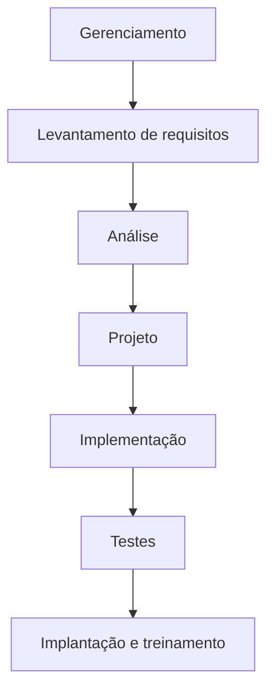
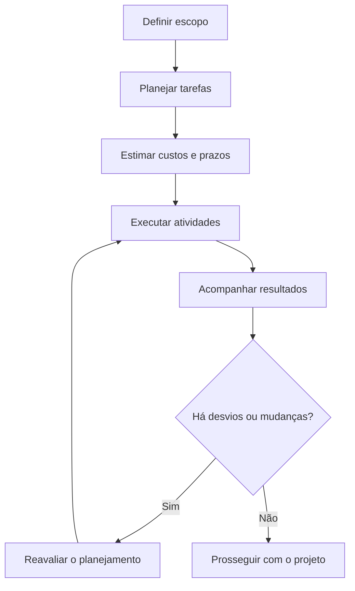
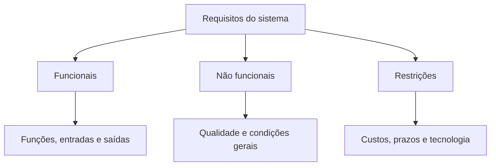
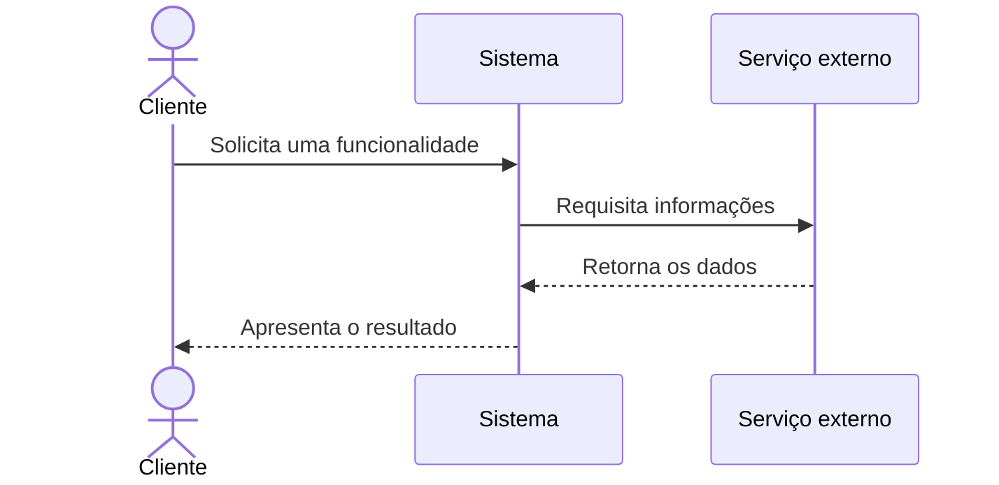
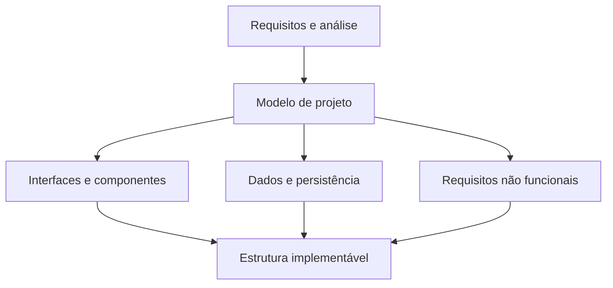
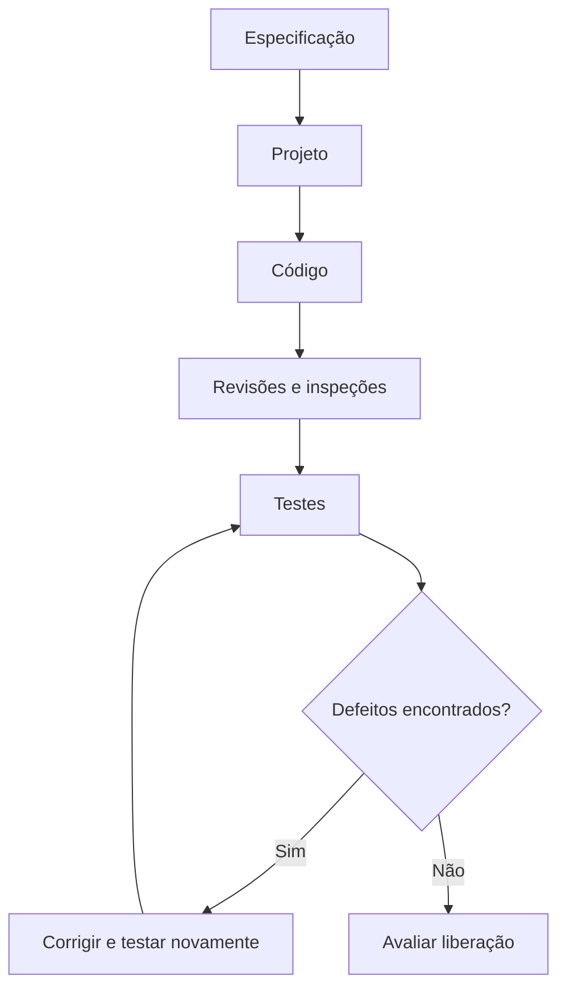
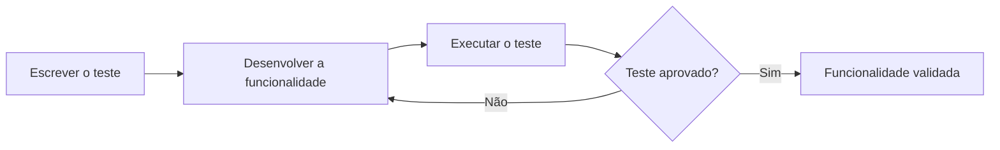

# Atividades e Processos de Desenvolvimento de Software

## Visão geral do processo de desenvolvimento

> [!info] Conceito
> O desenvolvimento de software é um processo organizado que transforma necessidades dos clientes em um produto implementado, testado e preparado para utilização.

A construção de um software envolve atividades que começam com a compreensão do problema e continuam até a implantação do produto no ambiente do cliente. Independentemente da metodologia adotada, é necessário estabelecer um projeto que defina o **escopo**, os **custos**, os **prazos** e as responsabilidades envolvidas.

O conteúdo organiza esse processo em quatro áreas principais:

1. gerenciamento do processo de desenvolvimento;
2. levantamento de requisitos;
3. análise;
4. projeto.

Além dessas áreas, o material aborda a implementação, os testes, a implantação, o treinamento dos usuários e a importância da certificação profissional para a qualidade do software.

> [!tip] Resumindo
> O software deve ser desenvolvido por meio de atividades planejadas e relacionadas, desde a definição do problema até a utilização efetiva do sistema.

## Gerenciamento do processo de desenvolvimento

> [!info] Conceito
> O gerenciamento acompanha todo o projeto, coordenando planejamento, cronograma, custos, pessoas, riscos e qualidade.

A gerência de projetos é considerada a primeira camada da Engenharia de Software porque abrange o processo de desenvolvimento do começo ao fim. Não corresponde apenas a uma etapa isolada: permanece ativa durante todo o projeto, acompanhando e revisando as atividades realizadas.

O gerenciamento do desenvolvimento inclui:

- planejamento e programação do projeto;
- definição e controle do escopo;
- gerenciamento de riscos;
- gestão da equipe;
- elaboração de estimativas de custos;
- acompanhamento de prazos;
- gerenciamento da qualidade;
- comparação entre o que foi planejado e o que efetivamente foi executado.

A definição inicial do escopo deve ocorrer por meio de reuniões entre o cliente e a equipe de desenvolvimento. O objetivo é estabelecer um entendimento comum sobre o produto que será construído. Com base nesse escopo, são formulados os requisitos e as diretrizes do projeto.

O escopo e os requisitos podem ser alterados durante o desenvolvimento quando se tornam inadequados ou deixam de corresponder ao contexto originalmente definido. Entretanto, qualquer alteração precisa ser avaliada porque pode afetar custos, prazos, recursos e outras partes do sistema.

### Planejamento e cronograma

O cronograma descreve o ciclo de desenvolvimento de um projeto específico. Ele divide o trabalho em etapas e cada etapa em tarefas ou atividades menores. Essa decomposição facilita o acompanhamento e fornece metas para a equipe.

Um cronograma adequado deve indicar:

- as etapas do desenvolvimento;
- as tarefas pertencentes a cada etapa;
- os responsáveis pelas atividades;
- os recursos necessários;
- os custos estimados;
- os prazos previstos.

O gerente deve reunir-se periodicamente com a equipe para discutir o andamento do projeto, verificar desvios e avaliar se as estimativas de prazo e custo continuam viáveis.

### Comunicação do gerente de projetos

O gerente geralmente prepara relatórios destinados tanto ao cliente quanto aos fornecedores. Esses documentos devem ser concisos, coerentes e capazes de resumir as informações fundamentais extraídas dos relatórios detalhados.

Além de produzir documentação, o gerente deve apresentar as informações durante reuniões e revisões de andamento. Por isso, a comunicação verbal e escrita é uma competência essencial para o exercício da função.

> [!warning] Atenção
> Mudanças no escopo ou nos requisitos podem repercutir em todo o projeto e devem ser analisadas antes de serem aprovadas.

## Levantamento de requisitos

> [!info] Conceito
> O levantamento de requisitos procura compreender o problema do cliente e definir o que o sistema deverá fazer e quais condições deverá atender.

Essa atividade representa a etapa de compreensão do problema. A equipe identifica e analisa as necessidades apresentadas pelos clientes para determinar como o software poderá solucioná-las.

O levantamento não se limita a registrar aquilo que o cliente declara. Desenvolvedores e clientes precisam identificar requisitos sobre os quais possam concordar e que sejam passíveis de verificação por meio de testes. Também é indispensável que as duas partes compartilhem uma visão semelhante do problema.

O fluxo de requisitos busca produzir enunciados completos, claros e precisos. Requisitos de boa qualidade devem ser:

- explícitos;
- não ambíguos;
- implementáveis;
- seguros;
- confiáveis;
- testáveis;
- relacionados às necessidades reais do cliente.

Os requisitos precisam ser avaliados e priorizados. Alguns são essenciais para o funcionamento do sistema, outros são desejáveis e alguns podem não ser contemplados na implementação.

### Documentos de requisitos

A atividade produz dois documentos principais:

| Documento | Finalidade |
|---|---|
| Definição dos requisitos | Apresenta a lista completa do que o cliente espera que o sistema faça. |
| Especificação dos requisitos | Descreve os requisitos em linguagem mais técnica, apropriada ao desenvolvimento do sistema. |

Esses documentos formalizam os desejos e as necessidades do cliente, servindo de referência para as demais atividades do projeto.

### Tipos de requisitos

#### Requisitos funcionais

Os requisitos funcionais descrevem as funcionalidades oferecidas pelo sistema e sua interação com o ambiente. Eles especificam:

- funções executadas;
- entradas recebidas;
- saídas produzidas;
- comportamentos esperados;
- situações excepcionais.

Podem ser documentados em diferentes níveis de detalhamento, conforme a necessidade do projeto.

#### Requisitos não funcionais

Os requisitos não funcionais estabelecem as características de qualidade e as condições gerais que o sistema deve apresentar. Eles não descrevem diretamente uma função, mas influenciam o sistema como um todo.

Podem estar relacionados a desempenho, segurança, confiabilidade, políticas organizacionais, orçamento ou fatores externos.

#### Restrições

As restrições definem limites ou condições impostas ao desenvolvimento, como:

- custos e prazos;
- plataforma tecnológica;
- licenciamento;
- limitações da interface;
- componentes de hardware;
- componentes de software que precisam ser adquiridos.

Depois de avaliados, analisados e tratados, os requisitos tornam-se a base das demais atividades do desenvolvimento. Eles representam o entendimento estabelecido entre o cliente e a equipe e, por isso, devem ser compreensíveis tanto para especialistas quanto para pessoas sem conhecimento técnico.

Quando um requisito é alterado, é necessário examinar seus efeitos sobre os processos e componentes do sistema. A equipe deve verificar a viabilidade técnica e financeira da mudança, bem como obter a aprovação do cliente.

> [!tip] Resumindo
> Requisitos claros e acordados reduzem ambiguidades, consolidam o escopo e oferecem uma base para estimar o impacto de futuras mudanças.

## Análise de software

> [!info] Conceito
> A análise transforma as necessidades levantadas em uma visão estruturada do problema, sem ainda se concentrar completamente nos detalhes técnicos da implementação.

A análise procura modelar os conceitos existentes no domínio do problema. Ela permite examinar a qualidade dos requisitos e compreender com maior precisão a finalidade de cada um.

O resultado dessa atividade é o **modelo de análise**, que serve de base para a fase de projeto. Análise e projeto estão estreitamente relacionados e poderiam, em alguns contextos, ser tratados como uma única fase. A principal diferença está no nível de detalhamento: a análise concentra-se no problema e nos conceitos do domínio, enquanto o projeto descreve uma solução implementável.

A análise de requisitos costuma utilizar a linguagem dos usuários para representar situações e conceitos do ambiente em que o sistema será aplicado.

### Casos de uso

Os casos de uso descrevem funcionalidades específicas do sistema por meio de cenários de interação. Eles facilitam a comunicação entre cliente e equipe e ajudam a verificar se as funções desejadas serão contempladas.

Cada caso de uso apresenta como determinados atores interagem com o sistema. Um ator pode ser:

- uma pessoa;
- um dispositivo;
- outro sistema externo.

Os casos de uso identificam os eventos que ocorrem em cada cenário e são especialmente utilizados na análise orientada a objetos.

O diagrama representa, de maneira genérica, como um caso de uso pode registrar a sequência de interações entre atores e sistema.

### Análise orientada a objetos

Na análise orientada a objetos, desenvolve-se um modelo do domínio da aplicação. Os objetos identificados representam entidades e operações associadas ao problema.

Conceitos importantes dessa abordagem incluem:

- **classe:** modelo que define características e comportamentos comuns;
- **instância:** ocorrência concreta de uma classe;
- **comportamento:** operação que um objeto pode executar;
- **herança:** possibilidade de uma classe aproveitar características de outra;
- **polimorfismo:** possibilidade de uma mesma operação assumir comportamentos diferentes conforme o objeto.

Independentemente do ciclo de vida adotado, as atividades precisam ser planejadas e estruturadas, incluindo a descrição dos requisitos, o projeto do sistema, o projeto dos programas, a codificação e os testes.

### Identificação de classes e objetos

Algumas estratégias auxiliam a identificação das classes:

1. **Análise gramatical:** nomes presentes na descrição do problema podem indicar objetos e atributos, enquanto verbos podem representar operações ou serviços.
2. **Identificação de entidades tangíveis:** funcionários, gerentes, administradores, solicitações e requisições podem representar elementos relevantes do domínio.
3. **Identificação de papéis significativos:** participantes importantes nas operações do sistema podem ser modelados como objetos.
4. **Decomposição de cenários:** dividir um cenário em partes menores facilita a identificação dos objetos, atributos e operações envolvidos.
5. **Cartões CRC:** apoiam a análise baseada em cenários e ajudam a organizar classes, responsabilidades e colaborações.

### UML na análise

A UML é uma notação utilizada para modelar diagramas e fluxos. Ela não é uma linguagem de programação nem uma linguagem de desenvolvimento. Sua função é representar aspectos do sistema de maneira compreensível e apoiar as atividades de análise, projeto, codificação e prototipação.

> [!warning] Atenção
> A UML representa e documenta o sistema, mas não substitui a linguagem usada para implementar o software.

## Projeto de software

> [!info] Conceito
> O projeto define uma estrutura tecnicamente implementável para que o produto atenda aos requisitos especificados.

Na fase de projeto, os conceitos identificados na análise recebem maior detalhamento técnico. As classes inicialmente previstas passam a ter sua composição descrita de maneira mais precisa, facilitando o trabalho dos responsáveis pela codificação.

Entre os objetivos do projeto estão:

- atender aos requisitos e aos casos de uso;
- detalhar as classes identificadas na análise;
- considerar os requisitos não funcionais;
- definir claramente as interfaces dos componentes;
- caracterizar o ambiente de implementação;
- analisar aspectos de usabilidade;
- registrar as alterações realizadas;
- favorecer a manutenção do produto;
- reutilizar componentes, estruturas, mecanismos e outros artefatos;
- aumentar a produtividade e a confiabilidade da equipe.

A documentação das mudanças é indispensável para que as informações sejam transmitidas sem ambiguidades aos responsáveis pela implementação e manutenção. Isso facilita a continuidade do sistema quando uma funcionalidade ou módulo precisa ser modificado.

### Abstração e detalhamento técnico

O projeto trabalha inicialmente com abstrações de alto nível e acrescenta informações necessárias à implementação. Entre as atividades realizadas estão:

- inserir aspectos computacionais nos modelos;
- acrescentar detalhes de bibliotecas de classes;
- aplicar uma abordagem de construção de componentes;
- considerar desempenho, segurança e outros requisitos não funcionais;
- ajustar o projeto às características de qualidade exigidas.

### Visões da UML

O material apresenta três perspectivas relacionadas à UML:

| Perspectiva | Representações |
|---|---|
| Dinâmica | Casos de uso, atividades, diagramas de interação, sequência, colaboração e máquinas de estado. |
| Estática | Diagramas de classes, associações, generalizações, dependências, realizações, pacotes e implementação. |
| Restrições e formalização | Expressas por meio da OCL, ou *Object Constraint Language*. |

A visão dinâmica representa o comportamento do sistema e suas mudanças ao longo do tempo. A visão estática mostra os elementos estruturais e seus relacionamentos. A OCL permite expressar formalmente restrições aplicadas aos modelos.

O diagrama de atividades apresenta o fluxo das funcionalidades e demonstra como as atividades interagem de acordo com condições que podem ou não ser satisfeitas.

> [!tip] Resumindo
> A análise explica o problema e identifica os conceitos importantes; o projeto detalha como esses conceitos formarão uma solução implementável.

## Implementação do projeto

> [!info] Conceito
> A implementação transforma os modelos de análise e projeto em componentes executáveis utilizando as tecnologias selecionadas.

O fluxo de implementação representa o sistema por meio de componentes de código-fonte e código binário. As unidades de implementação são organizadas conforme o planejamento da disciplina, suas tarefas e suas definições.

Durante essa atividade, são considerados:

- comportamentos esperados;
- interações entre componentes;
- entradas;
- processamento;
- saídas;
- interfaces;
- persistência dos dados;
- componentes reutilizáveis;
- documentação destinada ao usuário.

Os diagramas de componentes e de implantação da UML ajudam a visualizar as ligações entre componentes, os pacotes lógicos e os locais em que cada pacote será implementado. O acompanhamento continua necessário para identificar divergências entre o que foi projetado e o que está sendo produzido.

## Revisões, inspeções e testes

> [!info] Conceito
> Revisões, inspeções e testes procuram identificar defeitos e verificar a qualidade do software antes de sua liberação.

As revisões e inspeções podem ser superiores aos testes na remoção de determinados defeitos porque localizam diretamente a falha. Os testes, por sua vez, podem revelar apenas os sintomas, exigindo investigação posterior para identificar a verdadeira causa.

Uma inspeção pode utilizar um checklist para validar o código e confirmar a observância do processo. Testes de unidade bem planejados e executados podem detectar aproximadamente 70% dos defeitos que seriam posteriormente encontrados pelos usuários.

Os testes de unidade incluem, entre outros:

- testes de interfaces, que validam a passagem de parâmetros e a fidelidade das entradas;
- testes de estruturas de dados, que verificam a integridade dos dados temporariamente armazenados e sua compatibilidade com as operações solicitadas.

Os testes identificam defeitos que não foram encontrados durante as revisões e ajudam a avaliar a qualidade do produto e de seus componentes. Para isso, os desenvolvedores criam casos de teste destinados a exercitar o software e revelar erros ainda desconhecidos.

A atividade de teste é um elemento crítico da garantia da qualidade e representa uma revisão final da especificação, do projeto e da codificação. Ela também verifica se os requisitos de desempenho definidos durante a análise e o projeto foram atendidos.

Além de ajudar a decidir quando o sistema pode ser liberado, o teste oferece informações sobre seu possível desempenho futuro e funciona como uma fonte de feedback para os participantes do projeto.

### Principais tipos de teste

| Tipo de teste | Objetivo |
|---|---|
| Teste de unidade | Examinar um componente, classe ou pequena parte do código. |
| Teste de integração | Verificar se unidades ou componentes combinados funcionam corretamente. |
| Teste operacional | Avaliar se a aplicação consegue permanecer em funcionamento por um longo período sem falhas. |
| Teste positivo-negativo | Verificar o fluxo normal e os fluxos de exceção. |
| Teste de regressão | Testar novamente a aplicação depois de uma alteração. |
| Teste de caixa-preta | Avaliar entradas e saídas sem examinar a estrutura interna do código. |
| Teste de caixa-branca | Examinar diretamente os caminhos e as partes internas do código. |
| Teste funcional | Validar funcionalidades, requisitos e regras de negócio documentadas. |
| Teste de interface | Verificar navegabilidade, objetivos das telas e atendimento às necessidades do usuário. |
| Teste de desempenho | Conferir se o tempo de resposta é adequado. |
| Teste de carga | Avaliar a aplicação com muitos usuários simultâneos. |
| Teste de aceitação do usuário | Verificar se a solução atende às expectativas e será bem recebida pelo usuário. |
| Teste de volume | Avaliar o funcionamento diante de diferentes quantidades de dados. |
| Teste de estresse | Submeter a aplicação a situações extremas ou inesperadas. |
| Teste de configuração | Verificar o funcionamento em diferentes ambientes de hardware e software. |
| Teste de instalação | Confirmar se a instalação foi concluída corretamente. |
| Teste de segurança | Avaliar a proteção do sistema utilizando diferentes papéis, perfis e permissões. |

Também podem ser realizadas avaliações da especificação de requisitos, do projeto técnico, da documentação, da capacidade, da interface e do desempenho.

> [!warning] Atenção
> O custo de corrigir um defeito pode aumentar mais de cem vezes quando a correção ocorre nas fases finais, em comparação com a identificação nas fases iniciais.

## Desenvolvimento Orientado a Testes — TDD

> [!info] Conceito
> No TDD, os testes são escritos antes das funcionalidades que serão avaliadas.

O **Test Driven Development**, ou Desenvolvimento Orientado a Testes, procura antecipar a verificação do comportamento esperado. Primeiro são escritas as funcionalidades de teste; depois, desenvolve-se o código necessário para satisfazê-las.

Uma funcionalidade somente é validada quando consegue passar pelos testes previamente definidos. Essa abordagem reconhece a importância de detectar problemas cedo, quando o custo de correção tende a ser menor.

> [!tip] Resumindo
> O TDD utiliza os testes como referência para orientar o desenvolvimento e validar o comportamento esperado das funcionalidades.

## Implantação e treinamento

> [!info] Conceito
> A implantação introduz o software no ambiente de utilização e prepara os usuários para operá-lo corretamente.

A implantação é a etapa final do projeto e envolve **ambientação**, **treinamento** e **aculturação**. Nesse momento, cresce a interação entre os responsáveis pela implantação e os clientes.

Uma implantação mal conduzida pode provocar dificuldades posteriores, mesmo que o software tenha sido tecnicamente bem desenvolvido. Por isso, os usuários precisam receber atenção suficiente para aprender a operar e incorporar o sistema ao trabalho cotidiano.

O treinamento deve concentrar-se nas principais funções do sistema e nas necessidades de cada usuário. O acesso às funcionalidades é concedido conforme os papéis e permissões definidos.

Durante o treinamento, podem ser entregues:

- manuais;
- guias de utilização;
- documentos de requisitos;
- documentos de projeto dos programas;
- documento geral de projeto do software.

O apoio ao usuário não deve existir apenas no momento da entrega. O treinamento precisa fornecer mecanismos para que usuários e operadores recuperem informações quando esquecerem como acessar um arquivo ou executar determinada função.

Depois da implantação, da disponibilização da documentação e da realização dos treinamentos necessários, o desenvolvimento do produto pode ser encerrado.

> [!tip] Resumindo
> A entrega técnica não é suficiente: o projeto somente se completa quando o software está integrado ao ambiente e seus usuários sabem utilizá-lo.

## Certificação profissional e qualidade de software

> [!info] Conceito
> A certificação profissional busca reconhecer formalmente competências relacionadas ao trabalho em tecnologia da informação.

A qualidade de software pode ser difícil de mensurar somente pela classificação de um produto como bom ou ruim. Por isso, outras abordagens procuram avaliar:

- a maturidade dos processos;
- a capacitação dos profissionais;
- o reconhecimento das competências por meio de certificações.

O estudo indicado no material analisa testes de certificação disponíveis no mercado, suas características e a relação entre custos e benefícios. O tema contribui para uma compreensão mais ampla da carreira dos profissionais de TI e da possível influência da certificação na qualidade do software produzido.

Os resultados dessas discussões podem beneficiar:

- universidades, ao apoiar melhorias na formação dos estudantes;
- profissionais, ao oferecer uma visão mais ampla da carreira;
- gestores de capacitação, ao auxiliar a estruturação de programas formativos;
- a área de TI, ao estimular novas pesquisas sobre certificação e qualidade.

> [!warning] Atenção
> O material apresenta a certificação como um possível pilar da qualidade, ao lado da maturidade dos processos, e não como garantia isolada de que todo software produzido terá qualidade.

## Ferramentas de modelagem e prática com UML

> [!info] Conceito
> Ferramentas de modelagem ajudam a transformar conceitos e interações do sistema em diagramas compreensíveis.

O Astah é apresentado como uma plataforma gratuita e intuitiva que permite elaborar diferentes diagramas UML, incluindo:

- diagrama de casos de uso;
- diagrama de classes;
- diagrama de atividades;
- diagrama de sequência.

A prática com esses diagramas auxilia na compreensão da modelagem de sistemas. O aprendizado é construído por meio da utilização da ferramenta, da experimentação e da correção dos próprios modelos.

## Síntese final

> [!summary] Síntese
> O desenvolvimento de software depende da integração entre gerenciamento, requisitos, análise, projeto, implementação, testes, implantação e treinamento.

O gerenciamento acompanha o projeto do início ao fim, controlando escopo, custos, prazos, riscos, equipe e qualidade. O levantamento de requisitos estabelece uma compreensão comum entre cliente e desenvolvedores e define as funcionalidades, qualidades e restrições do sistema.

A análise modela o domínio do problema e utiliza recursos como casos de uso e conceitos da orientação a objetos. O projeto acrescenta o detalhamento técnico necessário para formar uma estrutura implementável, considerando componentes, interfaces, persistência, segurança, desempenho e reutilização.

A implementação transforma os modelos em código e componentes executáveis. Revisões, inspeções e diferentes tipos de teste ajudam a localizar defeitos, validar requisitos e avaliar a qualidade do produto. A identificação antecipada de problemas reduz os custos de correção, princípio que também fundamenta o Desenvolvimento Orientado a Testes.

Por fim, a implantação prepara o ambiente e os usuários para a operação do sistema. O treinamento, a documentação e o suporte à aprendizagem são necessários para que o produto seja efetivamente incorporado às atividades do cliente. Trabalhar com uma perspectiva de projeto contribui para reduzir custos, organizar processos e aumentar a produtividade.