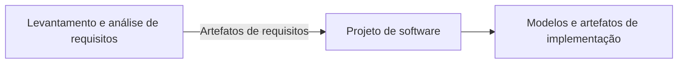
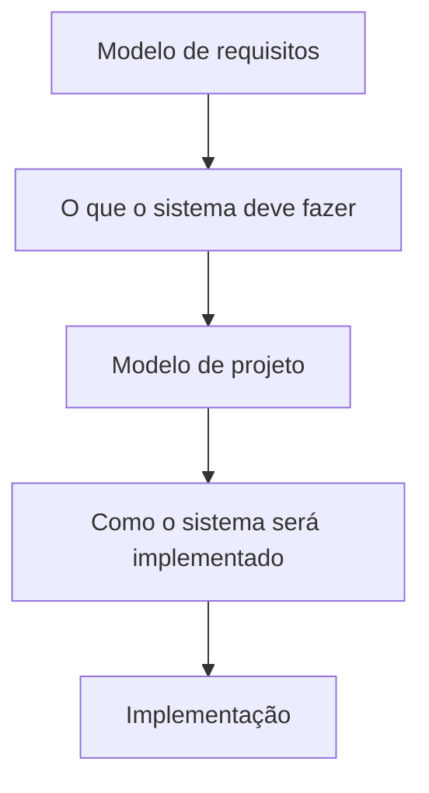
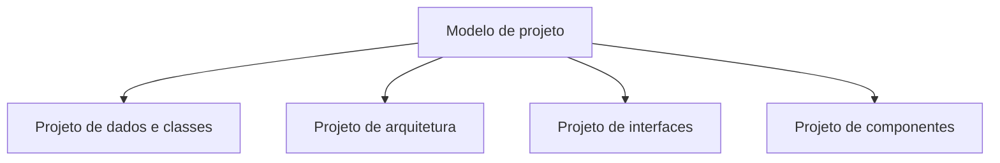
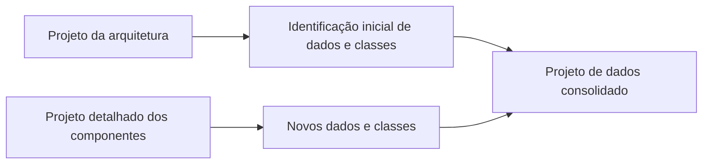
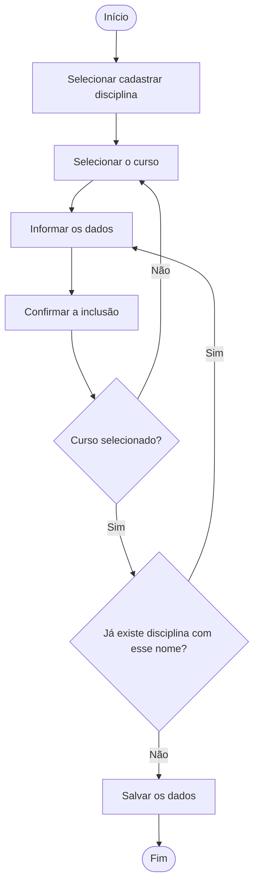
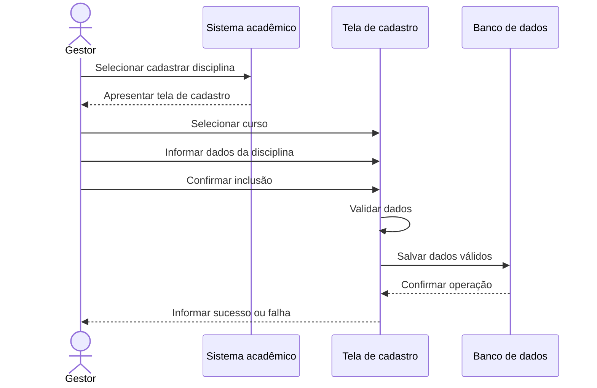
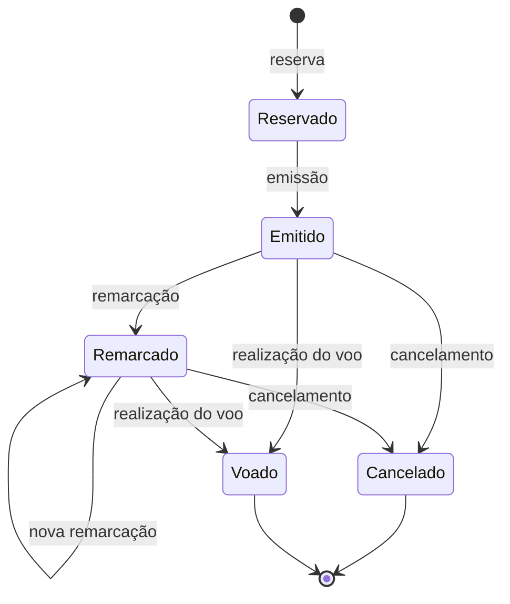
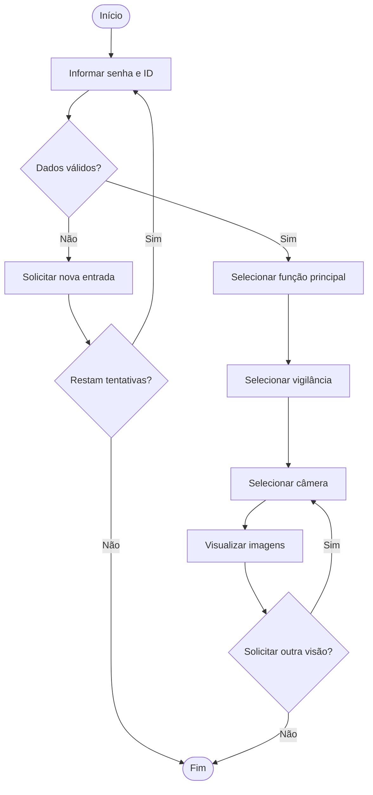

# Projeto de Software e Diagramas da UML

## 1. Conceito de projeto de software

> [!info] Conceito
> O projeto de software traduz os requisitos em uma “planta” que orienta a construção do sistema.

O **projeto de software**, também chamado de **fase de modelagem**, é um processo iterativo no qual os requisitos levantados e analisados são transformados em representações mais detalhadas do sistema. Enquanto a Engenharia de Requisitos define principalmente **o que** o software deverá fazer, o projeto estabelece **como** essas necessidades serão implementadas.

Os artefatos produzidos durante o levantamento e a análise de requisitos funcionam como entrada para a fase de projeto. Como saída, são gerados modelos e outros documentos que descrevem a arquitetura, os dados, as interfaces e os componentes necessários à implementação.

Esse processo é considerado iterativo porque o modelo pode ser revisado e aperfeiçoado à medida que novos detalhes são identificados.

> [!tip] Resumindo
> Os requisitos descrevem **o que fazer**; o projeto de software detalha **como fazer**.

---

## 2. Responsabilidades do projeto de software

> [!info] Conceito
> O projeto deve transformar os requisitos em uma representação completa, compreensível e adequada à implementação e aos testes.

Segundo Pressman, o projeto de software possui três responsabilidades fundamentais.

### 2.1 Implementar requisitos explícitos e implícitos

O projeto deve implementar todos os **requisitos explícitos**, isto é, aqueles que estão formalmente registrados no modelo de requisitos. Também deve acomodar os **requisitos implícitos**, que correspondem às características esperadas pelos usuários e demais envolvidos, mesmo quando não foram declaradas diretamente.

### 2.2 Orientar programadores e testadores

O projeto deve funcionar como um guia legível e compreensível tanto para os profissionais responsáveis pela geração do código quanto para aqueles que realizarão os testes e, posteriormente, darão suporte ao sistema.

Por isso, os modelos precisam apresentar detalhes suficientes para servir como insumo à fase de implementação.

### 2.3 Oferecer uma visão completa do software

O projeto deve representar o software sob três perspectivas:

- **Domínio dos dados:** quais informações serão armazenadas e como serão organizadas;
- **Domínio funcional:** quais operações e funcionalidades serão executadas;
- **Domínio comportamental:** como o sistema e seus componentes reagirão aos eventos.

Esses domínios devem ser analisados do ponto de vista da implementação.

> [!warning] Atenção
> O projeto não deve se limitar aos requisitos formalmente escritos. Ele também precisa considerar características necessárias ou naturalmente esperadas pelos envolvidos.

---

## 3. Do modelo de requisitos ao modelo de projeto

> [!info] Conceito
> O modelo de requisitos concentra-se na necessidade do usuário, enquanto o modelo de projeto descreve a solução técnica.

O modelo de projeto cria uma representação do software diferente daquela produzida durante a análise de requisitos. Essa diferença pode ser compreendida pela relação entre **“o que”** e **“como”**:

| Modelo | Questão principal | Conteúdo |
|---|---|---|
| Modelo de requisitos | O que o sistema deve fazer? | Necessidades, funcionalidades, restrições e interações esperadas |
| Modelo de projeto | Como o sistema será construído? | Arquitetura, estruturas de dados, interfaces e componentes |

O modelo de projeto aproxima a especificação abstrata da solução que será efetivamente programada. Ele fornece informações técnicas indispensáveis para transformar os requisitos em código.

> [!tip] Resumindo
> O projeto de software estabelece a ligação entre a análise dos requisitos e a construção efetiva do sistema.

---

## 4. Dimensões do modelo de projeto

> [!info] Conceito
> O modelo de projeto reúne representações de dados, arquitetura, interfaces e componentes.

Para apresentar uma visão suficientemente completa da solução, o projeto de software deve abranger quatro dimensões principais:

1. **Projeto de dados ou classes;**
2. **Projeto de arquitetura;**
3. **Projeto de interfaces;**
4. **Projeto de componentes.**

Essas dimensões são relacionadas e se complementam. A arquitetura estabelece a organização geral, os componentes detalham as partes do sistema, as interfaces definem a comunicação e o projeto de dados determina como as informações serão estruturadas.

---

## 5. Projeto de arquitetura

> [!info] Conceito
> O projeto de arquitetura define a estrutura e a organização geral do sistema.

A arquitetura representa a visão mais ampla do software. Nessa dimensão são identificados os grandes componentes ou conjuntos de funcionalidades que compõem o sistema e que podem ser utilizados pelos diversos módulos desenvolvidos.

A arquitetura funciona como a estrutura na qual os componentes serão inseridos. Durante sua definição, podem ser empregados **padrões de projeto**, também chamados de *design patterns*. Esses padrões são soluções conhecidas e reutilizáveis para problemas recorrentes encontrados no desenvolvimento de software.

> [!tip] Resumindo
> A arquitetura mostra como o sistema é organizado em alto nível e como suas partes principais se relacionam.

---

## 6. Projeto de interfaces

> [!info] Conceito
> O projeto de interfaces define como ocorre a comunicação entre pessoas, sistemas e componentes.

Uma interface é o ponto pelo qual duas partes trocam informações. O projeto deve considerar diferentes formas de comunicação:

- **Interface com o usuário:** define como as pessoas interagem com o software;
- **Interface externa:** estabelece como o software se comunica com outros sistemas;
- **Interface interna:** determina como os componentes do próprio sistema trocam informações.

O projeto de interfaces não se restringe, portanto, às telas apresentadas ao usuário. Ele também abrange os mecanismos de integração externa e a comunicação existente entre os módulos internos.

> [!warning] Atenção
> “Interface” não significa apenas interface gráfica. O termo também inclui a comunicação do software com outros sistemas e entre seus componentes internos.

---

## 7. Projeto de componentes

> [!info] Conceito
> O projeto de componentes especifica detalhadamente os módulos que formarão o sistema.

Os **componentes**, também chamados de **módulos**, são partes menores e relativamente independentes do software. Cada módulo possui responsabilidades próprias e deve se encaixar na arquitetura definida, como as peças de um quebra-cabeça.

Enquanto a arquitetura apresenta a organização geral, o projeto de componentes descreve cada unidade com maior nível de detalhe. Essa especificação orienta a posterior implementação das funcionalidades em código.

A independência entre os módulos facilita a organização do desenvolvimento, pois permite compreender e trabalhar separadamente nas diferentes partes da solução, sem perder a integração com o conjunto.

> [!tip] Resumindo
> A arquitetura define a estrutura do sistema; o projeto de componentes detalha as peças que ocuparão essa estrutura.

---

## 8. Projeto de dados e classes

> [!info] Conceito
> O projeto de dados e classes determina quais informações serão usadas e como serão organizadas.

Essa dimensão especifica os dados utilizados pelo sistema, a forma como serão agrupados e as estruturas necessárias para seu armazenamento e processamento.

Uma parte do projeto de classes pode surgir durante a definição da arquitetura, especialmente quando são identificados elementos compartilhados por todo o sistema. Entretanto, novos dados e classes também podem ser descobertos quando cada componente é analisado de maneira detalhada.

Por isso, o projeto de dados evolui ao longo da modelagem:

> [!tip] Resumindo
> A estrutura dos dados começa a ser definida na arquitetura e é progressivamente detalhada durante o projeto dos componentes.

---

## 9. Diagramas da UML

> [!info] Conceito
> A UML oferece diagramas para representar diferentes perspectivas estruturais e comportamentais do software.

A **UML — Linguagem de Modelagem Unificada** fornece recursos visuais para documentar os elementos e o comportamento de um sistema. Cada diagrama destaca uma perspectiva específica da solução.

| Diagrama | Finalidade |
|---|---|
| **Casos de uso** | Mostrar as interações entre os atores e as funcionalidades fornecidas pelo sistema |
| **Atividades** | Representar as atividades envolvidas em um processo e o fluxo entre elas |
| **Sequência** | Mostrar, em ordem temporal, as interações entre atores, sistema e componentes |
| **Comunicação** | Representar as mensagens trocadas entre os objetos, enfatizando suas ligações |
| **Classes** | Mostrar as classes obtidas na modelagem de dados e as associações existentes entre elas |
| **Estados** | Representar os estados de um componente e as transições provocadas por eventos |

Esses diagramas não apresentam exatamente as mesmas informações. Eles são empregados de acordo com o aspecto do sistema que precisa ser compreendido ou documentado.

---

## 10. Estudo de caso: cadastro de disciplina

> [!info] Conceito
> O caso de uso “Cadastrar disciplina” demonstra como um requisito pode ser transformado em diferentes modelos UML.

O exemplo apresentado refere-se a um **Sistema de Controle Acadêmico**. O ator envolvido é o **gestor**, representado pelo coordenador do curso.

### 10.1 Cenário principal

O fluxo principal para cadastrar uma nova disciplina é:

1. O gestor seleciona a opção de criar uma nova disciplina;
2. O gestor seleciona o curso ao qual a disciplina pertence;
3. O gestor informa os dados da disciplina;
4. O gestor confirma a inclusão;
5. O sistema valida e salva os dados.

### 10.2 Exceções

O processo possui duas condições excepcionais:

- Se nenhum curso tiver sido selecionado, o sistema informa que é necessário selecionar um curso;
- Se já existir uma disciplina com o nome informado, o sistema não permite a inclusão.

Essas exceções fazem com que o fluxo retorne à atividade correspondente para que o gestor corrija as informações.

---

## 11. Diagrama de atividades do cadastro

> [!info] Conceito
> O diagrama de atividades evidencia a sequência das ações, as decisões e os possíveis retornos do processo.

No cadastro de disciplina, o fluxo começa quando o gestor escolhe a função correspondente. Em seguida, ele seleciona o curso, informa os dados e confirma a inclusão.

Antes de salvar, o sistema avalia duas condições. Se o curso não tiver sido selecionado, o processo retorna à seleção do curso. Se já existir uma disciplina com o mesmo nome, retorna-se ao preenchimento dos dados. Somente quando as condições forem atendidas os dados serão salvos.

> [!tip] Resumindo
> O diagrama de atividades é especialmente útil para visualizar fluxos, decisões, exceções e repetições de tarefas.

---

## 12. Diagrama de sequência do cadastro

> [!info] Conceito
> O diagrama de sequência representa as mensagens na ordem temporal em que são trocadas.

No exemplo de cadastro de disciplina, participam da interação:

- o gestor;
- o Sistema de Controle Acadêmico;
- a tela de cadastro de disciplinas;
- o banco de dados.

O gestor solicita o cadastro ao sistema, que apresenta a tela correspondente. Na tela, o gestor seleciona o curso, informa os dados e confirma a inclusão. A tela valida as informações considerando as regras e exceções definidas. Se os dados forem válidos, solicita ao banco de dados que salve a disciplina e, depois, informa ao gestor o sucesso ou a falha da operação.

O ponto forte desse diagrama é tornar clara a ordem em que as mensagens e operações acontecem.

---

## 13. Diagrama de comunicação

> [!info] Conceito
> O diagrama de comunicação mostra as mesmas interações básicas do diagrama de sequência, mas enfatiza a organização e as ligações entre os participantes.

No estudo de caso, o diagrama de comunicação reúne o gestor, o Sistema de Controle Acadêmico, a tela de cadastro e o banco de dados. As mensagens recebem numeração, como `1`, `2`, `3`, `4`, `4.1` e `4.2`, para indicar a ordem das interações.

O diagrama de comunicação pode ser entendido como outra maneira de visualizar as informações de um diagrama de sequência. Entretanto, cada representação possui vantagens e limitações próprias.

| Diagrama | Pontos fortes | Pontos fracos |
|---|---|---|
| **Sequência** | Mostra com clareza a sequência ou ordem temporal das mensagens; comporta um conjunto amplo de ações detalhadas | Pode ficar muito extenso horizontalmente quando novos objetos são adicionados |
| **Comunicação** | Economiza espaço; permite adicionar novos objetos de maneira flexível; utiliza duas dimensões | Torna a sequência das mensagens menos evidente; possui menos opções de notação |

> [!warning] Atenção
> Os diagramas de sequência e comunicação podem representar as mesmas interações, mas organizam visualmente as informações de maneiras diferentes.

> [!tip] Resumindo
> Use o diagrama de sequência quando a ordem temporal for mais importante e o de comunicação quando for necessário destacar as relações entre os objetos ocupando menos espaço.

---

## 14. Diagrama de estados: emissão de bilhetes aéreos

> [!info] Conceito
> O diagrama de estados mostra as diferentes condições de um objeto e os eventos que provocam mudanças entre elas.

O exemplo apresentado representa os estados de um bilhete mantido por um sistema de emissão de passagens aéreas. Inicialmente, uma reserva faz com que o bilhete fique **reservado**. Após a emissão, ele passa ao estado **emitido**.

Um bilhete emitido pode:

- ser cancelado;
- ser utilizado no voo;
- ser remarcado.

Quando se encontra no estado **remarcado**, ele pode ser remarcado novamente várias vezes. Também pode ser cancelado ou utilizado no voo. Os estados **cancelado** e **voado** representam estados finais.

> [!tip] Resumindo
> O diagrama de estados é adequado quando é importante conhecer o ciclo de vida de um objeto e os eventos que alteram sua situação.

---

## 15. Diagrama de atividades do sistema CasaSegura

> [!info] Conceito
> O sistema CasaSegura exemplifica um fluxo de autenticação, seleção de funções e visualização de câmeras residenciais pela Internet.

O **CasaSegura**, apresentado por Pressman, é um sistema de vigilância residencial. O cenário mostrado consiste em acessar remotamente a vigilância e visualizar imagens das câmeras.

O fluxo começa com a introdução da senha e da identificação do usuário. Se os dados forem inválidos, o sistema solicita sua reintrodução enquanto ainda existirem tentativas disponíveis. Quando não restarem tentativas, o processo é encerrado.

Se a autenticação for válida, o usuário seleciona a função principal e, depois, a função de vigilância. A câmera pode ser escolhida por meio de uma visão em miniatura ou pela seleção direta de seu ícone. As imagens são então apresentadas em uma janela identificada.

Após a visualização, o usuário pode solicitar outra visão, selecionar outra câmera ou sair da função. O diagrama demonstra decisões, retornos, alternativas e encerramentos dentro de um mesmo processo.

> [!tip] Resumindo
> O exemplo CasaSegura evidencia como um diagrama de atividades representa autenticação, escolhas do usuário, repetições e diferentes formas de encerramento.

---

## 16. Relação entre os diagramas e o projeto de software

> [!info] Conceito
> Cada diagrama contribui para documentar uma perspectiva necessária à construção do sistema.

Os diagramas UML ajudam a transformar os requisitos em representações compreensíveis para desenvolvedores e testadores:

- O **diagrama de atividades** descreve o fluxo do processo;
- O **diagrama de sequência** apresenta a ordem temporal das interações;
- O **diagrama de comunicação** destaca as ligações entre os participantes;
- O **diagrama de classes** representa a estrutura dos dados e seus relacionamentos;
- O **diagrama de estados** apresenta o ciclo de vida de um componente;
- O **diagrama de casos de uso** relaciona atores e funcionalidades.

Não é necessário utilizar todos os diagramas em todos os projetos. A escolha depende das características do sistema e daquilo que precisa ser documentado para orientar sua implementação.

---

## 17. Bibliografia e leitura recomendada

A aula utiliza como referência:

**PRESSMAN, Roger S.; MAXIM, Bruce R. _Engenharia de software: uma abordagem profissional_. 8. ed. Rio de Janeiro: AMGH, 2016.**

Como aprofundamento, foi recomendada a leitura do **Capítulo 12** da obra.

---

## Síntese final

> [!summary] Síntese
> O projeto de software converte os requisitos em uma descrição técnica de como o sistema será implementado. Para isso, reúne projetos de dados, arquitetura, interfaces e componentes, utilizando diagramas UML para representar diferentes perspectivas da solução.

A fase de projeto funciona como uma ponte entre os requisitos e a implementação. Ela deve contemplar necessidades explícitas e implícitas, orientar desenvolvedores e testadores e oferecer uma visão completa dos aspectos funcionais, comportamentais e de dados.

A UML auxilia essa fase por meio de diagramas complementares. Os diagramas de atividades representam fluxos; os de sequência e comunicação mostram interações; os de classes descrevem estruturas; e os de estados registram mudanças no ciclo de vida dos componentes. Os estudos de caso do cadastro de disciplina, do bilhete aéreo e do sistema CasaSegura demonstram como essas representações tornam o funcionamento do software mais claro antes da codificação.