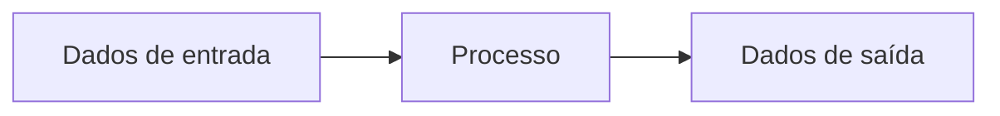
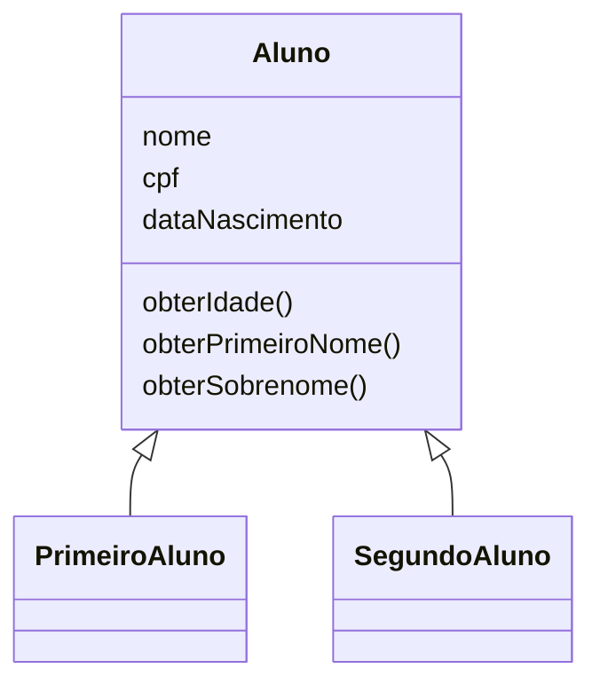
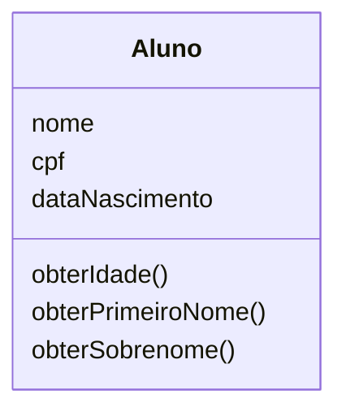
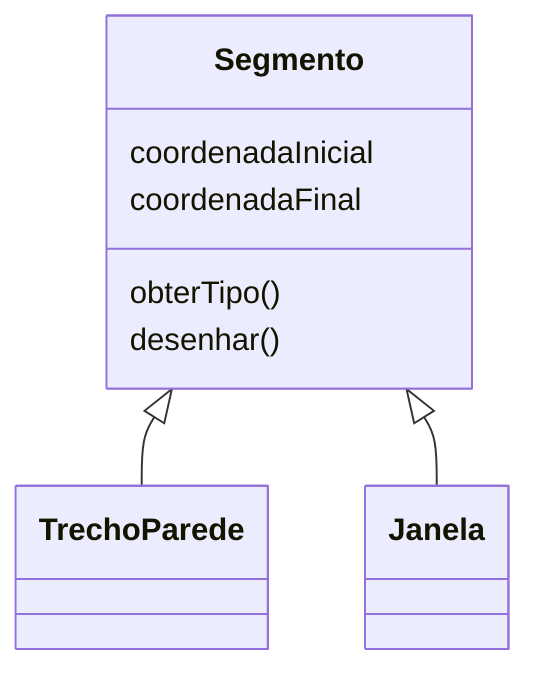
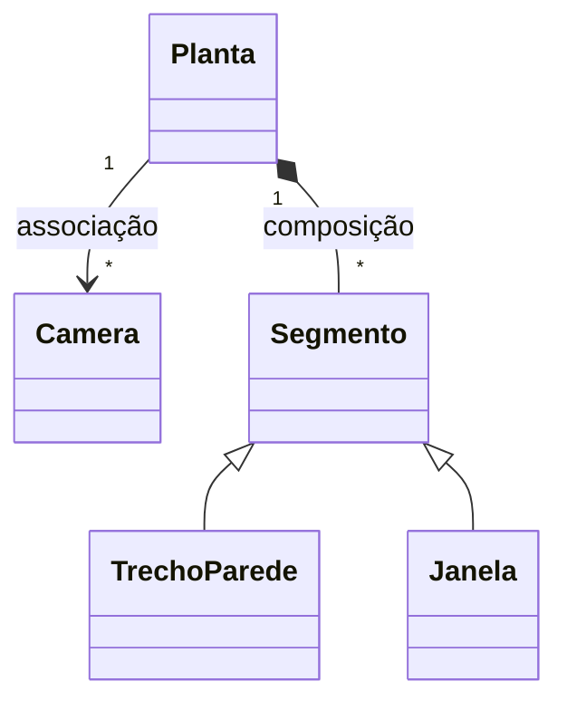
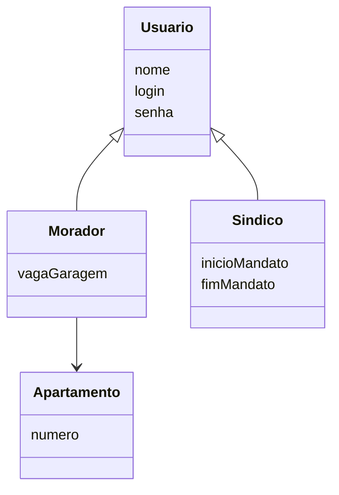
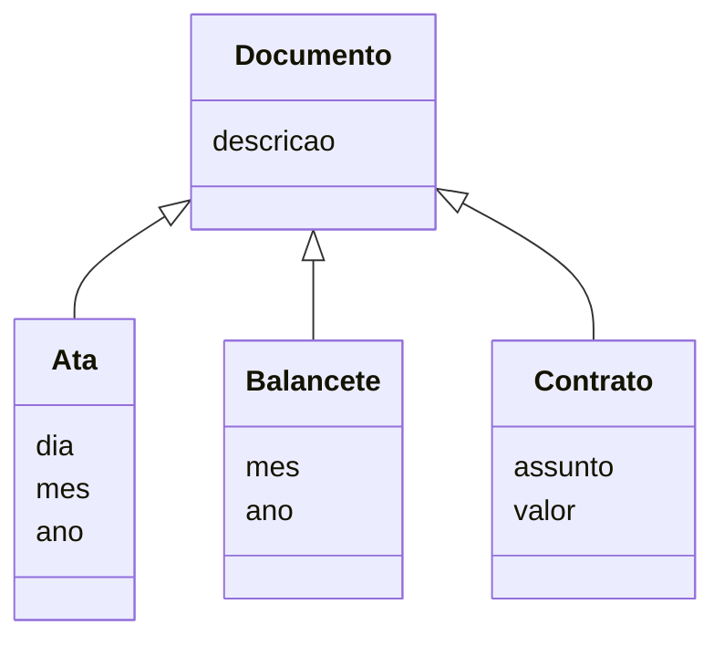
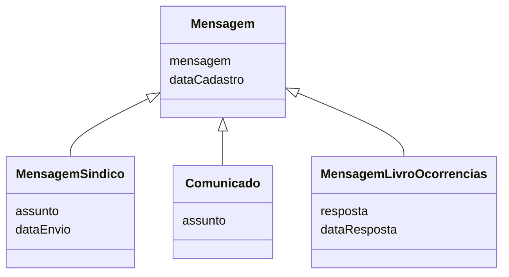
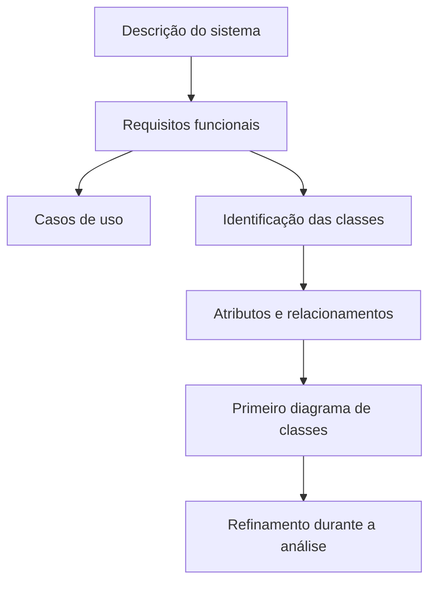

# Modelagem e Análise de Software Orientada a Objetos

## Modelos de análise de software

> [!info] Conceito
> Os modelos de análise representam o sistema de forma abstrata, permitindo compreender sua estrutura, seus dados, seus processos e o comportamento esperado antes da implementação.

A análise de software procura descrever como um sistema deve funcionar e como seus elementos se relacionam. A aula apresenta duas abordagens principais: a **análise estruturada** e a **análise orientada a objetos**.

Na análise estruturada, o sistema é compreendido principalmente como um conjunto de funções responsáveis por receber, transformar e produzir dados. Na análise orientada a objetos, o sistema é modelado como um conjunto de objetos que possuem características e comportamentos próprios e que interagem entre si.

| Aspecto | Análise estruturada | Análise orientada a objetos |
|---|---|---|
| Foco principal | Dados e processos | Classes e objetos |
| Visão do sistema | Conjunto de funções que processam dados | Conjunto de objetos que interagem |
| Diagramas utilizados | Diagramas de fluxo de dados | Diagramas da UML |
| Elementos centrais | Entrada, processo e saída | Atributos, operações e relacionamentos |

> [!tip] Resumindo
> A análise estruturada enfatiza as transformações realizadas sobre os dados, enquanto a análise orientada a objetos concentra-se nas entidades do sistema e nas interações entre elas.

## Análise estruturada

> [!info] Conceito
> A análise estruturada modela o sistema com base nos dados que entram, nos processos que os transformam e nos dados resultantes.

A análise estruturada utiliza principalmente **diagramas de fluxo de dados**. Sua modelagem tem como foco os dados e os processos que realizam transformações sobre esses dados. O sistema é visto como um conjunto de funções que processam informações.

Essa abordagem segue uma lógica semelhante à programação estruturada: determinados dados são fornecidos como entrada, uma função ou processo realiza alguma transformação e novos dados são produzidos como saída.

Embora ainda possa ser utilizada, essa abordagem não constitui o foco principal da aula, que se concentra na análise orientada a objetos.

## Análise orientada a objetos

> [!info] Conceito
> A análise orientada a objetos representa o sistema por meio de classes e objetos que possuem dados, executam ações e interagem entre si.

A **análise orientada a objetos** utiliza diagramas da **UML — Unified Modeling Language**. Nessa abordagem, a modelagem concentra-se nas classes, nos objetos e nos relacionamentos existentes entre eles.

O sistema passa a ser compreendido como um conjunto de objetos que colaboram para realizar suas funcionalidades. A UML oferece diferentes diagramas para representar perspectivas específicas do sistema. Entre os exemplos apresentados estão:

- **Diagrama de sequência:** representa a interação entre um ator e os objetos do sistema, bem como as mensagens trocadas entre os próprios objetos. Um exemplo é a interação entre o usuário, a tela de cadastro e o banco de dados.
- **Diagrama de estados:** mostra os diferentes estados que um objeto pode assumir em consequência dos eventos ocorridos no sistema. Um bilhete, por exemplo, pode passar pelos estados reservado, emitido, remarcado, cancelado e voado.

> [!warning] Atenção
> A orientação a objetos não observa apenas as funções isoladas do sistema. Ela procura identificar as entidades envolvidas, os dados que elas mantêm, as ações que realizam e como colaboram umas com as outras.

## Objetos e classes

> [!info] Conceito
> Um objeto é uma entidade individual e distinguível, enquanto uma classe é a especificação que define as características e os comportamentos dos objetos de determinado tipo.

Um **objeto** é uma entidade concreta, real e distinguível de outros objetos, mesmo quando eles pertencem ao mesmo tipo. Diferentes carros estacionados, por exemplo, podem ser considerados objetos distintos.

Uma **classe** representa um tipo ou uma especificação. Ela determina quais dados e ações estarão presentes nos objetos daquele tipo. Assim, “carro” pode ser entendido como uma classe, enquanto cada veículo específico corresponde a um objeto dessa classe.

No exemplo da aula, a classe `Aluno` define os dados e as operações que caracterizam um aluno:

- nome;
- CPF;
- data de nascimento;
- obtenção da idade;
- obtenção do primeiro nome;
- obtenção do sobrenome.

Lucas Ribeiro e Pedro Henrique são objetos distintos, mas ambos pertencem à classe `Aluno`. Cada um possui seus próprios valores de nome, CPF e data de nascimento, embora compartilhem a mesma estrutura definida pela classe.

> [!tip] Resumindo
> A classe funciona como a definição geral de um tipo, enquanto o objeto é uma ocorrência específica criada conforme essa definição.

## Atributos e operações

> [!info] Conceito
> Os atributos armazenam as informações de um objeto, enquanto as operações representam as ações que ele pode realizar.

Cada objeto possui características próprias, representadas por **atributos** e **operações**:

- **Atributos:** são os dados armazenados no objeto, representando suas características e informações.
- **Operações:** são as ações que podem ser realizadas pelo objeto. Na programação, também podem ser chamadas de métodos ou funções.

No caso da classe `Aluno`, `nome`, `cpf` e `dataNascimento` são atributos. Já `obterIdade()`, `obterPrimeiroNome()` e `obterSobrenome()` são operações.

Objetos que possuem o mesmo conjunto de atributos e operações pertencem à mesma classe. Portanto, os dados específicos podem variar de um objeto para outro, mas sua estrutura é determinada pela classe à qual pertencem.

> [!warning] Atenção
> Atributo não é a mesma coisa que valor. `nome` é um atributo da classe `Aluno`, enquanto “Lucas Ribeiro” é o valor desse atributo em um objeto específico.

## Diagrama de classes

> [!info] Conceito
> O diagrama de classes apresenta as classes de um sistema, seus atributos, suas operações e os relacionamentos existentes entre elas.

O **diagrama de classes** é um dos diagramas da UML empregados na análise orientada a objetos. Ele permite representar a estrutura do sistema, mostrando quais classes foram identificadas e como elas se relacionam.

A notação básica de uma classe é um retângulo dividido em três compartimentos:

1. nome da classe;
2. atributos;
3. operações.

O diagrama produzido durante a análise representa inicialmente um esboço do sistema. Ele pode ser modificado, ampliado e refinado conforme os requisitos sejam mais bem compreendidos.

> [!tip] Resumindo
> O diagrama de classes transforma os conceitos encontrados nos requisitos em uma representação estruturada das entidades do sistema.

## Relacionamentos entre classes

> [!info] Conceito
> Os relacionamentos indicam como as classes estão conectadas e quais vínculos estruturais existem entre seus objetos.

As classes de um sistema não aparecem isoladamente. Elas podem apresentar diferentes tipos de relacionamento, entre os quais a aula destaca **herança**, **associação** e **composição**.

### Herança

A **herança** permite que uma classe filha herde os atributos e as operações definidos por uma classe pai. A classe pai contém as características gerais, enquanto as classes filhas representam tipos mais específicos.

No exemplo apresentado, `Segmento` funciona como uma classe mais geral. `TrechoParede` e `Janela` são classes especializadas que herdam seus atributos e operações.

### Associação

A **associação** indica que uma classe está relacionada a outra. No exemplo, uma `Planta` encontra-se associada a uma ou mais `Câmeras`.

A multiplicidade apresentada indica que uma planta pode relacionar-se com várias câmeras.

### Composição

A **composição** é uma associação do tipo **todo-parte**. Ela representa uma ligação estrutural mais forte entre as classes.

Uma `Planta`, por exemplo, é composta por vários `Segmentos`. Nesse relacionamento, a planta representa o todo e os segmentos representam suas partes.

> [!tip] Resumindo
> A herança representa uma relação de generalização e especialização; a associação indica uma ligação entre classes; e a composição expressa uma relação estrutural entre um todo e suas partes.

## Estudo de caso: sistema de gestão condominial

> [!info] Conceito
> O estudo de caso demonstra como os requisitos funcionais podem ser analisados para identificar os atores, as funcionalidades e as classes de um sistema.

O sistema de gestão condominial possui dois tipos de usuário: **morador** e **síndico**. Ambos acessam o sistema utilizando login e senha, mas desempenham responsabilidades diferentes.

O síndico pode cadastrar documentos, como atas de assembleia, balancetes e contratos. O morador pode visualizar esses documentos. Morador e síndico podem reservar espaços do condomínio, como churrasqueira e salão de festas.

O síndico também pode enviar mensagens aos moradores e cadastrar comunicados para visualização. O morador pode escrever no livro digital de ocorrências, enquanto o síndico pode visualizar o conteúdo registrado e cadastrar uma resposta.

## Requisitos funcionais do sistema

> [!info] Conceito
> Requisitos funcionais descrevem as ações e os serviços que o sistema deve disponibilizar aos usuários.

A partir da descrição do estudo de caso, foram definidos os seguintes requisitos funcionais:

| Código | Requisito funcional |
|---|---|
| RF 01 | O usuário acessa o sistema informando login e senha. |
| RF 02 | O síndico cadastra documentos, como atas, balancetes e contratos. |
| RF 03 | O morador visualiza documentos. |
| RF 04 | O morador e o síndico reservam espaços do condomínio. |
| RF 05 | O síndico envia mensagens aos moradores. |
| RF 06 | O síndico cadastra comunicados. |
| RF 07 | Os moradores visualizam os comunicados. |
| RF 08 | O morador escreve no livro digital de ocorrências. |
| RF 09 | O síndico visualiza o livro de ocorrências e responde aos registros. |

Esses requisitos expressam o que cada tipo de usuário pode fazer no sistema e servem como base para a construção dos modelos de casos de uso e de classes.

## Diagrama de casos de uso do sistema condominial

> [!info] Conceito
> O diagrama de casos de uso relaciona os atores do sistema com as funcionalidades que eles podem executar.

O modelo apresentado utiliza o ator geral `Usuário`, especializado nos atores `Síndico` e `Morador`. Ambos podem acessar o sistema e reservar espaços.

O síndico mantém documentos, envia mensagens, mantém comunicados e responde ao livro de ocorrências. O morador visualiza documentos e comunicados e escreve no livro de ocorrências.

Algumas funcionalidades incluem outras ações:

- manter documentos inclui visualizar documentos;
- manter comunicados inclui visualizar comunicados;
- escrever ou responder no livro de ocorrências inclui visualizar o livro.

Essa representação permite observar as responsabilidades de cada ator e as dependências entre as funcionalidades do sistema.

> [!tip] Resumindo
> O diagrama de casos de uso representa o sistema sob a perspectiva das ações disponibilizadas aos usuários; o diagrama de classes representa sua estrutura interna.

## Identificação das classes do sistema

> [!info] Conceito
> As classes podem ser identificadas pela análise dos substantivos e das entidades relevantes encontrados nos requisitos funcionais.

A análise dos requisitos permitiu identificar as principais classes do sistema:

- `Usuário`;
- `Morador`;
- `Síndico`;
- `Apartamento`;
- `Documento`;
- `Ata`;
- `Balancete`;
- `Contrato`;
- `EspaçoReserva`;
- `Mensagem`;
- `MensagemSíndico`;
- `Comunicado`;
- `MensagemLivroOcorrências`.

Esses elementos correspondem a entidades que possuem informações próprias e precisam ser representadas no sistema. Os substantivos presentes nos requisitos auxiliam na identificação inicial das possíveis classes, embora o modelo ainda precise ser refinado ao longo da análise.

O espaço para reserva também possui tipos específicos, como:

- churrasqueira;
- salão de festas.

> [!warning] Atenção
> A identificação de substantivos é um ponto de partida para encontrar possíveis classes, mas o primeiro modelo não é definitivo. Ele deve evoluir conforme a análise dos requisitos avança.

## Primeiro esboço do diagrama de classes

> [!info] Conceito
> O primeiro diagrama de classes organiza as entidades extraídas dos requisitos e registra seus atributos e relacionamentos iniciais.

A classe `Usuário` contém os atributos comuns `nome`, `login` e `senha`. `Morador` e `Síndico` são especializações de `Usuário`, pois representam tipos de usuário do sistema:

- `Morador` possui o atributo `vagaGaragem`;
- `Síndico` possui os atributos `inicioMandato` e `fimMandato`.

O `Morador` está associado a um `Apartamento`, que possui o atributo `numero`.

A classe `Documento` contém o atributo comum `descricao`. Ela é generalizada nas seguintes classes:

- `Ata`, com os atributos `dia`, `mes` e `ano`;
- `Balancete`, com os atributos `mes` e `ano`;
- `Contrato`, com os atributos `assunto` e `valor`.

A classe `Mensagem` apresenta os atributos `mensagem` e `dataCadastro`. Ela possui as seguintes especializações:

- `MensagemSíndico`, com `assunto` e `dataEnvio`;
- `Comunicado`, com `assunto`;
- `MensagemLivroOcorrências`, com `resposta` e `dataResposta`.

A classe `EspaçoReserva` contém `nome` e `descricao`. O tipo do espaço pode ser representado pela enumeração `Espaço`, que contém as opções `Churrasqueira` e `Salão de Festas`.

A hierarquia dos documentos pode ser sintetizada da seguinte forma:

A hierarquia das mensagens é representada assim:

> [!tip] Resumindo
> O modelo reúne atributos comuns nas classes mais gerais e utiliza a herança para representar os tipos específicos de usuário, documento e mensagem.

## Evolução do modelo durante a análise

> [!info] Conceito
> Um modelo de análise é construído progressivamente e pode sofrer alterações conforme surgem novas informações sobre o sistema.

O diagrama apresentado constitui apenas um primeiro esboço das classes do sistema de gestão condominial. Durante o processo de análise, novas classes, atributos, operações e relacionamentos podem ser identificados.

Também pode ser necessário corrigir ou reorganizar elementos já existentes. Esse refinamento ocorre porque a compreensão do domínio e dos requisitos aumenta conforme o trabalho avança.

O processo mostrado na aula pode ser sintetizado da seguinte maneira:

> [!tip] Resumindo
> A modelagem não é uma atividade realizada apenas uma vez. O modelo inicial deve ser revisado e aperfeiçoado conforme os requisitos se tornam mais claros.

## Leitura recomendada

A aula recomenda a leitura do **Capítulo 10** da seguinte obra:

PRESSMAN, Roger S.; MAXIM, Bruce R. *Engenharia de software: uma abordagem profissional*. 8. ed. Rio de Janeiro: AMGH, 2016.

## Síntese final

> [!summary] Síntese
> A análise orientada a objetos representa um sistema como um conjunto de objetos pertencentes a classes e relacionados entre si. As classes definem atributos e operações, enquanto os diagramas da UML ajudam a representar a estrutura e o comportamento do sistema.

A aula parte da comparação entre análise estruturada e análise orientada a objetos. Na abordagem estruturada, o foco está nos dados e nos processos que os transformam. Na abordagem orientada a objetos, o foco passa a ser as classes, os objetos e suas interações.

Os objetos são ocorrências individuais, enquanto as classes definem os dados e as ações comuns aos objetos de determinado tipo. O diagrama de classes representa essas definições por meio do nome da classe, dos atributos, das operações e dos relacionamentos.

Entre os relacionamentos estudados estão a herança, a associação e a composição. A aplicação desses conceitos ao sistema de gestão condominial demonstra como os requisitos funcionais podem ser transformados em casos de uso e em um primeiro modelo de classes. Esse modelo permanece sujeito a refinamentos ao longo do processo de análise.