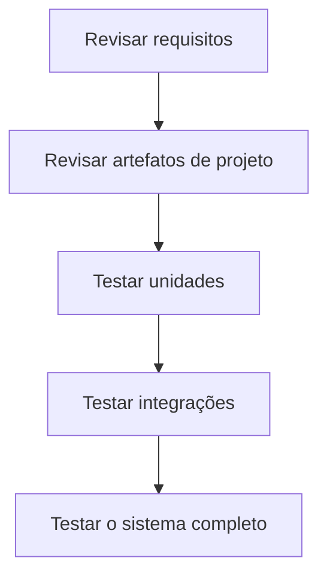
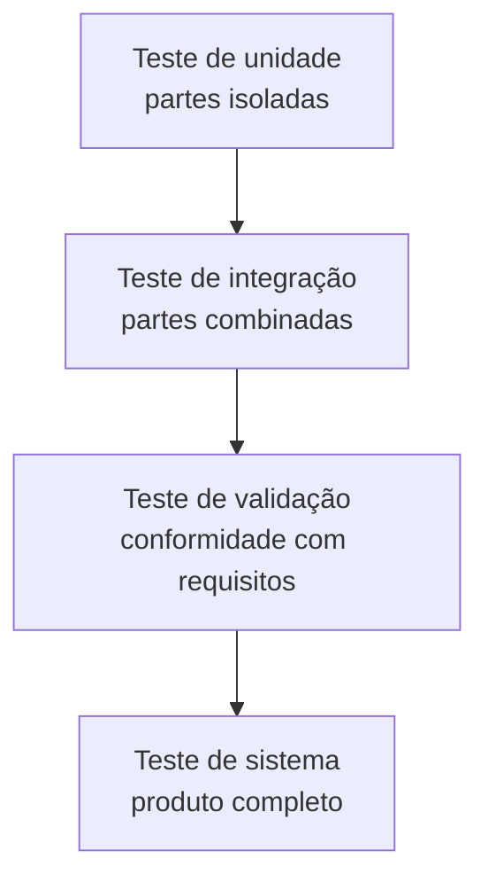
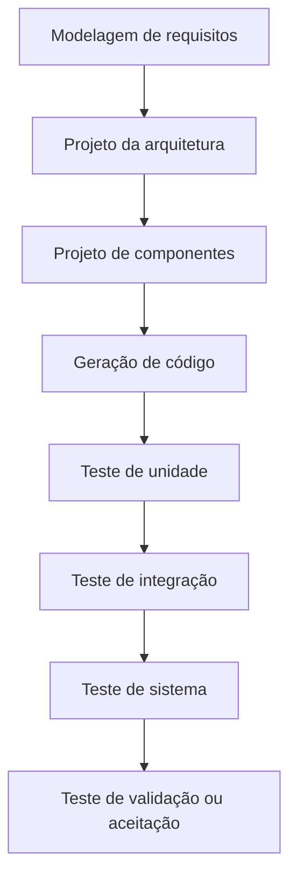
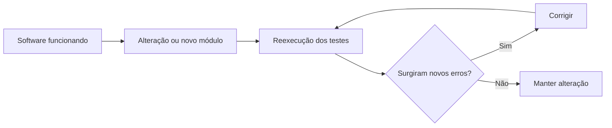

# Teste de Software

## 1. Conceito e objetivos do teste de software

> [!info] Conceito
> Teste de software é uma atividade do processo de desenvolvimento destinada a revelar falhas e verificar a qualidade do produto.

O teste faz parte do processo de desenvolvimento de software e está relacionado principalmente à etapa de construção. Seu primeiro objetivo é **encontrar e revelar falhas e problemas**, permitindo que sejam corrigidos antes que prejudiquem o usuário.

O segundo objetivo é **garantir a qualidade do software**. Nesse contexto, qualidade significa verificar se o produto atende aos requisitos especificados e às necessidades reais do cliente.

Os objetivos do teste são alcançados por meio de diferentes atividades:

- testes funcionais da aplicação;
- revisão e avaliação da especificação de requisitos;
- revisão e avaliação dos artefatos produzidos na fase de projeto;
- revisão e verificação dos demais documentos gerados durante o desenvolvimento;
- revisão e avaliação das interfaces do software;
- testes de desempenho e capacidade.

Assim, testar não significa apenas executar o programa procurando erros. A qualidade também é examinada pela revisão dos requisitos, do projeto, da documentação e de outros artefatos produzidos durante o desenvolvimento.

> [!tip] Resumindo
> O teste procura falhas, apoia sua correção e verifica se o software satisfaz os requisitos e as necessidades do cliente.

---

## 2. Por que testar o software?

> [!info] Conceito
> Sempre que o usuário executa o software, ele acaba testando seu comportamento, ainda que informalmente.

Caso a equipe não encontre os erros antes da entrega, provavelmente o cliente os encontrará durante o uso. Diante disso, existem duas possibilidades:

1. a equipe identifica e corrige os erros antes da entrega;
2. o cliente encontra os erros e a equipe realiza a correção posteriormente.

Em ambos os casos, os erros precisarão ser corrigidos. Entretanto, quando são descobertos pelo cliente, também pode haver comprometimento da imagem do produto e da própria equipe responsável pelo desenvolvimento.

Por isso, os testes devem ser executados de maneira planejada e antecipada, reduzindo a quantidade de falhas que chegam ao ambiente de utilização.

> [!warning] Atenção
> Deixar que o cliente encontre os erros não elimina o trabalho de correção e ainda pode causar uma percepção negativa sobre o produto.

---

## 3. Questões que orientam a realização dos testes

> [!info] Conceito
> A estratégia de teste responde a decisões sobre planejamento, abrangência, repetição e participação do cliente.

A realização dos testes envolve algumas perguntas importantes:

- É necessário estabelecer um plano formal de testes?
- O programa deve ser testado como um todo ou em partes?
- Os testes devem ser refeitos quando novos componentes forem acrescentados?
- Em que momento o cliente deve participar?

Essas questões mostram que testar não é uma atividade improvisada. É preciso definir objetivos, responsabilidades, partes do sistema que serão verificadas, critérios de execução e formas de avaliação dos resultados.

---

## 4. Estratégia de teste

> [!info] Conceito
> A estratégia de teste organiza o trabalho em planejamento, projeto, execução e avaliação.

A estratégia apresentada divide o processo de teste em quatro grandes etapas:

### 4.1. Planejamento dos testes

No planejamento são definidos os objetivos dos testes e as atividades que serão realizadas. Essa etapa estabelece a estratégia geral e produz o **plano de testes**, documento que reúne as principais definições do projeto de teste.

### 4.2. Projeto dos casos de teste

Na etapa de projeto são criados e priorizados os **casos de teste**. Um caso de teste descreve uma situação que será verificada, incluindo os dados utilizados, a ação executada e o resultado esperado.

A priorização ajuda a decidir quais verificações são mais importantes, especialmente quando o tempo ou os recursos disponíveis são limitados.

### 4.3. Execução dos testes

Na execução, os casos de teste planejados são aplicados ao software. O comportamento observado é comparado com o comportamento esperado para identificar falhas ou divergências.

### 4.4. Coleta e avaliação dos resultados

Após a execução, os dados obtidos são coletados e avaliados. Essa análise permite verificar quais testes foram aprovados, quais falharam e quais problemas precisam ser corrigidos.

Os principais artefatos gerados ao longo desse processo são:

| Etapa | Artefato produzido |
|---|---|
| Planejamento | Plano de testes |
| Projeto | Casos de teste |
| Execução e outras fases | Relatórios de erros ou *bugs* |
| Avaliação | Dados e resultados analisados |

> [!tip] Resumindo
> Uma estratégia estruturada transforma os testes em um processo planejado, repetível e documentado.

---

## 5. Quando realizar os testes?

> [!info] Conceito
> Os testes devem acompanhar o desenvolvimento de forma incremental, em vez de serem deixados somente para o final.

Uma primeira abordagem seria aguardar a conclusão da construção do software para somente depois iniciar os testes. O problema é que, ao final do processo, pode existir um produto com grande quantidade de erros e uma percepção negativa por parte dos usuários.

A abordagem considerada mais adequada é o **teste incremental**, no qual as verificações são realizadas ao longo do desenvolvimento. Essa abordagem inclui:

- revisões formais dos requisitos;
- revisões dos artefatos de projeto;
- testes das unidades do programa;
- testes da integração entre unidades;
- testes do sistema completo.

O teste incremental permite descobrir problemas mais cedo, antes que eles se propaguem para outras partes do sistema.

> [!warning] Atenção
> Concentrar todos os testes no final pode acumular defeitos e tornar sua identificação e correção mais difíceis.

---

## 6. Metodologias e tipos de teste

> [!info] Conceito
> Os tipos de teste distinguem o nível ou o objeto que está sendo verificado.

A aula apresenta quatro tipos principais:

1. testes de unidade;
2. testes de integração;
3. testes de validação;
4. testes de sistema.

Esses testes avançam das menores partes do programa até o produto completo:

---

## 7. Teste de unidade

> [!info] Conceito
> O teste de unidade verifica pequenas partes funcionais do software isoladamente.

Uma unidade pode ser uma função, um componente ou uma classe. O objetivo é confirmar se essa pequena parte executa corretamente a responsabilidade para a qual foi criada.

Os testes de unidade são geralmente executados pelos desenvolvedores. Um exemplo de aplicação consiste em verificar pequenos cálculos realizados por uma função do programa.

Ao testar partes pequenas e isoladas, torna-se mais fácil localizar a origem de um erro, pois a quantidade de elementos envolvidos é reduzida.

> [!tip] Resumindo
> O teste de unidade verifica se cada pequena parte do software funciona corretamente por conta própria.

---

## 8. Teste de integração

> [!info] Conceito
> O teste de integração verifica se unidades que funcionam isoladamente continuam funcionando quando são combinadas.

O foco desse tipo de teste está no **projeto e na arquitetura do software**. Mesmo que duas ou mais partes funcionem corretamente quando isoladas, podem surgir problemas na comunicação entre elas.

Os testes de integração são realizados à medida que cada novo componente é incorporado ao software. A finalidade é verificar se o incremento entregue não prejudica o funcionamento que já existia.

Entre os problemas que podem ser revelados estão incompatibilidades de dados, falhas de comunicação e comportamentos inesperados decorrentes da interação entre componentes.

> [!tip] Resumindo
> Não basta que as partes funcionem separadamente; é preciso verificar se continuam funcionando quando conectadas.

---

## 9. Teste de validação

> [!info] Conceito
> O teste de validação verifica se o produto implementado está em conformidade com os requisitos.

Durante a validação, são examinadas questões como:

- Todos os requisitos funcionais foram implementados?
- Os requisitos não funcionais foram contemplados?
- A documentação do projeto está correta e atualizada?
- As ações e saídas visíveis ao usuário correspondem ao que foi solicitado?

O teste de validação concentra-se no que pode ser percebido pelo usuário e recomenda-se que seja realizado com a presença do cliente.

Seu objetivo principal não é procurar falhas internas, mas verificar se o que foi construído atende ao que foi solicitado, permitindo que a entrega seja aceita.

> [!warning] Atenção
> A validação não se limita a perguntar se o software funciona; ela verifica se o produto entregue corresponde às necessidades e aos requisitos acordados com o cliente.

---

## 10. Teste de sistema

> [!info] Conceito
> O teste de sistema verifica se o software completo funciona conforme o esperado.

Depois que as unidades foram construídas e integradas, o sistema é analisado como um todo. A aula apresenta três modalidades de teste de sistema.

### 10.1. Teste de recuperação

Verifica se o software consegue se recuperar após uma falha. A preocupação está em observar como o sistema reage diante de uma interrupção e se consegue retomar seu funcionamento.

### 10.2. Teste de segurança

Verifica se o sistema está protegido contra acessos indevidos. Seu foco está nos mecanismos que impedem a utilização não autorizada do software.

### 10.3. Teste por esforço ou estresse

Força o sistema até seus limites para descobrir em que ponto ele falha. Pode-se verificar, por exemplo, quantos usuários conseguem utilizar o sistema simultaneamente antes que seu funcionamento seja comprometido.

Os testes de sistema podem ser realizados de forma manual ou automatizada com o auxílio de ferramentas.

| Teste de sistema | Questão principal |
|---|---|
| Recuperação | O sistema consegue se recuperar de uma falha? |
| Segurança | O sistema está protegido contra acessos indevidos? |
| Esforço ou estresse | Até que limite o sistema funciona antes de falhar? |

---

## 11. Relação entre os testes e o Modelo em V

> [!info] Conceito
> O Modelo em V relaciona etapas de desenvolvimento com níveis correspondentes de teste.

Cada tipo de teste está associado a uma atividade do desenvolvimento de software:

| Atividade de desenvolvimento | Teste relacionado |
|---|---|
| Modelagem de requisitos | Teste de validação ou aceitação |
| Projeto da arquitetura | Teste de sistema |
| Projeto de componentes | Teste de integração |
| Geração de código | Teste de unidade |

Na parte de desenvolvimento, o sistema é progressivamente detalhado, passando dos requisitos para a arquitetura, os componentes e o código. Na parte de testes, ocorre o movimento complementar: primeiro são verificadas as unidades, depois sua integração, o sistema completo e, por fim, sua aceitação.

Essa relação mostra que os testes não estão separados das demais atividades. Cada etapa de construção fornece uma base para um nível posterior de verificação.

> [!tip] Resumindo
> O Modelo em V evidencia que cada nível de desenvolvimento possui uma atividade de teste correspondente.

---

## 12. Teste de regressão

> [!info] Conceito
> O teste de regressão repete testes anteriormente executados para verificar se uma alteração introduziu novos problemas.

Esse teste é aplicado principalmente no contexto dos testes de integração. Sempre que um novo módulo é acrescentado, o software é modificado e podem surgir efeitos inesperados em partes que já funcionavam.

O teste de regressão consiste em reexecutar o mesmo subconjunto de testes já realizado anteriormente. O objetivo é assegurar que as mudanças não tenham propagado efeitos colaterais indesejados.

Ele ajuda a garantir que alterações motivadas por novas funcionalidades, correções ou outras razões não introduzam comportamentos inadequados nem erros adicionais.

> [!warning] Atenção
> Corrigir ou ampliar uma parte do software pode afetar outras partes. Por isso, testes que já passaram precisam ser executados novamente.

---

## 13. Técnicas de teste

> [!info] Conceito
> As técnicas de caixa branca e caixa preta diferenciam-se pelo conhecimento que o responsável pelo teste possui sobre o funcionamento interno do software.

### 13.1. Teste de caixa branca

O teste de caixa branca é realizado quando se conhece o funcionamento interno do produto ou seu código-fonte. Essa técnica permite exercitar a lógica interna do programa.

O responsável pode elaborar os testes considerando estruturas, decisões e caminhos existentes no código.

### 13.2. Teste de caixa preta

O teste de caixa preta é realizado sem conhecimento do funcionamento interno ou do código-fonte. Os testes são construídos com base na interface do software, considerando principalmente as entradas fornecidas e as saídas produzidas.

| Aspecto | Caixa branca | Caixa preta |
|---|---|---|
| Conhecimento interno | O código ou funcionamento interno é conhecido | O funcionamento interno não é conhecido |
| Foco | Lógica interna do programa | Interface, entradas e saídas |
| Referência para os testes | Estrutura interna | Comportamento observável |

> [!tip] Resumindo
> A caixa branca examina o software por dentro, enquanto a caixa preta avalia seu comportamento externo.

---

## 14. Test Driven Design — TDD

> [!info] Conceito
> No TDD, os testes são construídos antes da funcionalidade que será testada.

O **Test Driven Design (TDD)** é apresentado como uma abordagem utilizada na construção de testes unitários. Nela, o desenvolvedor primeiro prepara os testes e somente depois implementa a funcionalidade.

Quando a funcionalidade é concluída, já existem testes disponíveis para verificar se ela apresenta o comportamento esperado.

Essa abordagem aproxima a elaboração dos testes da própria construção do software e faz com que a verificabilidade seja considerada desde o início da implementação.

---

## 15. Quando os testes são suficientes?

> [!info] Conceito
> Não existe um momento absoluto em que se possa afirmar que todo teste possível foi concluído.

Segundo a ideia apresentada na aula, **o teste nunca termina completamente**. O encargo de testar apenas passa do engenheiro de software para o usuário.

Isso significa que, depois da entrega, situações de uso reais continuam revelando comportamentos do sistema. Aquilo que não foi verificado pela equipe poderá ser experimentado pelo usuário durante a utilização do produto.

Essa afirmação reforça a necessidade de planejar e executar os testes com cuidado, embora não seja possível eliminar completamente todas as possibilidades de falha.

---

## Síntese final

> [!summary] Síntese
> Testar software é uma atividade contínua que acompanha o desenvolvimento, revela falhas e verifica se o produto atende aos requisitos e às necessidades do cliente.

O teste de software deve ser tratado como uma atividade planejada, composta por planejamento, projeto dos casos de teste, execução e avaliação dos resultados. Sua aplicação incremental permite detectar problemas desde os requisitos e o projeto até a integração e o funcionamento do sistema completo.

Os testes de unidade verificam pequenas partes isoladas; os testes de integração examinam a interação entre componentes; os testes de validação avaliam a conformidade com os requisitos; e os testes de sistema verificam o produto completo, incluindo recuperação, segurança e resistência ao esforço.

O teste de regressão confirma que alterações não introduziram novos defeitos. Já as técnicas de caixa branca e caixa preta analisam, respectivamente, a estrutura interna e o comportamento externo do programa. No TDD, os testes são preparados antes da implementação da funcionalidade.

Por fim, os testes reduzem riscos e aumentam a confiança no produto, mas não encerram todas as possibilidades de verificação. Após a entrega, o próprio uso continua submetendo o software a novas situações.

## Leitura recomendada

- PRESSMAN, Roger S.; MAXIM, Bruce R. *Engenharia de software: uma abordagem profissional*. 8. ed. Rio de Janeiro: AMGH, 2016. Capítulo 22.