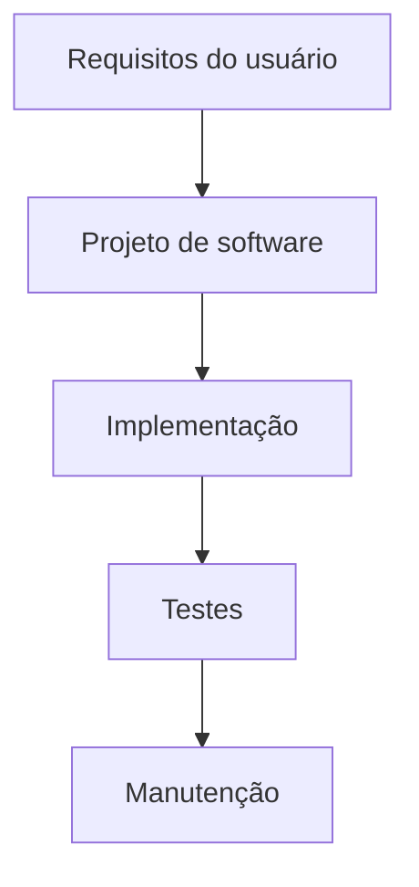
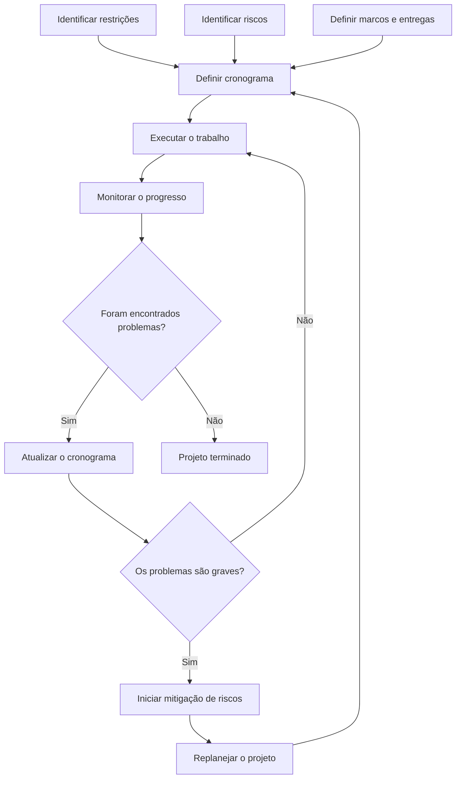

# Unidade IV — Aula XII: Planejamento e Plano de Projeto de Software

## 1. Projeto de software

> [!info] Conceito
> O projeto de software transforma os requisitos levantados em uma representação que orientará a implementação do sistema.

O projeto de software começa após o término da primeira iteração da engenharia de requisitos. Ele se encontra entre o levantamento de requisitos e a implementação, funcionando como uma ponte entre aquilo que o usuário necessita e o produto que será construído.

Durante essa fase, as necessidades identificadas são convertidas em modelos e definições técnicas que orientam o desenvolvimento. Por isso, problemas no projeto podem produzir consequências nas fases posteriores, como implementação, testes e manutenção.

> [!tip] Resumindo
> O projeto traduz as necessidades do usuário em uma solução estruturada e preparada para ser implementada.

## 2. Responsabilidades do projeto de software

> [!info] Conceito
> O projeto deve atender aos requisitos, orientar a equipe e apresentar uma visão completa da solução que será implementada.

Uma das principais responsabilidades do projeto de software é implementar todos os **requisitos explícitos** presentes no modelo de requisitos. Esses requisitos correspondem às necessidades que foram formalmente identificadas e documentadas.

O projeto também deve considerar os **requisitos implícitos**, isto é, características esperadas pelos envolvidos mesmo que não estejam expressamente registradas. Geralmente, esses requisitos estão associados a aspectos não funcionais, como disponibilidade da aplicação e capacidade de responder às solicitações em um tempo razoável.

> [!warning] Atenção
> Um requisito não estar escrito não significa necessariamente que possa ser ignorado. Algumas características são naturalmente esperadas para que o sistema seja utilizável e confiável.

O projeto precisa constituir um guia legível e compreensível para diferentes profissionais:

- aqueles que produzirão o código;
- aqueles que realizarão os testes;
- aqueles que posteriormente fornecerão suporte ao software.

Além disso, deve apresentar uma visão completa do sistema sob o ponto de vista da implementação, tratando dos seguintes domínios:

- **dados:** informações armazenadas, processadas ou transmitidas;
- **funcional:** funções e serviços realizados pelo sistema;
- **comportamental:** reações e mudanças de estado do software diante de eventos.

O projeto ainda deve prever elementos de organização e gerenciamento, como:

- divisão das tarefas;
- alocação de pessoas às atividades;
- prazos de execução;
- custos envolvidos;
- recursos necessários, como computadores, servidores e softwares.

## 3. Objetivo e qualidade do projeto de software

> [!info] Conceito
> O objetivo do projeto é aplicar princípios, conceitos e práticas que conduzam à criação de um sistema ou produto de alta qualidade.

A fase de projeto é o momento em que a qualidade é incorporada à engenharia de software. Nela, as necessidades fornecidas pelo usuário são transformadas em uma representação mais técnica e abstrata, que servirá de base para a implementação.

A qualidade do projeto depende de sua capacidade de representar corretamente os requisitos. Um projeto que não corresponda às necessidades identificadas poderá gerar erros ou dificuldades na implementação, nos testes e na manutenção.

> [!warning] Atenção
> Uma falha na transformação dos requisitos em projeto tende a se propagar pelas etapas seguintes do desenvolvimento.

Para aumentar as possibilidades de sucesso, é necessário elaborar um **plano de projeto**, no qual são documentados os elementos envolvidos na realização do projeto de software.

## 4. Plano de projeto de software

> [!info] Conceito
> O plano de projeto de software é o artefato que documenta o trabalho necessário e orienta as atividades da equipe.

O plano deve ser criado no início da fase de projeto, pois direcionará o trabalho que será realizado. Ele organiza as decisões técnicas, gerenciais e operacionais necessárias para conduzir o desenvolvimento.

O plano deve concentrar-se em quatro elementos fundamentais:

- **arquitetura do software:** estrutura geral do sistema e forma como suas partes serão organizadas;
- **interfaces:** meios de interação com usuários, outros sistemas e componentes;
- **componentes do software:** módulos que se encaixam na arquitetura e desempenham responsabilidades específicas;
- **aspectos de implantação:** condições necessárias para disponibilizar o software no ambiente em que será utilizado.

Esses elementos permitem que a equipe compreenda tanto a organização interna da solução quanto a maneira pela qual ela será integrada e colocada em funcionamento.

## 5. Itens abordados pelo plano de projeto

> [!info] Conceito
> O plano reúne informações sobre entregas, pessoas, recursos, controle, testes, riscos e custos.

### 5.1 Escopo do projeto

O **escopo** determina aquilo que precisa ser entregue ao cliente. Ele delimita o trabalho do projeto e esclarece quais produtos, funcionalidades ou resultados deverão ser produzidos.

### 5.2 Equipe do projeto

O plano deve identificar os integrantes da equipe e definir as atividades que cada membro desempenhará. Essa definição permite distribuir responsabilidades e evitar dúvidas sobre quem executará cada tarefa.

### 5.3 Infraestrutura

Devem ser definidos os recursos tecnológicos necessários, como:

- máquinas e computadores;
- servidores;
- softwares e ferramentas;
- outros recursos de apoio ao desenvolvimento.

### 5.4 Acompanhamento

O projeto precisa ser monitorado durante sua execução. O acompanhamento envolve principalmente:

- controle de custos;
- controle do cronograma;
- controle da alocação de pessoas;
- verificação do progresso das atividades.

### 5.5 Testes

O plano deve abordar a fase de testes, incluindo:

- **testes de unidade:** verificam componentes isolados;
- **testes de integração:** examinam a interação entre componentes;
- **testes de validação:** verificam se o produto atende às necessidades esperadas;
- **testes de sistema:** avaliam o funcionamento do sistema completo.

### 5.6 Riscos

Os possíveis riscos devem ser identificados antecipadamente para que possam ser tratados. Esse planejamento permite preparar respostas para acontecimentos que possam prejudicar prazos, custos, qualidade ou entregas.

### 5.7 Custos

O plano deve considerar diferentes categorias de despesas:

- custos com o pessoal do projeto;
- aquisição e manutenção de hardware e software;
- viagens;
- treinamento e capacitação.

> [!tip] Resumindo
> O plano de projeto esclarece o que será entregue, quem realizará o trabalho, quais recursos serão usados, como o progresso será controlado e quanto o projeto poderá custar.

## 6. Estrutura do plano de projeto segundo Sommerville

> [!info] Conceito
> Segundo Sommerville, o plano pode ser estruturado em seções que organizam objetivos, pessoas, riscos, recursos, atividades, prazos e acompanhamento.

### Introdução

Apresenta os objetivos e as restrições do projeto. As restrições correspondem às condições que limitam sua realização, como prazos, orçamento, recursos disponíveis ou exigências técnicas.

### Organização do projeto

Identifica as pessoas envolvidas e estabelece os papéis que cada uma desempenhará na equipe.

### Análise de riscos

Registra:

- os possíveis riscos;
- a probabilidade de ocorrência;
- as consequências esperadas;
- as estratégias para seu tratamento.

### Requisitos de hardware e software

Define os recursos tecnológicos necessários para desenvolver o projeto.

### Divisão do trabalho

Descreve as atividades previstas e as entregas correspondentes a cada atividade.

### Cronograma do projeto

Apresenta as estimativas de tempo e a alocação de pessoas para as tarefas que serão realizadas.

### Mecanismos de monitoração

Estabelece os meios utilizados para acompanhar o projeto, como relatórios de progresso e mecanismos de feedback.

| Parte do plano | Finalidade |
|---|---|
| Introdução | Definir objetivos e restrições |
| Organização | Identificar pessoas e papéis |
| Análise de riscos | Avaliar riscos e formas de tratamento |
| Requisitos de hardware e software | Definir recursos tecnológicos |
| Divisão do trabalho | Organizar atividades e entregas |
| Cronograma | Estimar prazos e alocar pessoas |
| Monitoração | Acompanhar o progresso e gerar feedback |

## 7. Suplementos do plano de projeto

> [!info] Conceito
> O plano principal pode ser complementado por documentos específicos para qualidade, validação, configuração, manutenção e desenvolvimento da equipe.

### 7.1 Plano de qualidade

Descreve os procedimentos de qualidade e as normas que serão utilizadas no projeto. Sua finalidade é orientar a equipe sobre os critérios que o produto e o processo devem atender.

### 7.2 Plano de validação

Define a abordagem, os recursos e o cronograma que serão empregados para validar o sistema.

### 7.3 Plano de gerenciamento de configuração

Descreve os procedimentos e as estruturas utilizados para controlar as configurações do software. Esse gerenciamento ajuda a organizar versões e mudanças realizadas durante o desenvolvimento.

### 7.4 Plano de manutenção

Prevê os requisitos de manutenção, os custos associados e o esforço necessário para manter o software após sua entrega.

### 7.5 Plano de desenvolvimento pessoal

Descreve como as habilidades e as experiências dos integrantes da equipe poderão ser desenvolvidas e aprimoradas.

| Suplemento | Conteúdo principal |
|---|---|
| Plano de qualidade | Procedimentos e normas de qualidade |
| Plano de validação | Abordagem, recursos e cronograma de validação |
| Plano de gerenciamento de configuração | Procedimentos e estruturas para controle das configurações |
| Plano de manutenção | Requisitos, custos e esforço de manutenção |
| Plano de desenvolvimento pessoal | Aperfeiçoamento das competências da equipe |

## 8. Processo de planejamento do projeto

> [!info] Conceito
> O planejamento não é uma atividade realizada apenas no início: ele é revisto conforme o trabalho avança e novos problemas são identificados.

O processo começa com a identificação das restrições, dos riscos, dos marcos e das entregas do projeto. Essas informações são utilizadas para definir o cronograma.

Depois da definição do cronograma, o trabalho é executado e simultaneamente monitorado. A monitoração permite comparar o progresso real com aquilo que foi planejado.

Quando são identificados desvios ou problemas menores, o cronograma pode ser atualizado para refletir a situação real. Se forem encontrados problemas graves, podem ser iniciadas ações de mitigação de riscos e um replanejamento do projeto.

> [!tip] Resumindo
> Planejar, executar, monitorar e revisar formam um processo contínuo até a conclusão do projeto.

## 9. Programação do projeto

> [!info] Conceito
> A programação do projeto organiza as atividades, suas relações, os recursos necessários e as pessoas responsáveis.

Segundo Sommerville, a programação do projeto é composta por quatro etapas principais:

1. **Identificar as atividades:** determinar quais tarefas precisam ser executadas.
2. **Identificar as dependências:** verificar quais atividades dependem da conclusão de outras.
3. **Estimar os recursos:** definir os recursos necessários para executar cada tarefa.
4. **Alocar pessoas:** atribuir os integrantes da equipe às atividades.

As dependências são importantes porque determinadas tarefas somente podem começar depois da conclusão de atividades anteriores. A estimativa de recursos e a alocação de pessoas também influenciam diretamente os prazos.

## 10. Cronograma e gráfico de Gantt

> [!info] Conceito
> O cronograma representa quando as tarefas serão executadas e como elas se relacionam ao longo do tempo.

O **gráfico de Gantt** é uma ferramenta muito utilizada para elaborar e visualizar o cronograma do projeto. Nele, as tarefas são distribuídas ao longo de períodos, como dias ou semanas, permitindo observar:

- o início e o término previsto de cada atividade;
- a duração das tarefas;
- a sequência do trabalho;
- as dependências entre atividades;
- os marcos do projeto;
- possíveis sobreposições entre tarefas.

O exemplo apresentado na aula distribui diversas tarefas por semanas e evidencia as relações de dependência. Algumas atividades podem ocorrer simultaneamente, enquanto outras precisam aguardar a conclusão de suas predecessoras.

> [!warning] Atenção
> O cronograma não deve ser tratado como algo imutável. O acompanhamento do trabalho pode revelar desvios que exijam sua atualização ou o replanejamento do projeto.

## 11. Leitura recomendada

> [!info] Material indicado
> A aula recomenda a leitura do Capítulo 12 da obra de Roger S. Pressman e Bruce R. Maxim sobre Engenharia de Software.

A leitura indicada é o **Capítulo 12** do livro *Engenharia de Software: uma abordagem profissional*, de Roger S. Pressman e Bruce R. Maxim, 8ª edição, publicado pela AMGH em 2016.

## Síntese final

> [!summary] Síntese
> O plano de projeto converte as decisões técnicas e gerenciais do desenvolvimento em uma orientação documentada para a equipe.

O projeto de software ocupa uma posição essencial entre a engenharia de requisitos e a implementação. Ele transforma as necessidades do usuário em uma representação técnica capaz de orientar a construção, os testes e o suporte ao sistema.

Para cumprir essa função, o projeto deve atender aos requisitos explícitos e implícitos, representar os domínios de dados, funcional e comportamental e oferecer uma visão compreensível da solução.

O plano de projeto documenta o trabalho necessário, definindo escopo, equipe, infraestrutura, atividades, entregas, testes, riscos, custos, recursos e cronograma. Planos complementares podem detalhar qualidade, validação, gerenciamento de configuração, manutenção e desenvolvimento pessoal.

O planejamento é um processo contínuo. Depois da definição inicial das atividades e do cronograma, o trabalho deve ser monitorado. Problemas menores podem resultar em ajustes, enquanto problemas graves podem exigir mitigação de riscos e replanejamento. Ferramentas como o gráfico de Gantt auxiliam na visualização das tarefas, dos prazos e das dependências, contribuindo para que o projeto seja executado de forma organizada e controlada.